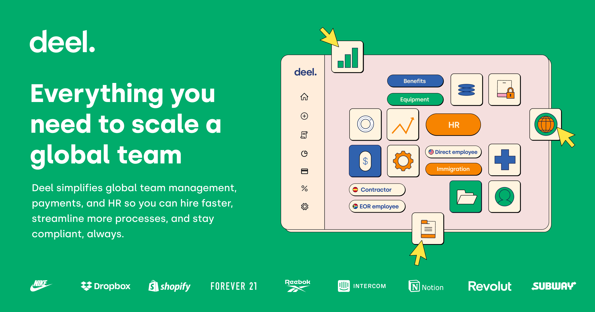

<div align="left">

[](https://deel.com)

# Deel<a id="deel"></a>

API specification for Deel HR user provisioning API. This YAML file is a preview of the API Deel is building. We are looking forward to your feedback.


</div>

## Table of Contents<a id="table-of-contents"></a>

<!-- toc -->

- [Requirements](#requirements)
- [Installation](#installation)
- [Getting Started](#getting-started)
- [Async](#async)
- [Raw HTTP Response](#raw-http-response)
- [Reference](#reference)
  * [`deel.accounting.get_deel_invoices`](#deelaccountingget_deel_invoices)
  * [`deel.accounting.get_invoice_pdf_download_link`](#deelaccountingget_invoice_pdf_download_link)
  * [`deel.accounting.get_paid_invoices`](#deelaccountingget_paid_invoices)
  * [`deel.accounting.get_payment_breakdown`](#deelaccountingget_payment_breakdown)
  * [`deel.accounting.get_payment_receipts`](#deelaccountingget_payment_receipts)
  * [`deel.adjustments.create_new_adjustment`](#deeladjustmentscreate_new_adjustment)
  * [`deel.adjustments.get_all`](#deeladjustmentsget_all)
  * [`deel.adjustments.get_by_id`](#deeladjustmentsget_by_id)
  * [`deel.adjustments.get_categories`](#deeladjustmentsget_categories)
  * [`deel.adjustments.remove_adjustment`](#deeladjustmentsremove_adjustment)
  * [`deel.adjustments.update_adjustment`](#deeladjustmentsupdate_adjustment)
  * [`deel.attachments.upload_deel_file`](#deelattachmentsupload_deel_file)
  * [`deel.candidates.add_candidate_to_deel`](#deelcandidatesadd_candidate_to_deel)
  * [`deel.candidates.update_candidate_by_id`](#deelcandidatesupdate_candidate_by_id)
  * [`deel.contractors.amend_contract_details`](#deelcontractorsamend_contract_details)
  * [`deel.contractors.create_new_deel_contract`](#deelcontractorscreate_new_deel_contract)
  * [`deel.contractors.create_new_fixed_rate_contract`](#deelcontractorscreate_new_fixed_rate_contract)
  * [`deel.contractors.create_new_milestone_contract`](#deelcontractorscreate_new_milestone_contract)
  * [`deel.contractors.create_new_task_based_contract`](#deelcontractorscreate_new_task_based_contract)
  * [`deel.contractors.create_new_time_based_contract`](#deelcontractorscreate_new_time_based_contract)
  * [`deel.contractors.get_contract_preview`](#deelcontractorsget_contract_preview)
  * [`deel.contractors.remove_premium`](#deelcontractorsremove_premium)
  * [`deel.contractors.terminate_contract`](#deelcontractorsterminate_contract)
  * [`deel.contractors.upgrade_to_premium`](#deelcontractorsupgrade_to_premium)
  * [`deel.contracts.add_external_id`](#deelcontractsadd_external_id)
  * [`deel.contracts.archive_contract`](#deelcontractsarchive_contract)
  * [`deel.contracts.attach_file_to_document`](#deelcontractsattach_file_to_document)
  * [`deel.contracts.calculate_final_payment_amount`](#deelcontractscalculate_final_payment_amount)
  * [`deel.contracts.calculate_first_payment_amount`](#deelcontractscalculate_first_payment_amount)
  * [`deel.contracts.client_sign_contract`](#deelcontractsclient_sign_contract)
  * [`deel.contracts.edit_file_attachment`](#deelcontractsedit_file_attachment)
  * [`deel.contracts.find_emails_by_id`](#deelcontractsfind_emails_by_id)
  * [`deel.contracts.get_list`](#deelcontractsget_list)
  * [`deel.contracts.get_list_0`](#deelcontractsget_list_0)
  * [`deel.contracts.get_single_contract`](#deelcontractsget_single_contract)
  * [`deel.contracts.invite_worker_to_sign`](#deelcontractsinvite_worker_to_sign)
  * [`deel.contracts.remove_invite`](#deelcontractsremove_invite)
  * [`deel.eor.calculate_employee_costs`](#deeleorcalculate_employee_costs)
  * [`deel.eor.create_contract_quote`](#deeleorcreate_contract_quote)
  * [`deel.eor.get_contract_benefits`](#deeleorget_contract_benefits)
  * [`deel.eor.get_country_guide`](#deeleorget_country_guide)
  * [`deel.eor.get_employee_payslips`](#deeleorget_employee_payslips)
  * [`deel.eor.get_payslip_download`](#deeleorget_payslip_download)
  * [`deel.global_payroll.add_bank_account`](#deelglobal_payrolladd_bank_account)
  * [`deel.global_payroll.create_contract_gp`](#deelglobal_payrollcreate_contract_gp)
  * [`deel.global_payroll.download_gross_to_net_gp_report`](#deelglobal_payrolldownload_gross_to_net_gp_report)
  * [`deel.global_payroll.get_bank_accounts`](#deelglobal_payrollget_bank_accounts)
  * [`deel.global_payroll.get_bank_guide`](#deelglobal_payrollget_bank_guide)
  * [`deel.global_payroll.get_gross_to_net_gp_report`](#deelglobal_payrollget_gross_to_net_gp_report)
  * [`deel.global_payroll.get_payslip_download_url`](#deelglobal_payrollget_payslip_download_url)
  * [`deel.global_payroll.get_payslips`](#deelglobal_payrollget_payslips)
  * [`deel.global_payroll.list_payroll_events_by_legal_entity`](#deelglobal_payrolllist_payroll_events_by_legal_entity)
  * [`deel.global_payroll.modify_bank_account`](#deelglobal_payrollmodify_bank_account)
  * [`deel.global_payroll.request_termination_process`](#deelglobal_payrollrequest_termination_process)
  * [`deel.global_payroll.update_compensation_history`](#deelglobal_payrollupdate_compensation_history)
  * [`deel.global_payroll.update_employee_information`](#deelglobal_payrollupdate_employee_information)
  * [`deel.global_payroll.update_pto_policy`](#deelglobal_payrollupdate_pto_policy)
  * [`deel.global_payroll.update_worker_address`](#deelglobal_payrollupdate_worker_address)
  * [`deel.invoices.create_adjustment`](#deelinvoicescreate_adjustment)
  * [`deel.invoices.delete_adjustment`](#deelinvoicesdelete_adjustment)
  * [`deel.invoices.get_attachment_file_url`](#deelinvoicesget_attachment_file_url)
  * [`deel.invoices.get_line_items_by_contract`](#deelinvoicesget_line_items_by_contract)
  * [`deel.invoices.list_invoice_adjustments`](#deelinvoiceslist_invoice_adjustments)
  * [`deel.invoices.review_multiple`](#deelinvoicesreview_multiple)
  * [`deel.invoices.submit_adjustment_review`](#deelinvoicessubmit_adjustment_review)
  * [`deel.invoices.update_adjustment_by_id`](#deelinvoicesupdate_adjustment_by_id)
  * [`deel.lookups.get_country_list`](#deellookupsget_country_list)
  * [`deel.lookups.get_currencies_list`](#deellookupsget_currencies_list)
  * [`deel.lookups.get_job_titles_list`](#deellookupsget_job_titles_list)
  * [`deel.lookups.get_seniority_levels`](#deellookupsget_seniority_levels)
  * [`deel.lookups.get_time_off_types`](#deellookupsget_time_off_types)
  * [`deel.managers.create_new_manager`](#deelmanagerscreate_new_manager)
  * [`deel.managers.list`](#deelmanagerslist)
  * [`deel.milestones.create_new_milestone`](#deelmilestonescreate_new_milestone)
  * [`deel.milestones.create_review`](#deelmilestonescreate_review)
  * [`deel.milestones.delete_single_milestone`](#deelmilestonesdelete_single_milestone)
  * [`deel.milestones.get_single_milestone`](#deelmilestonesget_single_milestone)
  * [`deel.milestones.list_by_contract`](#deelmilestoneslist_by_contract)
  * [`deel.milestones.review_multiple`](#deelmilestonesreview_multiple)
  * [`deel.off_cycle_payments.add_payment_invoice`](#deeloff_cycle_paymentsadd_payment_invoice)
  * [`deel.off_cycle_payments.get_list`](#deeloff_cycle_paymentsget_list)
  * [`deel.off_cycle_payments.get_single_payment`](#deeloff_cycle_paymentsget_single_payment)
  * [`deel.organizations.get_department_list`](#deelorganizationsget_department_list)
  * [`deel.organizations.get_details`](#deelorganizationsget_details)
  * [`deel.organizations.get_legal_entities_list`](#deelorganizationsget_legal_entities_list)
  * [`deel.organizations.get_team_list`](#deelorganizationsget_team_list)
  * [`deel.organizations.get_working_locations`](#deelorganizationsget_working_locations)
  * [`deel.organizations.list_agreements_with_deel`](#deelorganizationslist_agreements_with_deel)
  * [`deel.partner_managed.add_additional_information_for_eor_employee`](#deelpartner_managedadd_additional_information_for_eor_employee)
  * [`deel.partner_managed.add_bank_account_for_eor_employee`](#deelpartner_managedadd_bank_account_for_eor_employee)
  * [`deel.partner_managed.download_compliance_document_template`](#deelpartner_manageddownload_compliance_document_template)
  * [`deel.partner_managed.download_employee_agreement_pdf`](#deelpartner_manageddownload_employee_agreement_pdf)
  * [`deel.partner_managed.download_hr_verification_letters_and_documents`](#deelpartner_manageddownload_hr_verification_letters_and_documents)
  * [`deel.partner_managed.get_bank_guide_for_eor_employee`](#deelpartner_managedget_bank_guide_for_eor_employee)
  * [`deel.partner_managed.get_employee_agreement_html`](#deelpartner_managedget_employee_agreement_html)
  * [`deel.partner_managed.list_employee_compliance_documents`](#deelpartner_managedlist_employee_compliance_documents)
  * [`deel.partner_managed.list_hr_verification_letters_and_documents`](#deelpartner_managedlist_hr_verification_letters_and_documents)
  * [`deel.partner_managed.list_payslips_for_eor_employee`](#deelpartner_managedlist_payslips_for_eor_employee)
  * [`deel.partner_managed.list_tax_documents_for_employee`](#deelpartner_managedlist_tax_documents_for_employee)
  * [`deel.partner_managed.modify_bank_account_for_eor_employee`](#deelpartner_managedmodify_bank_account_for_eor_employee)
  * [`deel.partner_managed.preview_job_offer_letter`](#deelpartner_managedpreview_job_offer_letter)
  * [`deel.partner_managed.request_custom_verification_letter`](#deelpartner_managedrequest_custom_verification_letter)
  * [`deel.partner_managed.sign_contract`](#deelpartner_managedsign_contract)
  * [`deel.partner_managed.upload_compliance_document`](#deelpartner_managedupload_compliance_document)
  * [`deel.people.add_time_off_request`](#deelpeopleadd_time_off_request)
  * [`deel.people.create_direct_employee`](#deelpeoplecreate_direct_employee)
  * [`deel.people.delete_time_off_request`](#deelpeopledelete_time_off_request)
  * [`deel.people.edit_time_off_request`](#deelpeopleedit_time_off_request)
  * [`deel.people.get_current_profile`](#deelpeopleget_current_profile)
  * [`deel.people.get_list`](#deelpeopleget_list)
  * [`deel.people.get_list_0`](#deelpeopleget_list_0)
  * [`deel.people.get_person`](#deelpeopleget_person)
  * [`deel.people.list_time_off_entitlements`](#deelpeoplelist_time_off_entitlements)
  * [`deel.people.list_time_off_policies`](#deelpeoplelist_time_off_policies)
  * [`deel.people.list_time_offs_by_worker_id`](#deelpeoplelist_time_offs_by_worker_id)
  * [`deel.people.review_time_off`](#deelpeoplereview_time_off)
  * [`deel.people.update_department`](#deelpeopleupdate_department)
  * [`deel.people.update_working_location`](#deelpeopleupdate_working_location)
  * [`deel.service_provider_config.get_details`](#deelservice_provider_configget_details)
  * [`deel.tasks.create_new_task`](#deeltaskscreate_new_task)
  * [`deel.tasks.delete_from_contract`](#deeltasksdelete_from_contract)
  * [`deel.tasks.get_contract_tasks`](#deeltasksget_contract_tasks)
  * [`deel.tasks.review_many_tasks`](#deeltasksreview_many_tasks)
  * [`deel.tasks.submit_task_review`](#deeltaskssubmit_task_review)
  * [`deel.time_off.add_request_obsolete`](#deeltime_offadd_request_obsolete)
  * [`deel.time_off.cancel_request_obsolete`](#deeltime_offcancel_request_obsolete)
  * [`deel.time_off.edit_request_obsolete`](#deeltime_offedit_request_obsolete)
  * [`deel.time_off.get_all_obsolete`](#deeltime_offget_all_obsolete)
  * [`deel.time_off.get_time_off_types`](#deeltime_offget_time_off_types)
  * [`deel.time_off.list_by_contract`](#deeltime_offlist_by_contract)
  * [`deel.time_off.list_entitlements`](#deeltime_offlist_entitlements)
  * [`deel.time_off.manage_request`](#deeltime_offmanage_request)
  * [`deel.timesheets.delete_entry`](#deeltimesheetsdelete_entry)
  * [`deel.timesheets.get_list`](#deeltimesheetsget_list)
  * [`deel.timesheets.get_single_entry`](#deeltimesheetsget_single_entry)
  * [`deel.timesheets.list_by_contract`](#deeltimesheetslist_by_contract)
  * [`deel.timesheets.review_multiple`](#deeltimesheetsreview_multiple)
  * [`deel.timesheets.review_single_timesheet`](#deeltimesheetsreview_single_timesheet)
  * [`deel.timesheets.submit_work_for_contractor`](#deeltimesheetssubmit_work_for_contractor)
  * [`deel.timesheets.update_entry`](#deeltimesheetsupdate_entry)
  * [`deel.token.create_public_token`](#deeltokencreate_public_token)
  * [`deel.user.create_user`](#deelusercreate_user)
  * [`deel.user.delete_user`](#deeluserdelete_user)
  * [`deel.user.get_by_id`](#deeluserget_by_id)
  * [`deel.user.list_deel_users`](#deeluserlist_deel_users)
  * [`deel.user.partially_update_user`](#deeluserpartially_update_user)
  * [`deel.user.search_or_list`](#deelusersearch_or_list)
  * [`deel.user.update_user_by_id`](#deeluserupdate_user_by_id)
  * [`deel.webhooks.create_subscription`](#deelwebhookscreate_subscription)
  * [`deel.webhooks.delete_by_id`](#deelwebhooksdelete_by_id)
  * [`deel.webhooks.edit_by_id`](#deelwebhooksedit_by_id)
  * [`deel.webhooks.get_by_id`](#deelwebhooksget_by_id)
  * [`deel.webhooks.list_event_types`](#deelwebhookslist_event_types)
  * [`deel.webhooks.list_webhook_subscriptions`](#deelwebhookslist_webhook_subscriptions)

<!-- tocstop -->

## Requirements<a id="requirements"></a>

Python >=3.7

## Installation<a id="installation"></a>
<div align="center">
  <a href="https://konfigthis.com/sdk-sign-up?company=Deel&language=Python">
    
  </a>
</div>

## Getting Started<a id="getting-started"></a>

```python
from pprint import pprint
from deel_python_sdk import Deel, ApiException

deel = Deel(

    access_token = 'YOUR_BEARER_TOKEN',

    client_id = 'YOUR_CLIENT_ID',
    client_secret = 'YOUR_CLIENT_SECRET',
)

try:
    # Retrieve Deel invoices
    get_deel_invoices_response = deel.accounting.get_deel_invoices(
        limit=10,
        offset=0,
    )
    print(get_deel_invoices_response)
except ApiException as e:
    print("Exception when calling AccountingApi.get_deel_invoices: %s\n" % e)
    pprint(e.body)
    if e.status == 400:
        pprint(e.body["request"])
        pprint(e.body["errors"])
    if e.status == 401:
        pprint(e.body["request"])
        pprint(e.body["errors"])
    if e.status == 500:
        pprint(e.body["request"])
        pprint(e.body["errors"])
    if e.status == 403:
        pprint(e.body["request"])
        pprint(e.body["errors"])
    if e.status == 404:
        pprint(e.body["request"])
        pprint(e.body["errors"])
    pprint(e.headers)
    pprint(e.status)
    pprint(e.reason)
    pprint(e.round_trip_time)
```

## Async<a id="async"></a>

`async` support is available by prepending `a` to any method.

```python

import asyncio
from pprint import pprint
from deel_python_sdk import Deel, ApiException

deel = Deel(

    access_token = 'YOUR_BEARER_TOKEN',

    client_id = 'YOUR_CLIENT_ID',
    client_secret = 'YOUR_CLIENT_SECRET',
)

async def main():
    try:
        # Retrieve Deel invoices
        get_deel_invoices_response = await deel.accounting.aget_deel_invoices(
            limit=10,
            offset=0,
        )
        print(get_deel_invoices_response)
    except ApiException as e:
        print("Exception when calling AccountingApi.get_deel_invoices: %s\n" % e)
        pprint(e.body)
        if e.status == 400:
            pprint(e.body["request"])
            pprint(e.body["errors"])
        if e.status == 401:
            pprint(e.body["request"])
            pprint(e.body["errors"])
        if e.status == 500:
            pprint(e.body["request"])
            pprint(e.body["errors"])
        if e.status == 403:
            pprint(e.body["request"])
            pprint(e.body["errors"])
        if e.status == 404:
            pprint(e.body["request"])
            pprint(e.body["errors"])
        pprint(e.headers)
        pprint(e.status)
        pprint(e.reason)
        pprint(e.round_trip_time)

asyncio.run(main())
```

## Raw HTTP Response<a id="raw-http-response"></a>

To access raw HTTP response values, use the `.raw` namespace.

```python
from pprint import pprint
from deel_python_sdk import Deel, ApiException

deel = Deel(

    access_token = 'YOUR_BEARER_TOKEN',

    client_id = 'YOUR_CLIENT_ID',
    client_secret = 'YOUR_CLIENT_SECRET',
)

try:
    # Retrieve Deel invoices
    get_deel_invoices_response = deel.accounting.raw.get_deel_invoices(
        limit=10,
        offset=0,
    )
    pprint(get_deel_invoices_response.body)
    pprint(get_deel_invoices_response.body["data"])
    pprint(get_deel_invoices_response.body["page"])
    pprint(get_deel_invoices_response.headers)
    pprint(get_deel_invoices_response.status)
    pprint(get_deel_invoices_response.round_trip_time)
except ApiException as e:
    print("Exception when calling AccountingApi.get_deel_invoices: %s\n" % e)
    pprint(e.body)
    if e.status == 400:
        pprint(e.body["request"])
        pprint(e.body["errors"])
    if e.status == 401:
        pprint(e.body["request"])
        pprint(e.body["errors"])
    if e.status == 500:
        pprint(e.body["request"])
        pprint(e.body["errors"])
    if e.status == 403:
        pprint(e.body["request"])
        pprint(e.body["errors"])
    if e.status == 404:
        pprint(e.body["request"])
        pprint(e.body["errors"])
    pprint(e.headers)
    pprint(e.status)
    pprint(e.reason)
    pprint(e.round_trip_time)
```


## Reference<a id="reference"></a>
### `deel.accounting.get_deel_invoices`<a id="deelaccountingget_deel_invoices"></a>

Retrieve a list of invoices related to Deel fees.

#### 🛠️ Usage<a id="🛠️-usage"></a>

```python
get_deel_invoices_response = deel.accounting.get_deel_invoices(
    limit=10,
    offset=0,
)
```

#### ⚙️ Parameters<a id="⚙️-parameters"></a>

##### limit: `Union[int, float]`<a id="limit-unionint-float"></a>

Return a page of results with given number of records; NOTE: technically ALL query parameters are strings or array of strings

##### offset: `Union[int, float]`<a id="offset-unionint-float"></a>

Return a page of results after given index of row; NOTE: technically ALL query parameters are strings or array of strings

#### 🔄 Return<a id="🔄-return"></a>

[`DeelInvoiceListContainer`](./deel_python_sdk/pydantic/deel_invoice_list_container.py)

#### 🌐 Endpoint<a id="🌐-endpoint"></a>

`/invoices/deel` `get`

[🔙 **Back to Table of Contents**](#table-of-contents)

---

### `deel.accounting.get_invoice_pdf_download_link`<a id="deelaccountingget_invoice_pdf_download_link"></a>

Get link to download the invoice PDF.

#### 🛠️ Usage<a id="🛠️-usage"></a>

```python
get_invoice_pdf_download_link_response = deel.accounting.get_invoice_pdf_download_link(
    invoice_id="invoice_id_example",
)
```

#### ⚙️ Parameters<a id="⚙️-parameters"></a>

##### invoice_id: `str`<a id="invoice_id-str"></a>

ID of an existing invoice

#### 🔄 Return<a id="🔄-return"></a>

[`InvoiceDownloadLinkContainer`](./deel_python_sdk/pydantic/invoice_download_link_container.py)

#### 🌐 Endpoint<a id="🌐-endpoint"></a>

`/invoices/{invoice_id}/download` `get`

[🔙 **Back to Table of Contents**](#table-of-contents)

---

### `deel.accounting.get_paid_invoices`<a id="deelaccountingget_paid_invoices"></a>

Retrieve a list of paid invoices for your workforce.

#### 🛠️ Usage<a id="🛠️-usage"></a>

```python
get_paid_invoices_response = deel.accounting.get_paid_invoices(
    issued_from_date="string_example",
    issued_to_date="string_example",
    limit=10,
    offset=0,
)
```

#### ⚙️ Parameters<a id="⚙️-parameters"></a>

##### issued_from_date: `str`<a id="issued_from_date-str"></a>

to get records created after given issue date

##### issued_to_date: `str`<a id="issued_to_date-str"></a>

to get records created before given issued date

##### limit: `Union[int, float]`<a id="limit-unionint-float"></a>

Return a page of results with given number of records; NOTE: technically ALL query parameters are strings or array of strings

##### offset: `Union[int, float]`<a id="offset-unionint-float"></a>

Return a page of results after given index of row; NOTE: technically ALL query parameters are strings or array of strings

#### 🔄 Return<a id="🔄-return"></a>

[`InvoiceListContainer`](./deel_python_sdk/pydantic/invoice_list_container.py)

#### 🌐 Endpoint<a id="🌐-endpoint"></a>

`/invoices` `get`

[🔙 **Back to Table of Contents**](#table-of-contents)

---

### `deel.accounting.get_payment_breakdown`<a id="deelaccountingget_payment_breakdown"></a>

Get a full breakdown of a payment made to Deel. Breakdown will include individual invoices and Deel fee as line items.

#### 🛠️ Usage<a id="🛠️-usage"></a>

```python
get_payment_breakdown_response = deel.accounting.get_payment_breakdown(
    payment_id="payment_id_example",
)
```

#### ⚙️ Parameters<a id="⚙️-parameters"></a>

##### payment_id: `str`<a id="payment_id-str"></a>

#### 🔄 Return<a id="🔄-return"></a>

[`PaymentBreakDownContainer`](./deel_python_sdk/pydantic/payment_break_down_container.py)

#### 🌐 Endpoint<a id="🌐-endpoint"></a>

`/payments/{payment_id}/breakdown` `get`

[🔙 **Back to Table of Contents**](#table-of-contents)

---

### `deel.accounting.get_payment_receipts`<a id="deelaccountingget_payment_receipts"></a>

Retrieve a list of payments made to Deel.

#### 🛠️ Usage<a id="🛠️-usage"></a>

```python
get_payment_receipts_response = deel.accounting.get_payment_receipts(
    date_from="2022-01-01T00:00:00.000Z",
    date_to="2022-12-01T00:00:00.000Z",
    currencies=None,
    entities=None,
)
```

#### ⚙️ Parameters<a id="⚙️-parameters"></a>

##### date_from: [`DateString`](./deel_python_sdk/type/.py)<a id="date_from-datestringdeel_python_sdktypepy"></a>

Filtered results will include records created on or after the provided date.

##### date_to: [`DateString`](./deel_python_sdk/type/.py)<a id="date_to-datestringdeel_python_sdktypepy"></a>

Filtered results will include records created before the provided date.

##### currencies: Union[[`CurrencyCodeList`](./deel_python_sdk/type/currency_code_list.py), `CurrencyCodeRequired`]<a id="currencies-unioncurrencycodelistdeel_python_sdktypecurrency_code_listpy-currencycoderequired"></a>


Currency codes of contracts to filter.

##### entities: Union[[`LegalEntityArray`](./deel_python_sdk/type/legal_entity_array.py), [`LegalEntityType`](./deel_python_sdk/type/legal_entity_type.py)]<a id="entities-unionlegalentityarraydeel_python_sdktypelegal_entity_arraypy-legalentitytypedeel_python_sdktypelegal_entity_typepy"></a>


Filter by legal entity type; company, or individual

#### 🔄 Return<a id="🔄-return"></a>

[`PaymentListContainer`](./deel_python_sdk/pydantic/payment_list_container.py)

#### 🌐 Endpoint<a id="🌐-endpoint"></a>

`/payments` `get`

[🔙 **Back to Table of Contents**](#table-of-contents)

---

### `deel.adjustments.create_new_adjustment`<a id="deeladjustmentscreate_new_adjustment"></a>

Create a new adjustment.

#### 🛠️ Usage<a id="🛠️-usage"></a>

```python
create_new_adjustment_response = deel.adjustments.create_new_adjustment(
    data={
        "title": "Your title here",
        "description": "Your description here",
        "contract_id": "m3jk2j",
        "amount": None,
        "date_of_adjustment": "1999-12-31T00:00:00.000Z",
        "cycle_reference": "my_cycle_reference",
        "file": open('/path/to/file', 'rb'),
        "adjustment_category_id": "c9cf4c2c0165f48f494415390c3b49",
        "move_next_cycle": True,
        "vendor": "Vendor",
        "country": "US",
    },
)
```

#### ⚙️ Parameters<a id="⚙️-parameters"></a>

##### data: [`AdjustmentToCreate`](./deel_python_sdk/type/adjustment_to_create.py)<a id="data-adjustmenttocreatedeel_python_sdktypeadjustment_to_createpy"></a>


#### ⚙️ Request Body<a id="⚙️-request-body"></a>

[`AdjustmentToCreateContainer`](./deel_python_sdk/type/adjustment_to_create_container.py)
Creation data for a new adjustment

#### 🔄 Return<a id="🔄-return"></a>

[`AdjustmentCreatedContainer`](./deel_python_sdk/pydantic/adjustment_created_container.py)

#### 🌐 Endpoint<a id="🌐-endpoint"></a>

`/adjustments` `post`

[🔙 **Back to Table of Contents**](#table-of-contents)

---

### `deel.adjustments.get_all`<a id="deeladjustmentsget_all"></a>

Get all adjustments for the specific contract.

#### 🛠️ Usage<a id="🛠️-usage"></a>

```python
get_all_response = deel.adjustments.get_all(
    contract_id="37nex2x",
    _from="1970-01-01",
    to="1970-01-01",
)
```

#### ⚙️ Parameters<a id="⚙️-parameters"></a>

##### contract_id: `str`<a id="contract_id-str"></a>

Deel contract id.

##### _from: `date`<a id="_from-date"></a>

Filter adjustments by start date.

##### to: `date`<a id="to-date"></a>

Filter adjustments by end date.

#### 🔄 Return<a id="🔄-return"></a>

[`AdjustmentsContainer`](./deel_python_sdk/pydantic/adjustments_container.py)

#### 🌐 Endpoint<a id="🌐-endpoint"></a>

`/contracts/{contract_id}/adjustments` `get`

[🔙 **Back to Table of Contents**](#table-of-contents)

---

### `deel.adjustments.get_by_id`<a id="deeladjustmentsget_by_id"></a>

Retrieve an adjustment.

#### 🛠️ Usage<a id="🛠️-usage"></a>

```python
get_by_id_response = deel.adjustments.get_by_id(
    adjustment_id="adjustment_id_example",
)
```

#### ⚙️ Parameters<a id="⚙️-parameters"></a>

##### adjustment_id: `str`<a id="adjustment_id-str"></a>

Adjustment id.

#### 🔄 Return<a id="🔄-return"></a>

[`AdjustmentCreatedContainer`](./deel_python_sdk/pydantic/adjustment_created_container.py)

#### 🌐 Endpoint<a id="🌐-endpoint"></a>

`/adjustments/{adjustment_id}` `get`

[🔙 **Back to Table of Contents**](#table-of-contents)

---

### `deel.adjustments.get_categories`<a id="deeladjustmentsget_categories"></a>

Get all categories for your organization.

#### 🛠️ Usage<a id="🛠️-usage"></a>

```python
get_categories_response = deel.adjustments.get_categories()
```

#### 🔄 Return<a id="🔄-return"></a>

[`AdjustmentsCategoriesContainer`](./deel_python_sdk/pydantic/adjustments_categories_container.py)

#### 🌐 Endpoint<a id="🌐-endpoint"></a>

`/adjustments/categories` `get`

[🔙 **Back to Table of Contents**](#table-of-contents)

---

### `deel.adjustments.remove_adjustment`<a id="deeladjustmentsremove_adjustment"></a>

Delete an adjustment.

#### 🛠️ Usage<a id="🛠️-usage"></a>

```python
remove_adjustment_response = deel.adjustments.remove_adjustment(
    adjustment_id="adjustment_id_example",
)
```

#### ⚙️ Parameters<a id="⚙️-parameters"></a>

##### adjustment_id: `str`<a id="adjustment_id-str"></a>

Adjustment id.

#### 🔄 Return<a id="🔄-return"></a>

[`GenericResultDeleted`](./deel_python_sdk/pydantic/generic_result_deleted.py)

#### 🌐 Endpoint<a id="🌐-endpoint"></a>

`/adjustments/{adjustment_id}` `delete`

[🔙 **Back to Table of Contents**](#table-of-contents)

---

### `deel.adjustments.update_adjustment`<a id="deeladjustmentsupdate_adjustment"></a>

Update an adjustment.

#### 🛠️ Usage<a id="🛠️-usage"></a>

```python
update_adjustment_response = deel.adjustments.update_adjustment(
    data={
        "title": "Your title here",
        "description": "Your description here",
    },
    adjustment_id="adjustment_id_example",
)
```

#### ⚙️ Parameters<a id="⚙️-parameters"></a>

##### data: [`AdjustmentToUpdate`](./deel_python_sdk/type/adjustment_to_update.py)<a id="data-adjustmenttoupdatedeel_python_sdktypeadjustment_to_updatepy"></a>


##### adjustment_id: `str`<a id="adjustment_id-str"></a>

Adjustment id.

#### ⚙️ Request Body<a id="⚙️-request-body"></a>

[`AdjustmentToUpdateContainer`](./deel_python_sdk/type/adjustment_to_update_container.py)
Adjustment object that needs to be updated

#### 🔄 Return<a id="🔄-return"></a>

[`GenericResultUpdated`](./deel_python_sdk/pydantic/generic_result_updated.py)

#### 🌐 Endpoint<a id="🌐-endpoint"></a>

`/adjustments/{adjustment_id}` `patch`

[🔙 **Back to Table of Contents**](#table-of-contents)

---

### `deel.attachments.upload_deel_file`<a id="deelattachmentsupload_deel_file"></a>

Upload file to Deel storage to use the file attachment feature for other endpoints.

#### 🛠️ Usage<a id="🛠️-usage"></a>

```python
upload_deel_file_response = deel.attachments.upload_deel_file(
    data={
        "content_type": "application/pdf",
    },
)
```

#### ⚙️ Parameters<a id="⚙️-parameters"></a>

##### data: [`InputToCreateFileRefData`](./deel_python_sdk/type/input_to_create_file_ref_data.py)<a id="data-inputtocreatefilerefdatadeel_python_sdktypeinput_to_create_file_ref_datapy"></a>


#### ⚙️ Request Body<a id="⚙️-request-body"></a>

[`InputToCreateFileRef`](./deel_python_sdk/type/input_to_create_file_ref.py)
File info object that needs to be created.

#### 🔄 Return<a id="🔄-return"></a>

[`OutputToCreateFileRefContainer`](./deel_python_sdk/pydantic/output_to_create_file_ref_container.py)

#### 🌐 Endpoint<a id="🌐-endpoint"></a>

`/attachments` `post`

[🔙 **Back to Table of Contents**](#table-of-contents)

---

### `deel.candidates.add_candidate_to_deel`<a id="deelcandidatesadd_candidate_to_deel"></a>

Add a candidate to Deel.

#### 🛠️ Usage<a id="🛠️-usage"></a>

```python
add_candidate_to_deel_response = deel.candidates.add_candidate_to_deel(
    data={
        "id": "id_example",
        "first_name": "John",
        "last_name": "Doe",
        "status": "offer-accepted",
        "start_date": "1999-12-31T00:00:00.000Z",
        "link": "link_example",
        "job_title": "3D Designer",
        "nationality": "US",
        "country": "US",
        "state": "AL",
    },
)
```

#### ⚙️ Parameters<a id="⚙️-parameters"></a>

##### data: [`CandidateToCreate`](./deel_python_sdk/type/candidate_to_create.py)<a id="data-candidatetocreatedeel_python_sdktypecandidate_to_createpy"></a>


#### ⚙️ Request Body<a id="⚙️-request-body"></a>

[`CandidateToCreateContainer`](./deel_python_sdk/type/candidate_to_create_container.py)
Add a candidate to Deel

#### 🔄 Return<a id="🔄-return"></a>

[`GenericResultCreated`](./deel_python_sdk/pydantic/generic_result_created.py)

#### 🌐 Endpoint<a id="🌐-endpoint"></a>

`/candidates` `post`

[🔙 **Back to Table of Contents**](#table-of-contents)

---

### `deel.candidates.update_candidate_by_id`<a id="deelcandidatesupdate_candidate_by_id"></a>

Update an existed candidate.

#### 🛠️ Usage<a id="🛠️-usage"></a>

```python
update_candidate_by_id_response = deel.candidates.update_candidate_by_id(
    data={
        "first_name": "John",
        "last_name": "Doe",
        "status": "offer-accepted",
        "start_date": "1999-12-31T00:00:00.000Z",
        "job_title": "3D Designer",
        "nationality": "US",
        "country": "US",
        "state": "AL",
    },
    candidate_id="37nex2x",
)
```

#### ⚙️ Parameters<a id="⚙️-parameters"></a>

##### data: [`CandidateToPatch`](./deel_python_sdk/type/candidate_to_patch.py)<a id="data-candidatetopatchdeel_python_sdktypecandidate_to_patchpy"></a>


##### candidate_id: `str`<a id="candidate_id-str"></a>

Candidate id.

#### ⚙️ Request Body<a id="⚙️-request-body"></a>

[`CandidateToPatchContainer`](./deel_python_sdk/type/candidate_to_patch_container.py)
Update an existed candidate

#### 🔄 Return<a id="🔄-return"></a>

[`GenericResultUpdated`](./deel_python_sdk/pydantic/generic_result_updated.py)

#### 🌐 Endpoint<a id="🌐-endpoint"></a>

`/candidates/{candidate_id}` `patch`

[🔙 **Back to Table of Contents**](#table-of-contents)

---

### `deel.contractors.amend_contract_details`<a id="deelcontractorsamend_contract_details"></a>

Amend the details of a contract. Please note that if the contract is already signed or active, then the update will have to be approved and re-signed for to take effect.

#### 🛠️ Usage<a id="🛠️-usage"></a>

```python
amend_contract_details_response = deel.contractors.amend_contract_details(
    data={
        "amount": 100,
        "currency_code": "GBP",
        "scale": "daily",
        "effective_date": "1999-12-31T00:00:00.000Z",
        "first_payment_date": "1999-12-31T00:00:00.000Z",
        "frequency": "monthly",
        "cycle_end_type": "DAY_OF_WEEK",
        "payment_due_type": "REGULAR",
        "job_title_name": "3D Designer",
        "job_title_id": "00000000-0000-0000-0000-000000000000",
        "seniority_id": "00000000-0000-0000-0000-000000000000",
    },
    contract_id="37nex2x",
)
```

#### ⚙️ Parameters<a id="⚙️-parameters"></a>

##### data: [`ContractDetailsToAmend`](./deel_python_sdk/type/contract_details_to_amend.py)<a id="data-contractdetailstoamenddeel_python_sdktypecontract_details_to_amendpy"></a>


##### contract_id: `str`<a id="contract_id-str"></a>

Deel contract id.

#### ⚙️ Request Body<a id="⚙️-request-body"></a>

[`ContractToAmendDetailsContainer`](./deel_python_sdk/type/contract_to_amend_details_container.py)
Contract object that needs to be amended

#### 🔄 Return<a id="🔄-return"></a>

[`GenericResultCreated`](./deel_python_sdk/pydantic/generic_result_created.py)

#### 🌐 Endpoint<a id="🌐-endpoint"></a>

`/contracts/{contract_id}/amendments` `post`

[🔙 **Back to Table of Contents**](#table-of-contents)

---

### `deel.contractors.create_new_deel_contract`<a id="deelcontractorscreate_new_deel_contract"></a>

Create a new Deel contract.

#### 🛠️ Usage<a id="🛠️-usage"></a>

```python
create_new_deel_contract_response = deel.contractors.create_new_deel_contract(
    data=None,
)
```

#### ⚙️ Parameters<a id="⚙️-parameters"></a>

##### data: `ContractToCreate`<a id="data-contracttocreate"></a>

#### ⚙️ Request Body<a id="⚙️-request-body"></a>

[`ContractToCreateContainer`](./deel_python_sdk/type/contract_to_create_container.py)
Contract object that needs to be created

#### 🔄 Return<a id="🔄-return"></a>

[`ContractContainer`](./deel_python_sdk/pydantic/contract_container.py)

#### 🌐 Endpoint<a id="🌐-endpoint"></a>

`/contracts` `post`

[🔙 **Back to Table of Contents**](#table-of-contents)

---

### `deel.contractors.create_new_fixed_rate_contract`<a id="deelcontractorscreate_new_fixed_rate_contract"></a>

Create a new contract (fixed-rate)

#### 🛠️ Usage<a id="🛠️-usage"></a>

```python
create_new_fixed_rate_contract_response = deel.contractors.create_new_fixed_rate_contract(
    data=None,
)
```

#### ⚙️ Parameters<a id="⚙️-parameters"></a>

##### data: [`ContractToCreateOngoingTimeBased`](./deel_python_sdk/type/contract_to_create_ongoing_time_based.py)<a id="data-contracttocreateongoingtimebaseddeel_python_sdktypecontract_to_create_ongoing_time_basedpy"></a>


#### ⚙️ Request Body<a id="⚙️-request-body"></a>

[`ContractToCreateContainerOngoingTimeBased`](./deel_python_sdk/type/contract_to_create_container_ongoing_time_based.py)
Contract object that needs to be created

#### 🔄 Return<a id="🔄-return"></a>

[`ContractContainerOngoingTimeBased`](./deel_python_sdk/pydantic/contract_container_ongoing_time_based.py)

#### 🌐 Endpoint<a id="🌐-endpoint"></a>

`/contracts/fixed-rate` `post`

[🔙 **Back to Table of Contents**](#table-of-contents)

---

### `deel.contractors.create_new_milestone_contract`<a id="deelcontractorscreate_new_milestone_contract"></a>

Create a new contract (milestone-based)

#### 🛠️ Usage<a id="🛠️-usage"></a>

```python
create_new_milestone_contract_response = deel.contractors.create_new_milestone_contract(
    data=None,
)
```

#### ⚙️ Parameters<a id="⚙️-parameters"></a>

##### data: [`ContractToCreatePaygMilestones`](./deel_python_sdk/type/contract_to_create_payg_milestones.py)<a id="data-contracttocreatepaygmilestonesdeel_python_sdktypecontract_to_create_payg_milestonespy"></a>


#### ⚙️ Request Body<a id="⚙️-request-body"></a>

[`ContractToCreateContainerPaygMilestones`](./deel_python_sdk/type/contract_to_create_container_payg_milestones.py)
Contract object that needs to be created

#### 🔄 Return<a id="🔄-return"></a>

[`ContractContainerPaygMilestones`](./deel_python_sdk/pydantic/contract_container_payg_milestones.py)

#### 🌐 Endpoint<a id="🌐-endpoint"></a>

`/contracts/milestone-based` `post`

[🔙 **Back to Table of Contents**](#table-of-contents)

---

### `deel.contractors.create_new_task_based_contract`<a id="deelcontractorscreate_new_task_based_contract"></a>

Create a new contract (task-based)

#### 🛠️ Usage<a id="🛠️-usage"></a>

```python
create_new_task_based_contract_response = deel.contractors.create_new_task_based_contract(
    data=None,
)
```

#### ⚙️ Parameters<a id="⚙️-parameters"></a>

##### data: [`ContractToCreatePaygTasks`](./deel_python_sdk/type/contract_to_create_payg_tasks.py)<a id="data-contracttocreatepaygtasksdeel_python_sdktypecontract_to_create_payg_taskspy"></a>


#### ⚙️ Request Body<a id="⚙️-request-body"></a>

[`ContractToCreateContainerPaygTasks`](./deel_python_sdk/type/contract_to_create_container_payg_tasks.py)
Contract object that needs to be created

#### 🔄 Return<a id="🔄-return"></a>

[`ContractContainerPaygTasks`](./deel_python_sdk/pydantic/contract_container_payg_tasks.py)

#### 🌐 Endpoint<a id="🌐-endpoint"></a>

`/contracts/task-based` `post`

[🔙 **Back to Table of Contents**](#table-of-contents)

---

### `deel.contractors.create_new_time_based_contract`<a id="deelcontractorscreate_new_time_based_contract"></a>

Create a new contract (time-based)

#### 🛠️ Usage<a id="🛠️-usage"></a>

```python
create_new_time_based_contract_response = deel.contractors.create_new_time_based_contract(
    data=None,
)
```

#### ⚙️ Parameters<a id="⚙️-parameters"></a>

##### data: [`ContractToCreatePayAsYouGoTimeBased`](./deel_python_sdk/type/contract_to_create_pay_as_you_go_time_based.py)<a id="data-contracttocreatepayasyougotimebaseddeel_python_sdktypecontract_to_create_pay_as_you_go_time_basedpy"></a>


#### ⚙️ Request Body<a id="⚙️-request-body"></a>

[`ContractToCreateContainerPayAsYouGoTimeBased`](./deel_python_sdk/type/contract_to_create_container_pay_as_you_go_time_based.py)
Contract object that needs to be created

#### 🔄 Return<a id="🔄-return"></a>

[`ContractContainerPayAsYouGoTimeBased`](./deel_python_sdk/pydantic/contract_container_pay_as_you_go_time_based.py)

#### 🌐 Endpoint<a id="🌐-endpoint"></a>

`/contracts/time-based` `post`

[🔙 **Back to Table of Contents**](#table-of-contents)

---

### `deel.contractors.get_contract_preview`<a id="deelcontractorsget_contract_preview"></a>

Retrieve an IC and EOR contract agreement content in HTML. If no template is specified, the default or currently assigned template will be used. This endpoint does not support Global Payroll contract type.

#### 🛠️ Usage<a id="🛠️-usage"></a>

```python
get_contract_preview_response = deel.contractors.get_contract_preview(
    contract_id="37nex2x",
    template_id="string_example",
)
```

#### ⚙️ Parameters<a id="⚙️-parameters"></a>

##### contract_id: `str`<a id="contract_id-str"></a>

Deel contract id.

##### template_id: `str`<a id="template_id-str"></a>

ID of an existing contract template.

#### 🌐 Endpoint<a id="🌐-endpoint"></a>

`/contracts/{contract_id}/preview` `get`

[🔙 **Back to Table of Contents**](#table-of-contents)

---

### `deel.contractors.remove_premium`<a id="deelcontractorsremove_premium"></a>

Remove Deel Premium from an existing contract.

#### 🛠️ Usage<a id="🛠️-usage"></a>

```python
remove_premium_response = deel.contractors.remove_premium(
    contract_id="37nex2x",
    reason="string_example",
)
```

#### ⚙️ Parameters<a id="⚙️-parameters"></a>

##### contract_id: `str`<a id="contract_id-str"></a>

Deel contract id.

##### reason: `str`<a id="reason-str"></a>

Reason for deleting an existing Deel Premium from a contract.

#### 🔄 Return<a id="🔄-return"></a>

[`GenericResultDeleted`](./deel_python_sdk/pydantic/generic_result_deleted.py)

#### 🌐 Endpoint<a id="🌐-endpoint"></a>

`/contracts/{contract_id}/premium` `delete`

[🔙 **Back to Table of Contents**](#table-of-contents)

---

### `deel.contractors.terminate_contract`<a id="deelcontractorsterminate_contract"></a>

Terminate an active contract.

#### 🛠️ Usage<a id="🛠️-usage"></a>

```python
terminate_contract_response = deel.contractors.terminate_contract(
    data={
        "completion_date": "1999-12-31T00:00:00.000Z",
    },
    contract_id="37nex2x",
)
```

#### ⚙️ Parameters<a id="⚙️-parameters"></a>

##### data: [`ContractToTerminate`](./deel_python_sdk/type/contract_to_terminate.py)<a id="data-contracttoterminatedeel_python_sdktypecontract_to_terminatepy"></a>


##### contract_id: `str`<a id="contract_id-str"></a>

Deel contract id.

#### ⚙️ Request Body<a id="⚙️-request-body"></a>

[`ContractToTerminateContainer`](./deel_python_sdk/type/contract_to_terminate_container.py)
Contract that needs to be terminated and when.

#### 🔄 Return<a id="🔄-return"></a>

[`ContractTerminationResultContainer`](./deel_python_sdk/pydantic/contract_termination_result_container.py)

#### 🌐 Endpoint<a id="🌐-endpoint"></a>

`/contracts/{contract_id}/terminations` `post`

[🔙 **Back to Table of Contents**](#table-of-contents)

---

### `deel.contractors.upgrade_to_premium`<a id="deelcontractorsupgrade_to_premium"></a>

Add additional protection against misclassification by upgrading to Deel Premium.

#### 🛠️ Usage<a id="🛠️-usage"></a>

```python
upgrade_to_premium_response = deel.contractors.upgrade_to_premium(
    data={
        "agreement_reflects_relation": True,
        "contractor_characteristics": False,
    },
    contract_id="37nex2x",
)
```

#### ⚙️ Parameters<a id="⚙️-parameters"></a>

##### data: [`PremiumToAdd`](./deel_python_sdk/type/premium_to_add.py)<a id="data-premiumtoadddeel_python_sdktypepremium_to_addpy"></a>


##### contract_id: `str`<a id="contract_id-str"></a>

Deel contract id.

#### ⚙️ Request Body<a id="⚙️-request-body"></a>

[`PremiumToAddContainer`](./deel_python_sdk/type/premium_to_add_container.py)
Answers for assessment in order to find eligibility for Deel Premium.

#### 🔄 Return<a id="🔄-return"></a>

[`PremiumResultAddedContainer`](./deel_python_sdk/pydantic/premium_result_added_container.py)

#### 🌐 Endpoint<a id="🌐-endpoint"></a>

`/contracts/{contract_id}/premium` `post`

[🔙 **Back to Table of Contents**](#table-of-contents)

---

### `deel.contracts.add_external_id`<a id="deelcontractsadd_external_id"></a>

Add an external Id to a Deel contract. You can use this to add a Deel contract's refernece Id in your platform. External Id can be passed as a query parameter in List contract endpoint to find this conract later.

#### 🛠️ Usage<a id="🛠️-usage"></a>

```python
add_external_id_response = deel.contracts.add_external_id(
    data={
        "external_id": "external_id_example",
    },
    contract_id="37nex2x",
)
```

#### ⚙️ Parameters<a id="⚙️-parameters"></a>

##### data: [`ContractExternalIdToPatch`](./deel_python_sdk/type/contract_external_id_to_patch.py)<a id="data-contractexternalidtopatchdeel_python_sdktypecontract_external_id_to_patchpy"></a>


##### contract_id: `str`<a id="contract_id-str"></a>

Deel contract id.

#### ⚙️ Request Body<a id="⚙️-request-body"></a>

[`InputToPatchContractExternalId`](./deel_python_sdk/type/input_to_patch_contract_external_id.py)
Contract object that needs to be created

#### 🔄 Return<a id="🔄-return"></a>

[`GenericResultCreated`](./deel_python_sdk/pydantic/generic_result_created.py)

#### 🌐 Endpoint<a id="🌐-endpoint"></a>

`/contracts/{contract_id}` `patch`

[🔙 **Back to Table of Contents**](#table-of-contents)

---

### `deel.contracts.archive_contract`<a id="deelcontractsarchive_contract"></a>

Archive a terminated, cancelled or completed contract.

#### 🛠️ Usage<a id="🛠️-usage"></a>

```python
archive_contract_response = deel.contracts.archive_contract(
    contract_id="37nex2x",
)
```

#### ⚙️ Parameters<a id="⚙️-parameters"></a>

##### contract_id: `str`<a id="contract_id-str"></a>

Deel contract id.

#### 🔄 Return<a id="🔄-return"></a>

[`GenericResultUpdated`](./deel_python_sdk/pydantic/generic_result_updated.py)

#### 🌐 Endpoint<a id="🌐-endpoint"></a>

`/contracts/{contract_id}/archive` `patch`

[🔙 **Back to Table of Contents**](#table-of-contents)

---

### `deel.contracts.attach_file_to_document`<a id="deelcontractsattach_file_to_document"></a>

Attach a file to contract document.

#### 🛠️ Usage<a id="🛠️-usage"></a>

```python
attach_file_to_document_response = deel.contracts.attach_file_to_document(
    contract_id="37nex2x",
    file=open('/path/to/file', 'rb'),
)
```

#### ⚙️ Parameters<a id="⚙️-parameters"></a>

##### contract_id: `str`<a id="contract_id-str"></a>

Deel contract id.

##### file: `IO`<a id="file-io"></a>

Upload the file you want to attach to this entry.

#### ⚙️ Request Body<a id="⚙️-request-body"></a>

[`FileObject`](./deel_python_sdk/type/file_object.py)
A form to attach a file to contract document.

#### 🔄 Return<a id="🔄-return"></a>

[`ContractDocumentContainer`](./deel_python_sdk/pydantic/contract_document_container.py)

#### 🌐 Endpoint<a id="🌐-endpoint"></a>

`/contracts/{contract_id}/documents` `post`

[🔙 **Back to Table of Contents**](#table-of-contents)

---

### `deel.contracts.calculate_final_payment_amount`<a id="deelcontractscalculate_final_payment_amount"></a>

Calculate the final payment due to the contractor when ending the contract.

#### 🛠️ Usage<a id="🛠️-usage"></a>

```python
calculate_final_payment_amount_response = deel.contracts.calculate_final_payment_amount(
    contract_id="37nex2x",
    end_date="1999-12-31T00:00:00.000Z",
    calculation_type="CUSTOM_AMOUNT",
    workweek_start="string_example",
    workweek_end="string_example",
)
```

#### ⚙️ Parameters<a id="⚙️-parameters"></a>

##### contract_id: `str`<a id="contract_id-str"></a>

Deel contract id.

##### end_date: [`DateString`](./deel_python_sdk/type/.py)<a id="end_date-datestringdeel_python_sdktypepy"></a>

The day to end the contract.

##### calculation_type: `str`<a id="calculation_type-str"></a>

The days to calculate.

##### workweek_start: `str`<a id="workweek_start-str"></a>

The day the work week starts, 0 to 6

##### workweek_end: `str`<a id="workweek_end-str"></a>

The day the work week ends, 0 to 6

#### 🔄 Return<a id="🔄-return"></a>

[`FinalPaymentCalculatedContainer`](./deel_python_sdk/pydantic/final_payment_calculated_container.py)

#### 🌐 Endpoint<a id="🌐-endpoint"></a>

`/contracts/{contract_id}/final-payments` `get`

[🔙 **Back to Table of Contents**](#table-of-contents)

---

### `deel.contracts.calculate_first_payment_amount`<a id="deelcontractscalculate_first_payment_amount"></a>

First payment is calculated from the number of working/calendar days between their start date and the start of the payment cycle.

#### 🛠️ Usage<a id="🛠️-usage"></a>

```python
calculate_first_payment_amount_response = deel.contracts.calculate_first_payment_amount(
    data={
        "type": "ongoing_time_based",
        "country_code": "US",
        "start_date": "1999-12-31T00:00:00.000Z",
        "compensation_details": {
            "amount": 2500,
            "currency_code": "GBP",
            "scale": "monthly",
            "cycle_end_type": "DAY_OF_WEEK",
            "payment_due_type": "REGULAR",
            "calculation_type": "CUSTOM_AMOUNT",
            "work_week_start": "Monday",
            "work_week_end": "Monday",
        },
    },
)
```

#### ⚙️ Parameters<a id="⚙️-parameters"></a>

##### data: [`EstimateFirstPayment`](./deel_python_sdk/type/estimate_first_payment.py)<a id="data-estimatefirstpaymentdeel_python_sdktypeestimate_first_paymentpy"></a>


#### ⚙️ Request Body<a id="⚙️-request-body"></a>

[`EstimateFirstPaymentContainer`](./deel_python_sdk/type/estimate_first_payment_container.py)
Pro-rata payment object that needs to estimated payment

#### 🔄 Return<a id="🔄-return"></a>

[`ResponseEstimateFirstPaymentContainer`](./deel_python_sdk/pydantic/response_estimate_first_payment_container.py)

#### 🌐 Endpoint<a id="🌐-endpoint"></a>

`/contracts/estimate` `post`

[🔙 **Back to Table of Contents**](#table-of-contents)

---

### `deel.contracts.client_sign_contract`<a id="deelcontractsclient_sign_contract"></a>

Sign a contract as a client.

#### 🛠️ Usage<a id="🛠️-usage"></a>

```python
client_sign_contract_response = deel.contracts.client_sign_contract(
    data={
        "client_signature": "client_signature_example",
        "contract_template_id": 12345678,
    },
    contract_id="37nex2x",
)
```

#### ⚙️ Parameters<a id="⚙️-parameters"></a>

##### data: [`ContractSignatureToCreate`](./deel_python_sdk/type/contract_signature_to_create.py)<a id="data-contractsignaturetocreatedeel_python_sdktypecontract_signature_to_createpy"></a>


##### contract_id: `str`<a id="contract_id-str"></a>

Deel contract id.

#### ⚙️ Request Body<a id="⚙️-request-body"></a>

[`ContractSignatureToCreateContainer`](./deel_python_sdk/type/contract_signature_to_create_container.py)
Contract signature object that needs to be created

#### 🔄 Return<a id="🔄-return"></a>

[`GenericResultCreated`](./deel_python_sdk/pydantic/generic_result_created.py)

#### 🌐 Endpoint<a id="🌐-endpoint"></a>

`/contracts/{contract_id}/signatures` `post`

[🔙 **Back to Table of Contents**](#table-of-contents)

---

### `deel.contracts.edit_file_attachment`<a id="deelcontractsedit_file_attachment"></a>

Overwrite the file currently attached to contract document.

#### 🛠️ Usage<a id="🛠️-usage"></a>

```python
edit_file_attachment_response = deel.contracts.edit_file_attachment(
    contract_id="37nex2x",
    file=open('/path/to/file', 'rb'),
)
```

#### ⚙️ Parameters<a id="⚙️-parameters"></a>

##### contract_id: `str`<a id="contract_id-str"></a>

Deel contract id.

##### file: `IO`<a id="file-io"></a>

Upload the file you want to attach to this entry.

#### ⚙️ Request Body<a id="⚙️-request-body"></a>

[`FileObject`](./deel_python_sdk/type/file_object.py)
A form to attach a file to contract document.

#### 🔄 Return<a id="🔄-return"></a>

[`ContractDocumentContainer`](./deel_python_sdk/pydantic/contract_document_container.py)

#### 🌐 Endpoint<a id="🌐-endpoint"></a>

`/contracts/{contract_id}/documents` `put`

[🔙 **Back to Table of Contents**](#table-of-contents)

---

### `deel.contracts.find_emails_by_id`<a id="deelcontractsfind_emails_by_id"></a>

Returns an array of alternate email objects

#### 🛠️ Usage<a id="🛠️-usage"></a>

```python
find_emails_by_id_response = deel.contracts.find_emails_by_id(
    contract_id="37nex2x",
)
```

#### ⚙️ Parameters<a id="⚙️-parameters"></a>

##### contract_id: `str`<a id="contract_id-str"></a>

Deel contract id.

#### 🔄 Return<a id="🔄-return"></a>

[`AlternateEmailList`](./deel_python_sdk/pydantic/alternate_email_list.py)

#### 🌐 Endpoint<a id="🌐-endpoint"></a>

`/contracts/{contract_id}/alternate_emails` `get`

[🔙 **Back to Table of Contents**](#table-of-contents)

---

### `deel.contracts.get_list`<a id="deelcontractsget_list"></a>

Retrieve a list of contracts.

#### 🛠️ Usage<a id="🛠️-usage"></a>

```python
get_list_response = deel.contracts.get_list(
    after_cursor="string_example",
    limit=10,
    order_direction="asc",
    types=[
        "string_example"
    ],
    statuses=[
        "string_example"
    ],
    team_id="string_example",
    external_id="string_example",
    countries=[
        "AE"
    ],
    currencies=None,
    search="string_example",
    sort_by="contract_title",
)
```

#### ⚙️ Parameters<a id="⚙️-parameters"></a>

##### after_cursor: `str`<a id="after_cursor-str"></a>

Return next page of results after given cursor.

##### limit: `Union[int, float]`<a id="limit-unionint-float"></a>

Return a page of results with given number of records; NOTE: technically ALL query parameters are strings or array of strings

##### order_direction: [`SortDirEnum`](./deel_python_sdk/type/.py)<a id="order_direction-sortdirenumdeel_python_sdktypepy"></a>

Order direction of results; ascending or descending.

##### types: [`ContractTypeEnumList`](./deel_python_sdk/type/.py)<a id="types-contracttypeenumlistdeel_python_sdktypepy"></a>

You can filter contracts by type, a contract is included in results if its type is in this list.

##### statuses: [`ContractStatusEnumList`](./deel_python_sdk/type/.py)<a id="statuses-contractstatusenumlistdeel_python_sdktypepy"></a>

You can filter contracts by current status, a contract is included in results if its status is in this list.

##### team_id: `str`<a id="team_id-str"></a>

Filter contracts for given team ID; NOTE: technically ALL query parameters are strings or array of strings

##### external_id: `str`<a id="external_id-str"></a>

Filter contracts for given external ID

##### countries: [`CountryCodeList`](./deel_python_sdk/type/.py)<a id="countries-countrycodelistdeel_python_sdktypepy"></a>

Country codes of contracts to filter.

##### currencies: Union[[`CurrencyCodeList`](./deel_python_sdk/type/currency_code_list.py), `CurrencyCodeRequired`]<a id="currencies-unioncurrencycodelistdeel_python_sdktypecurrency_code_listpy-currencycoderequired"></a>


Currency codes of contracts to filter.

##### search: `str`<a id="search-str"></a>

Include a contract if by name or contractor name contains given search term.

##### sort_by: [`ContractsSortByEnum`](./deel_python_sdk/type/.py)<a id="sort_by-contractssortbyenumdeel_python_sdktypepy"></a>

Sort contracts by given field name.

#### 🔄 Return<a id="🔄-return"></a>

[`ContractListContainer`](./deel_python_sdk/pydantic/contract_list_container.py)

#### 🌐 Endpoint<a id="🌐-endpoint"></a>

`/contracts` `get`

[🔙 **Back to Table of Contents**](#table-of-contents)

---

### `deel.contracts.get_list_0`<a id="deelcontractsget_list_0"></a>

Retrieve a list of contract templates in your organization.

#### 🛠️ Usage<a id="🛠️-usage"></a>

```python
get_list_0_response = deel.contracts.get_list_0()
```

#### 🔄 Return<a id="🔄-return"></a>

[`ContractTemplateListContainer`](./deel_python_sdk/pydantic/contract_template_list_container.py)

#### 🌐 Endpoint<a id="🌐-endpoint"></a>

`/contract-templates` `get`

[🔙 **Back to Table of Contents**](#table-of-contents)

---

### `deel.contracts.get_single_contract`<a id="deelcontractsget_single_contract"></a>

Retrieve a single contract.

#### 🛠️ Usage<a id="🛠️-usage"></a>

```python
get_single_contract_response = deel.contracts.get_single_contract(
    contract_id="37nex2x",
)
```

#### ⚙️ Parameters<a id="⚙️-parameters"></a>

##### contract_id: `str`<a id="contract_id-str"></a>

Deel contract id.

#### 🔄 Return<a id="🔄-return"></a>

[`ContractContainer`](./deel_python_sdk/pydantic/contract_container.py)

#### 🌐 Endpoint<a id="🌐-endpoint"></a>

`/contracts/{contract_id}` `get`

[🔙 **Back to Table of Contents**](#table-of-contents)

---

### `deel.contracts.invite_worker_to_sign`<a id="deelcontractsinvite_worker_to_sign"></a>

Invite a worker to sign the contract. Worker will be notified via email.

#### 🛠️ Usage<a id="🛠️-usage"></a>

```python
invite_worker_to_sign_response = deel.contracts.invite_worker_to_sign(
    data={
        "email": "email_example",
        "message": "message_example",
    },
    contract_id="37nex2x",
)
```

#### ⚙️ Parameters<a id="⚙️-parameters"></a>

##### data: [`ContractInvitationToCreate`](./deel_python_sdk/type/contract_invitation_to_create.py)<a id="data-contractinvitationtocreatedeel_python_sdktypecontract_invitation_to_createpy"></a>


##### contract_id: `str`<a id="contract_id-str"></a>

Deel contract id.

#### ⚙️ Request Body<a id="⚙️-request-body"></a>

[`ContractInvitationToCreateContainer`](./deel_python_sdk/type/contract_invitation_to_create_container.py)
Contract invitation object that needs to be created

#### 🔄 Return<a id="🔄-return"></a>

[`GenericResultCreated`](./deel_python_sdk/pydantic/generic_result_created.py)

#### 🌐 Endpoint<a id="🌐-endpoint"></a>

`/contracts/{contract_id}/invitations` `post`

[🔙 **Back to Table of Contents**](#table-of-contents)

---

### `deel.contracts.remove_invite`<a id="deelcontractsremove_invite"></a>

Remove invite in order to re-invite a worker to sign the contract.

#### 🛠️ Usage<a id="🛠️-usage"></a>

```python
remove_invite_response = deel.contracts.remove_invite(
    contract_id="37nex2x",
)
```

#### ⚙️ Parameters<a id="⚙️-parameters"></a>

##### contract_id: `str`<a id="contract_id-str"></a>

Deel contract id.

#### 🔄 Return<a id="🔄-return"></a>

[`GenericResultDeleted`](./deel_python_sdk/pydantic/generic_result_deleted.py)

#### 🌐 Endpoint<a id="🌐-endpoint"></a>

`/contracts/{contract_id}/invitations` `delete`

[🔙 **Back to Table of Contents**](#table-of-contents)

---

### `deel.eor.calculate_employee_costs`<a id="deeleorcalculate_employee_costs"></a>

Determine EOR employee costs across the globe.

#### 🛠️ Usage<a id="🛠️-usage"></a>

```python
calculate_employee_costs_response = deel.eor.calculate_employee_costs(
    data={
        "salary": 50000,
        "country": "Germany",
        "currency": "EUR",
    },
)
```

#### ⚙️ Parameters<a id="⚙️-parameters"></a>

##### data: [`EorEmployeeCostCalculationRequestBody`](./deel_python_sdk/type/eor_employee_cost_calculation_request_body.py)<a id="data-eoremployeecostcalculationrequestbodydeel_python_sdktypeeor_employee_cost_calculation_request_bodypy"></a>


#### ⚙️ Request Body<a id="⚙️-request-body"></a>

[`EorEmployeeCostCalculationRequestBodyContainer`](./deel_python_sdk/type/eor_employee_cost_calculation_request_body_container.py)
Information to use in the EOR employeeCost calculation.

#### 🔄 Return<a id="🔄-return"></a>

[`EorEmployeeCostCalculationResponseContainer`](./deel_python_sdk/pydantic/eor_employee_cost_calculation_response_container.py)

#### 🌐 Endpoint<a id="🌐-endpoint"></a>

`/eor/employment_cost` `post`

[🔙 **Back to Table of Contents**](#table-of-contents)

---

### `deel.eor.create_contract_quote`<a id="deeleorcreate_contract_quote"></a>

Create an Employee of Record (EOR) contract quote. The endpoints creates a contract quote request. Deel will process the information and get back with a quote for this contract.

#### 🛠️ Usage<a id="🛠️-usage"></a>

```python
create_contract_quote_response = deel.eor.create_contract_quote(
    data={
        "employee": {
            "first_name": "Jane",
            "last_name": "Doe",
            "email": "employee@email.com",
            "nationality": "US",
        },
        "employment": {
            "country": "US",
            "type": "Full-time",
            "work_visa_required": False,
            "start_date": "1999-12-31T00:00:00.000Z",
            "end_date": "1999-12-31T00:00:00.000Z",
            "time_off_type": "STANDARD",
        },
        "job_title": "job_title_example",
        "seniority": {
            "id": "00000000-0000-0000-0000-000000000000",
        },
        "client": {
            "team": {
                "id": "00000000-0000-0000-0000-000000000000",
            },
        },
        "compensation_details": {
            "currency": "currency_example",
            "variable_compensation_type": "PERCENTAGE",
        },
    },
)
```

#### ⚙️ Parameters<a id="⚙️-parameters"></a>

##### data: [`EorContractToCreate`](./deel_python_sdk/type/eor_contract_to_create.py)<a id="data-eorcontracttocreatedeel_python_sdktypeeor_contract_to_createpy"></a>


#### ⚙️ Request Body<a id="⚙️-request-body"></a>

[`EorContractToCreateContainer`](./deel_python_sdk/type/eor_contract_to_create_container.py)
Employee (eor) contract object that needs to be created

#### 🔄 Return<a id="🔄-return"></a>

[`EorContractCreatedContainer`](./deel_python_sdk/pydantic/eor_contract_created_container.py)

#### 🌐 Endpoint<a id="🌐-endpoint"></a>

`/eor` `post`

[🔙 **Back to Table of Contents**](#table-of-contents)

---

### `deel.eor.get_contract_benefits`<a id="deeleorget_contract_benefits"></a>

Retrieve EOR contract benefits

#### 🛠️ Usage<a id="🛠️-usage"></a>

```python
get_contract_benefits_response = deel.eor.get_contract_benefits(
    contract_id="37nex2x",
)
```

#### ⚙️ Parameters<a id="⚙️-parameters"></a>

##### contract_id: `str`<a id="contract_id-str"></a>

Deel contract id.

#### 🔄 Return<a id="🔄-return"></a>

[`EORContractBenefitsContainer`](./deel_python_sdk/pydantic/eor_contract_benefits_container.py)

#### 🌐 Endpoint<a id="🌐-endpoint"></a>

`/eor/{contract_id}/benefits` `get`

[🔙 **Back to Table of Contents**](#table-of-contents)

---

### `deel.eor.get_country_guide`<a id="deeleorget_country_guide"></a>

Retrieve the hiring guide data for a country. This data can be used to create Employee of Record (EOR) contract quotes.

#### 🛠️ Usage<a id="🛠️-usage"></a>

```python
get_country_guide_response = deel.eor.get_country_guide(
    country_code="US",
)
```

#### ⚙️ Parameters<a id="⚙️-parameters"></a>

##### country_code: [`CountryCode`](./deel_python_sdk/type/.py)<a id="country_code-countrycodedeel_python_sdktypepy"></a>

Country code.

#### 🔄 Return<a id="🔄-return"></a>

[`EorCountryValidationsContainer`](./deel_python_sdk/pydantic/eor_country_validations_container.py)

#### 🌐 Endpoint<a id="🌐-endpoint"></a>

`/eor/validations/{country_code}` `get`

[🔙 **Back to Table of Contents**](#table-of-contents)

---

### `deel.eor.get_employee_payslips`<a id="deeleorget_employee_payslips"></a>

Get of payslips for an employee.

#### 🛠️ Usage<a id="🛠️-usage"></a>

```python
get_employee_payslips_response = deel.eor.get_employee_payslips(
    worker_id="0123abcd-e031-4f1e-93d4-6bc66e8c4727",
)
```

#### ⚙️ Parameters<a id="⚙️-parameters"></a>

##### worker_id: `str`<a id="worker_id-str"></a>

Unique identifier for a worker.

#### 🔄 Return<a id="🔄-return"></a>

[`EORPayslipsListContainer`](./deel_python_sdk/pydantic/eor_payslips_list_container.py)

#### 🌐 Endpoint<a id="🌐-endpoint"></a>

`/eor/workers/{worker_id}/payslips` `get`

[🔙 **Back to Table of Contents**](#table-of-contents)

---

### `deel.eor.get_payslip_download`<a id="deeleorget_payslip_download"></a>

Get download url for EOR payslip.

#### 🛠️ Usage<a id="🛠️-usage"></a>

```python
get_payslip_download_response = deel.eor.get_payslip_download(
    worker_id="0123abcd-e031-4f1e-93d4-6bc66e8c4727",
    payslip_id="ApdZbLvq0r0E",
)
```

#### ⚙️ Parameters<a id="⚙️-parameters"></a>

##### worker_id: `str`<a id="worker_id-str"></a>

Unique identifier for a worker.

##### payslip_id: `str`<a id="payslip_id-str"></a>

Unique identifier for a payslip.

#### 🔄 Return<a id="🔄-return"></a>

[`EORPayslipDownloadUrlContainer`](./deel_python_sdk/pydantic/eor_payslip_download_url_container.py)

#### 🌐 Endpoint<a id="🌐-endpoint"></a>

`/eor/workers/{worker_id}/payslips/{payslip_id}/download` `get`

[🔙 **Back to Table of Contents**](#table-of-contents)

---

### `deel.global_payroll.add_bank_account`<a id="deelglobal_payrolladd_bank_account"></a>

Add a new bank account for an employee.

#### 🛠️ Usage<a id="🛠️-usage"></a>

```python
add_bank_account_response = deel.global_payroll.add_bank_account(
    data={
        "full_name": "John Doe",
        "phone": "+1234567890",
        "address_line1": "1234 Main St",
        "address_line2": "Apartment 101",
        "city": "Springfield",
        "province_state": "Ontario",
        "postal": "12345",
        "bank_name": "Bank of Examples",
        "country_code": "US",
        "bank_country_code": "US",
        "swift_bic": "EXAMPLEBIC",
        "account_number": "123456789012",
        "bank_code": "123",
        "original_name": "Johnathan Doe",
        "tax_id": "123-45-6789",
        "branch_code": "001",
        "currency_code": "USD",
        "bank_branch_name": "Main Street Branch",
        "iban": "GB29NWBK60161331926819",
        "email": "john.doe@example.com",
        "rib_number": "12345678901",
        "account_type": "12345678901",
        "ach_routing_number": "12345678901",
    },
    worker_id="0123abcd-e031-4f1e-93d4-6bc66e8c4727",
)
```

#### ⚙️ Parameters<a id="⚙️-parameters"></a>

##### data: [`WorkerBankAccountToAdd`](./deel_python_sdk/type/worker_bank_account_to_add.py)<a id="data-workerbankaccounttoadddeel_python_sdktypeworker_bank_account_to_addpy"></a>


##### worker_id: `str`<a id="worker_id-str"></a>

Unique identifier for a worker.

#### ⚙️ Request Body<a id="⚙️-request-body"></a>

[`AddWorkerBankAccountContainer`](./deel_python_sdk/type/add_worker_bank_account_container.py)
Request body to add new bank account for employee

#### 🔄 Return<a id="🔄-return"></a>

[`BankAccountUpdatedContainer`](./deel_python_sdk/pydantic/bank_account_updated_container.py)

#### 🌐 Endpoint<a id="🌐-endpoint"></a>

`/gp/workers/{worker_id}/banks` `post`

[🔙 **Back to Table of Contents**](#table-of-contents)

---

### `deel.global_payroll.create_contract_gp`<a id="deelglobal_payrollcreate_contract_gp"></a>

Create a Global Payroll contract.

#### 🛠️ Usage<a id="🛠️-usage"></a>

```python
create_contract_gp_response = deel.global_payroll.create_contract_gp(
    data={
        "employee": {
            "first_name": "Jane",
            "last_name": "Doe",
            "email": "email_example",
            "work_email": "work_email_example",
            "nationality": "US",
            "employee_number": "100",
            "address": {
                "street": "Deel Street 500",
                "city": "Denver",
                "state": "CO",
                "zip": "44000",
                "country": "US",
            },
        },
        "employment": {
            "type": "Full-time",
            "start_date": "1999-12-31T00:00:00.000Z",
            "holidays": {
                "allowance": 3.14,
                "start_date": "1999-12-31T00:00:00.000Z",
            },
        },
        "job_title": "job_title_example",
        "client": {
            "legal_entity": {
                "id": "00000000-0000-0000-0000-000000000000",
            },
,
        },
        "compensation_details": {
            "scale": "YEAR",
            "salary": 3.14,
            "currency": "GBP",
        },
    },
)
```

#### ⚙️ Parameters<a id="⚙️-parameters"></a>

##### data: [`GPContractToCreate`](./deel_python_sdk/type/gp_contract_to_create.py)<a id="data-gpcontracttocreatedeel_python_sdktypegp_contract_to_createpy"></a>


#### ⚙️ Request Body<a id="⚙️-request-body"></a>

[`GPContractToCreateContainer`](./deel_python_sdk/type/gp_contract_to_create_container.py)
Global Payroll (GP) contract object that needs to be created

#### 🔄 Return<a id="🔄-return"></a>

[`GPContractCreatedContainer`](./deel_python_sdk/pydantic/gp_contract_created_container.py)

#### 🌐 Endpoint<a id="🌐-endpoint"></a>

`/contracts/gp` `post`

[🔙 **Back to Table of Contents**](#table-of-contents)

---

### `deel.global_payroll.download_gross_to_net_gp_report`<a id="deelglobal_payrolldownload_gross_to_net_gp_report"></a>

Download global payroll reports detailing gross-to-net calculations.

#### 🛠️ Usage<a id="🛠️-usage"></a>

```python
download_gross_to_net_gp_report_response = deel.global_payroll.download_gross_to_net_gp_report(
    gp_report_id="gp_report_id_example",
)
```

#### ⚙️ Parameters<a id="⚙️-parameters"></a>

##### gp_report_id: `str`<a id="gp_report_id-str"></a>

Id of gp report.

#### 🌐 Endpoint<a id="🌐-endpoint"></a>

`/gp/reports/{gp_report_id}/gross_to_net/csv` `get`

[🔙 **Back to Table of Contents**](#table-of-contents)

---

### `deel.global_payroll.get_bank_accounts`<a id="deelglobal_payrollget_bank_accounts"></a>

Retrieve all bank accounts for an employee.

#### 🛠️ Usage<a id="🛠️-usage"></a>

```python
get_bank_accounts_response = deel.global_payroll.get_bank_accounts(
    worker_id="0123abcd-e031-4f1e-93d4-6bc66e8c4727",
)
```

#### ⚙️ Parameters<a id="⚙️-parameters"></a>

##### worker_id: `str`<a id="worker_id-str"></a>

Unique identifier for a worker.

#### 🔄 Return<a id="🔄-return"></a>

[`WorkerBankAccountsInfoContainer`](./deel_python_sdk/pydantic/worker_bank_accounts_info_container.py)

#### 🌐 Endpoint<a id="🌐-endpoint"></a>

`/gp/workers/{worker_id}/banks` `get`

[🔙 **Back to Table of Contents**](#table-of-contents)

---

### `deel.global_payroll.get_bank_guide`<a id="deelglobal_payrollget_bank_guide"></a>

Retrieve the bank form guide for employee.

#### 🛠️ Usage<a id="🛠️-usage"></a>

```python
get_bank_guide_response = deel.global_payroll.get_bank_guide(
    worker_id="0123abcd-e031-4f1e-93d4-6bc66e8c4727",
)
```

#### ⚙️ Parameters<a id="⚙️-parameters"></a>

##### worker_id: `str`<a id="worker_id-str"></a>

Unique identifier for a worker.

#### 🔄 Return<a id="🔄-return"></a>

[`BankAccountGuideContainer`](./deel_python_sdk/pydantic/bank_account_guide_container.py)

#### 🌐 Endpoint<a id="🌐-endpoint"></a>

`/gp/workers/{worker_id}/banks/guide` `get`

[🔙 **Back to Table of Contents**](#table-of-contents)

---

### `deel.global_payroll.get_gross_to_net_gp_report`<a id="deelglobal_payrollget_gross_to_net_gp_report"></a>

Get list of global payroll reports detailing gross-to-net calculations.

#### 🛠️ Usage<a id="🛠️-usage"></a>

```python
get_gross_to_net_gp_report_response = deel.global_payroll.get_gross_to_net_gp_report(
    gp_report_id="gp_report_id_example",
)
```

#### ⚙️ Parameters<a id="⚙️-parameters"></a>

##### gp_report_id: `str`<a id="gp_report_id-str"></a>

Id of gp report.

#### 🔄 Return<a id="🔄-return"></a>

[`GlobalPayrollG2NReportContainer`](./deel_python_sdk/pydantic/global_payroll_g2_n_report_container.py)

#### 🌐 Endpoint<a id="🌐-endpoint"></a>

`/gp/reports/{gp_report_id}/gross_to_net` `get`

[🔙 **Back to Table of Contents**](#table-of-contents)

---

### `deel.global_payroll.get_payslip_download_url`<a id="deelglobal_payrollget_payslip_download_url"></a>

Get download url for GP payslip.

#### 🛠️ Usage<a id="🛠️-usage"></a>

```python
get_payslip_download_url_response = deel.global_payroll.get_payslip_download_url(
    worker_id="0123abcd-e031-4f1e-93d4-6bc66e8c4727",
    payslip_id="ApdZbLvq0r0E",
)
```

#### ⚙️ Parameters<a id="⚙️-parameters"></a>

##### worker_id: `str`<a id="worker_id-str"></a>

Unique identifier for a worker.

##### payslip_id: `str`<a id="payslip_id-str"></a>

Unique identifier for a payslip.

#### 🔄 Return<a id="🔄-return"></a>

[`GPPayslipDownloadUrlContainer`](./deel_python_sdk/pydantic/gp_payslip_download_url_container.py)

#### 🌐 Endpoint<a id="🌐-endpoint"></a>

`/gp/workers/{worker_id}/payslips/{payslip_id}/download` `get`

[🔙 **Back to Table of Contents**](#table-of-contents)

---

### `deel.global_payroll.get_payslips`<a id="deelglobal_payrollget_payslips"></a>

Get of payslips for an employee.

#### 🛠️ Usage<a id="🛠️-usage"></a>

```python
get_payslips_response = deel.global_payroll.get_payslips(
    worker_id="0123abcd-e031-4f1e-93d4-6bc66e8c4727",
)
```

#### ⚙️ Parameters<a id="⚙️-parameters"></a>

##### worker_id: `str`<a id="worker_id-str"></a>

Unique identifier for a worker.

#### 🔄 Return<a id="🔄-return"></a>

[`GPPayslipsListContainer`](./deel_python_sdk/pydantic/gp_payslips_list_container.py)

#### 🌐 Endpoint<a id="🌐-endpoint"></a>

`/gp/workers/{worker_id}/payslips` `get`

[🔙 **Back to Table of Contents**](#table-of-contents)

---

### `deel.global_payroll.list_payroll_events_by_legal_entity`<a id="deelglobal_payrolllist_payroll_events_by_legal_entity"></a>

Get list of global payroll events by legal entities.

#### 🛠️ Usage<a id="🛠️-usage"></a>

```python
list_payroll_events_by_legal_entity_response = deel.global_payroll.list_payroll_events_by_legal_entity(
    legal_entity_id="legal_entity_id_example",
    start_date="1999-12-31T00:00:00.000Z",
)
```

#### ⚙️ Parameters<a id="⚙️-parameters"></a>

##### legal_entity_id: `str`<a id="legal_entity_id-str"></a>

Id of an legal entity.

##### start_date: [`DateString`](./deel_python_sdk/type/.py)<a id="start_date-datestringdeel_python_sdktypepy"></a>

Start date of payroll report.

#### 🔄 Return<a id="🔄-return"></a>

[`GPPayrollEventReportContainer`](./deel_python_sdk/pydantic/gp_payroll_event_report_container.py)

#### 🌐 Endpoint<a id="🌐-endpoint"></a>

`/gp/legal-entities/{legal_entity_id}/reports` `get`

[🔙 **Back to Table of Contents**](#table-of-contents)

---

### `deel.global_payroll.modify_bank_account`<a id="deelglobal_payrollmodify_bank_account"></a>

Modify bank account for an employee.

#### 🛠️ Usage<a id="🛠️-usage"></a>

```python
modify_bank_account_response = deel.global_payroll.modify_bank_account(
    data={
        "full_name": "John Doe",
        "phone": "+1234567890",
        "address_line1": "1234 Main St",
        "address_line2": "Apartment 101",
        "city": "Springfield",
        "province_state": "Ontario",
        "postal": "12345",
        "bank_name": "Bank of Examples",
        "country_code": "US",
        "bank_country_code": "US",
        "swift_bic": "EXAMPLEBIC",
        "account_number": "123456789012",
        "bank_code": "123",
        "original_name": "Johnathan Doe",
        "tax_id": "123-45-6789",
        "branch_code": "001",
        "currency_code": "USD",
        "bank_branch_name": "Main Street Branch",
        "iban": "GB29NWBK60161331926819",
        "email": "john.doe@example.com",
        "rib_number": "12345678901",
        "account_type": "12345678901",
        "ach_routing_number": "12345678901",
    },
    worker_id="0123abcd-e031-4f1e-93d4-6bc66e8c4727",
    bank_id="dcc7b587-2246-4909-853e-12056e90c451",
)
```

#### ⚙️ Parameters<a id="⚙️-parameters"></a>

##### data: [`WorkerBankAccountToAdd`](./deel_python_sdk/type/worker_bank_account_to_add.py)<a id="data-workerbankaccounttoadddeel_python_sdktypeworker_bank_account_to_addpy"></a>


##### worker_id: `str`<a id="worker_id-str"></a>

Unique identifier for a worker.

##### bank_id: `str`<a id="bank_id-str"></a>

Bank Account id.

#### ⚙️ Request Body<a id="⚙️-request-body"></a>

[`AddWorkerBankAccountContainer`](./deel_python_sdk/type/add_worker_bank_account_container.py)
Request body to add new bank account for employee

#### 🔄 Return<a id="🔄-return"></a>

[`BankAccountUpdatedContainer`](./deel_python_sdk/pydantic/bank_account_updated_container.py)

#### 🌐 Endpoint<a id="🌐-endpoint"></a>

`/gp/workers/{worker_id}/banks/{bank_id}` `patch`

[🔙 **Back to Table of Contents**](#table-of-contents)

---

### `deel.global_payroll.request_termination_process`<a id="deelglobal_payrollrequest_termination_process"></a>

Request a termination for a global payroll employee. A successful call starts the termination process and does not confirm termination.

#### 🛠️ Usage<a id="🛠️-usage"></a>

```python
request_termination_process_response = deel.global_payroll.request_termination_process(
    data={
        "desired_end_date": "2023-12-31T00:00:00.000Z",
        "last_date_of_work": "2023-12-31T00:00:00.000Z",
        "message": "Termination reason",
        "is_voluntary": True,
        "severance": {},
    },
    worker_id="0123abcd-e031-4f1e-93d4-6bc66e8c4727",
)
```

#### ⚙️ Parameters<a id="⚙️-parameters"></a>

##### data: [`WorkerTerminationBody`](./deel_python_sdk/type/worker_termination_body.py)<a id="data-workerterminationbodydeel_python_sdktypeworker_termination_bodypy"></a>


##### worker_id: `str`<a id="worker_id-str"></a>

Unique identifier for a worker.

#### ⚙️ Request Body<a id="⚙️-request-body"></a>

[`WorkerTerminationBodyContainer`](./deel_python_sdk/type/worker_termination_body_container.py)
Request body to add new bank account for employee

#### 🔄 Return<a id="🔄-return"></a>

[`WorkerTerminationContainer`](./deel_python_sdk/pydantic/worker_termination_container.py)

#### 🌐 Endpoint<a id="🌐-endpoint"></a>

`/gp/workers/{worker_id}/terminations` `post`

[🔙 **Back to Table of Contents**](#table-of-contents)

---

### `deel.global_payroll.update_compensation_history`<a id="deelglobal_payrollupdate_compensation_history"></a>

Update the compensation of a Global Payroll employee. Returns the full compensation history including the update.

#### 🛠️ Usage<a id="🛠️-usage"></a>

```python
update_compensation_history_response = deel.global_payroll.update_compensation_history(
    data={
        "scale": "YEAR",
        "salary": 50000,
        "effective_date": "1999-12-31T00:00:00.000Z",
    },
    worker_id="0123abcd-e031-4f1e-93d4-6bc66e8c4727",
)
```

#### ⚙️ Parameters<a id="⚙️-parameters"></a>

##### data: [`GPEmployeeCompensationUpdateData`](./deel_python_sdk/type/gp_employee_compensation_update_data.py)<a id="data-gpemployeecompensationupdatedatadeel_python_sdktypegp_employee_compensation_update_datapy"></a>


##### worker_id: `str`<a id="worker_id-str"></a>

Unique identifier for a worker.

#### ⚙️ Request Body<a id="⚙️-request-body"></a>

[`GPEmployeeCompensationToUpdateContainer`](./deel_python_sdk/type/gp_employee_compensation_to_update_container.py)
The desired compensation of the Global Payroll employee

#### 🔄 Return<a id="🔄-return"></a>

[`GPEmployeeCompensationUpdatedContainer`](./deel_python_sdk/pydantic/gp_employee_compensation_updated_container.py)

#### 🌐 Endpoint<a id="🌐-endpoint"></a>

`/gp/workers/{worker_id}/compensation` `patch`

[🔙 **Back to Table of Contents**](#table-of-contents)

---

### `deel.global_payroll.update_employee_information`<a id="deelglobal_payrollupdate_employee_information"></a>

Update Global Payroll employee information.

#### 🛠️ Usage<a id="🛠️-usage"></a>

```python
update_employee_information_response = deel.global_payroll.update_employee_information(
    data={
        "first_name": "Jane",
        "middle_name": "Jay",
        "last_name": "Doe",
        "date_of_birth": "1999-12-31T00:00:00.000Z",
        "marital_status": "Single",
    },
    worker_id="0123abcd-e031-4f1e-93d4-6bc66e8c4727",
)
```

#### ⚙️ Parameters<a id="⚙️-parameters"></a>

##### data: [`GPEmployeeInformationUpdateData`](./deel_python_sdk/type/gp_employee_information_update_data.py)<a id="data-gpemployeeinformationupdatedatadeel_python_sdktypegp_employee_information_update_datapy"></a>


##### worker_id: `str`<a id="worker_id-str"></a>

Unique identifier for a worker.

#### ⚙️ Request Body<a id="⚙️-request-body"></a>

[`GPEmployeeInformationToUpdateContainer`](./deel_python_sdk/type/gp_employee_information_to_update_container.py)
The desired information of the Global Payroll employee

#### 🔄 Return<a id="🔄-return"></a>

[`GPEmployeeInformationUpdatedContainer`](./deel_python_sdk/pydantic/gp_employee_information_updated_container.py)

#### 🌐 Endpoint<a id="🌐-endpoint"></a>

`/gp/workers/{worker_id}/employee-information` `patch`

[🔙 **Back to Table of Contents**](#table-of-contents)

---

### `deel.global_payroll.update_pto_policy`<a id="deelglobal_payrollupdate_pto_policy"></a>

Update the PTO policy of a Global Payroll employee.

#### 🛠️ Usage<a id="🛠️-usage"></a>

```python
update_pto_policy_response = deel.global_payroll.update_pto_policy(
    data={
        "accrual_start_date": "1999-12-31T00:00:00.000Z",
        "yearly_allowance": "15",
    },
    worker_id="0123abcd-e031-4f1e-93d4-6bc66e8c4727",
)
```

#### ⚙️ Parameters<a id="⚙️-parameters"></a>

##### data: [`GPEmployeePTOUpdateData`](./deel_python_sdk/type/gp_employee_pto_update_data.py)<a id="data-gpemployeeptoupdatedatadeel_python_sdktypegp_employee_pto_update_datapy"></a>


##### worker_id: `str`<a id="worker_id-str"></a>

Unique identifier for a worker.

#### ⚙️ Request Body<a id="⚙️-request-body"></a>

[`GPEmployeePTOToUpdateContainer`](./deel_python_sdk/type/gp_employee_ptoto_update_container.py)
The desired PTO policy of the Global Payroll employee

#### 🔄 Return<a id="🔄-return"></a>

[`GenericResultUpdated`](./deel_python_sdk/pydantic/generic_result_updated.py)

#### 🌐 Endpoint<a id="🌐-endpoint"></a>

`/gp/workers/{worker_id}/pto-policy` `patch`

[🔙 **Back to Table of Contents**](#table-of-contents)

---

### `deel.global_payroll.update_worker_address`<a id="deelglobal_payrollupdate_worker_address"></a>

Update the address of a Global Payroll employee.

#### 🛠️ Usage<a id="🛠️-usage"></a>

```python
update_worker_address_response = deel.global_payroll.update_worker_address(
    data={
        "city": "London",
        "street": "123 Deel Street",
        "zip": "12345",
    },
    worker_id="0123abcd-e031-4f1e-93d4-6bc66e8c4727",
)
```

#### ⚙️ Parameters<a id="⚙️-parameters"></a>

##### data: [`GPEmployeeAddressUpdateData`](./deel_python_sdk/type/gp_employee_address_update_data.py)<a id="data-gpemployeeaddressupdatedatadeel_python_sdktypegp_employee_address_update_datapy"></a>


##### worker_id: `str`<a id="worker_id-str"></a>

Unique identifier for a worker.

#### ⚙️ Request Body<a id="⚙️-request-body"></a>

[`GPEmployeeAddressToUpdateContainer`](./deel_python_sdk/type/gp_employee_address_to_update_container.py)
The desired address of the Global Payroll employee

#### 🔄 Return<a id="🔄-return"></a>

[`GPEmployeeAddressUpdatedContainer`](./deel_python_sdk/pydantic/gp_employee_address_updated_container.py)

#### 🌐 Endpoint<a id="🌐-endpoint"></a>

`/gp/workers/{worker_id}/address` `patch`

[🔙 **Back to Table of Contents**](#table-of-contents)

---

### `deel.invoices.create_adjustment`<a id="deelinvoicescreate_adjustment"></a>

Create an invoice adjustment using this endpoint. For example, you can add a bonus, commission, VAT %, deduction etc. to an invoice.

#### 🛠️ Usage<a id="🛠️-usage"></a>

```python
create_adjustment_response = deel.invoices.create_adjustment(
    data={
        "description": "Bonus for being awesome.",
        "contract_id": "contract_id_example",
        "date_submitted": "1999-12-31T00:00:00.000Z",
        "type": "bonus",
        "amount": 2500,
    },
    recurring=True,
)
```

#### ⚙️ Parameters<a id="⚙️-parameters"></a>

##### data: [`InvoiceAdjustmentToCreate`](./deel_python_sdk/type/invoice_adjustment_to_create.py)<a id="data-invoiceadjustmenttocreatedeel_python_sdktypeinvoice_adjustment_to_createpy"></a>


##### recurring: `bool`<a id="recurring-bool"></a>

Add this invoice adjustment as recurring

#### ⚙️ Request Body<a id="⚙️-request-body"></a>

[`InvoiceAdjustmentToCreateContainer`](./deel_python_sdk/type/invoice_adjustment_to_create_container.py)
InvoiceAdjustment object that needs to be created

#### 🔄 Return<a id="🔄-return"></a>

[`InvoiceAdjustmentCreatedContainer`](./deel_python_sdk/pydantic/invoice_adjustment_created_container.py)

#### 🌐 Endpoint<a id="🌐-endpoint"></a>

`/invoice-adjustments` `post`

[🔙 **Back to Table of Contents**](#table-of-contents)

---

### `deel.invoices.delete_adjustment`<a id="deelinvoicesdelete_adjustment"></a>

Delete an existing invoice adjustment.

#### 🛠️ Usage<a id="🛠️-usage"></a>

```python
delete_adjustment_response = deel.invoices.delete_adjustment(
    invoice_adjustment_id=3.14,
    reason="string_example",
)
```

#### ⚙️ Parameters<a id="⚙️-parameters"></a>

##### invoice_adjustment_id: `Union[int, float]`<a id="invoice_adjustment_id-unionint-float"></a>

ID of an existing invoice adjustment

##### reason: `str`<a id="reason-str"></a>

Reason for deleting an existing invoice adjustment

#### 🔄 Return<a id="🔄-return"></a>

[`GenericResultDeleted`](./deel_python_sdk/pydantic/generic_result_deleted.py)

#### 🌐 Endpoint<a id="🌐-endpoint"></a>

`/invoice-adjustments/{invoice_adjustment_id}` `delete`

[🔙 **Back to Table of Contents**](#table-of-contents)

---

### `deel.invoices.get_attachment_file_url`<a id="deelinvoicesget_attachment_file_url"></a>

Retrieve Attachment file url of specified id.

#### 🛠️ Usage<a id="🛠️-usage"></a>

```python
get_attachment_file_url_response = deel.invoices.get_attachment_file_url(
    invoice_adjustment_id=3.14,
)
```

#### ⚙️ Parameters<a id="⚙️-parameters"></a>

##### invoice_adjustment_id: `Union[int, float]`<a id="invoice_adjustment_id-unionint-float"></a>

ID of an existing invoice adjustment

#### 🔄 Return<a id="🔄-return"></a>

[`InvoiceAdjustmentAttachmentContainer`](./deel_python_sdk/pydantic/invoice_adjustment_attachment_container.py)

#### 🌐 Endpoint<a id="🌐-endpoint"></a>

`/invoice-adjustments/{invoice_adjustment_id}/attachment` `get`

[🔙 **Back to Table of Contents**](#table-of-contents)

---

### `deel.invoices.get_line_items_by_contract`<a id="deelinvoicesget_line_items_by_contract"></a>

Retrieve invoice line items for a given contract id.

#### 🛠️ Usage<a id="🛠️-usage"></a>

```python
get_line_items_by_contract_response = deel.invoices.get_line_items_by_contract(
    contract_id="37nex2x",
    contract_types=[
        "string_example"
    ],
    types=[
        "string_example"
    ],
    statuses=[
        "string_example"
    ],
    invoice_id=3.14,
    reporter_id=3.14,
    date_from="1999-12-31T00:00:00.000Z",
    date_to="1999-12-31T00:00:00.000Z",
    limit=10,
    offset=0,
)
```

#### ⚙️ Parameters<a id="⚙️-parameters"></a>

##### contract_id: `str`<a id="contract_id-str"></a>

Deel contract id.

##### contract_types: [`ContractTypeEnumList`](./deel_python_sdk/type/.py)<a id="contract_types-contracttypeenumlistdeel_python_sdktypepy"></a>

types of contracts to filter

##### types: [`InvoiceAdjustmentTypeEnumList`](./deel_python_sdk/type/.py)<a id="types-invoiceadjustmenttypeenumlistdeel_python_sdktypepy"></a>

types of invoice adjustments to filter

##### statuses: [`InvoiceAdjustmentStatusEnumList`](./deel_python_sdk/type/.py)<a id="statuses-invoiceadjustmentstatusenumlistdeel_python_sdktypepy"></a>

statuses of invoice adjustment to filter

##### invoice_id: `Union[int, float]`<a id="invoice_id-unionint-float"></a>

ID of an existing invoice; NOTE: technically ALL query parameters are strings or array of strings

##### reporter_id: `Union[int, float]`<a id="reporter_id-unionint-float"></a>

ID of an existing profile; NOTE: technically ALL query parameters are strings or array of strings

##### date_from: [`DateString`](./deel_python_sdk/type/.py)<a id="date_from-datestringdeel_python_sdktypepy"></a>

to get invoice adjustments submitted on or after given start date (inclusive)

##### date_to: [`DateString`](./deel_python_sdk/type/.py)<a id="date_to-datestringdeel_python_sdktypepy"></a>

to get invoice adjustments submitted before given end date (excludes records submitted on this date)

##### limit: `Union[int, float]`<a id="limit-unionint-float"></a>

Return a page of results with given number of records; NOTE: technically ALL query parameters are strings or array of strings

##### offset: `Union[int, float]`<a id="offset-unionint-float"></a>

Return a page of results after given index of row; NOTE: technically ALL query parameters are strings or array of strings

#### 🔄 Return<a id="🔄-return"></a>

[`InvoiceAdjustmentListContainer`](./deel_python_sdk/pydantic/invoice_adjustment_list_container.py)

#### 🌐 Endpoint<a id="🌐-endpoint"></a>

`/contracts/{contract_id}/invoice-adjustments` `get`

[🔙 **Back to Table of Contents**](#table-of-contents)

---

### `deel.invoices.list_invoice_adjustments`<a id="deelinvoiceslist_invoice_adjustments"></a>

Retrieve invoice adjustments. You can filter the list by providing additional parameters e.g. contract_id, contract_type etc.

#### 🛠️ Usage<a id="🛠️-usage"></a>

```python
list_invoice_adjustments_response = deel.invoices.list_invoice_adjustments(
    contract_id="string_example",
    contract_types=[
        "string_example"
    ],
    types=[
        "string_example"
    ],
    statuses=[
        "string_example"
    ],
    invoice_id=3.14,
    reporter_id=3.14,
    date_from="1999-12-31T00:00:00.000Z",
    date_to="1999-12-31T00:00:00.000Z",
    limit=10,
    offset=0,
)
```

#### ⚙️ Parameters<a id="⚙️-parameters"></a>

##### contract_id: `str`<a id="contract_id-str"></a>

Id of an Deel contract.

##### contract_types: [`ContractTypeEnumList`](./deel_python_sdk/type/.py)<a id="contract_types-contracttypeenumlistdeel_python_sdktypepy"></a>

types of contracts to filter

##### types: [`InvoiceAdjustmentTypeEnumList`](./deel_python_sdk/type/.py)<a id="types-invoiceadjustmenttypeenumlistdeel_python_sdktypepy"></a>

types of invoice adjustments to filter

##### statuses: [`InvoiceAdjustmentStatusEnumList`](./deel_python_sdk/type/.py)<a id="statuses-invoiceadjustmentstatusenumlistdeel_python_sdktypepy"></a>

statuses of invoice adjustment to filter

##### invoice_id: `Union[int, float]`<a id="invoice_id-unionint-float"></a>

ID of an existing invoice; NOTE: technically ALL query parameters are strings or array of strings

##### reporter_id: `Union[int, float]`<a id="reporter_id-unionint-float"></a>

ID of an existing profile; NOTE: technically ALL query parameters are strings or array of strings

##### date_from: [`DateString`](./deel_python_sdk/type/.py)<a id="date_from-datestringdeel_python_sdktypepy"></a>

to get invoice adjustments submitted on or after given start date (inclusive)

##### date_to: [`DateString`](./deel_python_sdk/type/.py)<a id="date_to-datestringdeel_python_sdktypepy"></a>

to get invoice adjustments submitted before given end date (excludes records submitted on this date)

##### limit: `Union[int, float]`<a id="limit-unionint-float"></a>

Return a page of results with given number of records; NOTE: technically ALL query parameters are strings or array of strings

##### offset: `Union[int, float]`<a id="offset-unionint-float"></a>

Return a page of results after given index of row; NOTE: technically ALL query parameters are strings or array of strings

#### 🔄 Return<a id="🔄-return"></a>

[`InvoiceAdjustmentListContainer`](./deel_python_sdk/pydantic/invoice_adjustment_list_container.py)

#### 🌐 Endpoint<a id="🌐-endpoint"></a>

`/invoice-adjustments` `get`

[🔙 **Back to Table of Contents**](#table-of-contents)

---

### `deel.invoices.review_multiple`<a id="deelinvoicesreview_multiple"></a>

Review multiple invoice adjustments to approve or decline a batch.

#### 🛠️ Usage<a id="🛠️-usage"></a>

```python
review_multiple_response = deel.invoices.review_multiple(
    data={
        "status": "approved",
        "reason": "reason_example",
        "ids": [
            None
        ],
    },
)
```

#### ⚙️ Parameters<a id="⚙️-parameters"></a>

##### data: [`InvoiceAdjustmentReviewsToCreate`](./deel_python_sdk/type/invoice_adjustment_reviews_to_create.py)<a id="data-invoiceadjustmentreviewstocreatedeel_python_sdktypeinvoice_adjustment_reviews_to_createpy"></a>


#### ⚙️ Request Body<a id="⚙️-request-body"></a>

[`InvoiceAdjustmentReviewsToCreateContainer`](./deel_python_sdk/type/invoice_adjustment_reviews_to_create_container.py)
InvoiceAdjustment review objects that need to be created

#### 🔄 Return<a id="🔄-return"></a>

[`GenericResultCreated`](./deel_python_sdk/pydantic/generic_result_created.py)

#### 🌐 Endpoint<a id="🌐-endpoint"></a>

`/invoice-adjustments/many/reviews` `post`

[🔙 **Back to Table of Contents**](#table-of-contents)

---

### `deel.invoices.submit_adjustment_review`<a id="deelinvoicessubmit_adjustment_review"></a>

Review an invoice adjustment to approve or decline it.

#### 🛠️ Usage<a id="🛠️-usage"></a>

```python
submit_adjustment_review_response = deel.invoices.submit_adjustment_review(
    data={
        "status": "approved",
        "reason": "reason_example",
    },
    invoice_adjustment_id=3.14,
)
```

#### ⚙️ Parameters<a id="⚙️-parameters"></a>

##### data: [`InvoiceAdjustmentReviewToCreate`](./deel_python_sdk/type/invoice_adjustment_review_to_create.py)<a id="data-invoiceadjustmentreviewtocreatedeel_python_sdktypeinvoice_adjustment_review_to_createpy"></a>


##### invoice_adjustment_id: `Union[int, float]`<a id="invoice_adjustment_id-unionint-float"></a>

ID of an existing invoice adjustment

#### ⚙️ Request Body<a id="⚙️-request-body"></a>

[`InvoiceAdjustmentReviewToCreateContainer`](./deel_python_sdk/type/invoice_adjustment_review_to_create_container.py)
InvoiceAdjustment review object that need to be created

#### 🔄 Return<a id="🔄-return"></a>

[`GenericResultCreated`](./deel_python_sdk/pydantic/generic_result_created.py)

#### 🌐 Endpoint<a id="🌐-endpoint"></a>

`/invoice-adjustments/{invoice_adjustment_id}/reviews` `post`

[🔙 **Back to Table of Contents**](#table-of-contents)

---

### `deel.invoices.update_adjustment_by_id`<a id="deelinvoicesupdate_adjustment_by_id"></a>

Update an existing invoice adjustment. It is not possible to update VAT adjustments, we recommend you to delete the existing VAT adjust and create a new one.

#### 🛠️ Usage<a id="🛠️-usage"></a>

```python
update_adjustment_by_id_response = deel.invoices.update_adjustment_by_id(
    data={
        "description": "description_example",
    },
    invoice_adjustment_id=3.14,
)
```

#### ⚙️ Parameters<a id="⚙️-parameters"></a>

##### data: [`InvoiceAdjustmentToUpdate`](./deel_python_sdk/type/invoice_adjustment_to_update.py)<a id="data-invoiceadjustmenttoupdatedeel_python_sdktypeinvoice_adjustment_to_updatepy"></a>


##### invoice_adjustment_id: `Union[int, float]`<a id="invoice_adjustment_id-unionint-float"></a>

ID of an existing invoice adjustment

#### ⚙️ Request Body<a id="⚙️-request-body"></a>

[`InvoiceAdjustmentToUpdateContainer`](./deel_python_sdk/type/invoice_adjustment_to_update_container.py)
InvoiceAdjustment object that needs to be updated

#### 🔄 Return<a id="🔄-return"></a>

[`GenericResultUpdated`](./deel_python_sdk/pydantic/generic_result_updated.py)

#### 🌐 Endpoint<a id="🌐-endpoint"></a>

`/invoice-adjustments/{invoice_adjustment_id}` `patch`

[🔙 **Back to Table of Contents**](#table-of-contents)

---

### `deel.lookups.get_country_list`<a id="deellookupsget_country_list"></a>

Retrieve a list of countries supported by Deel.

#### 🛠️ Usage<a id="🛠️-usage"></a>

```python
get_country_list_response = deel.lookups.get_country_list()
```

#### 🔄 Return<a id="🔄-return"></a>

[`CountryListContainer`](./deel_python_sdk/pydantic/country_list_container.py)

#### 🌐 Endpoint<a id="🌐-endpoint"></a>

`/lookups/countries` `get`

[🔙 **Back to Table of Contents**](#table-of-contents)

---

### `deel.lookups.get_currencies_list`<a id="deellookupsget_currencies_list"></a>

Retrieve the list of currencies used by Deel.

#### 🛠️ Usage<a id="🛠️-usage"></a>

```python
get_currencies_list_response = deel.lookups.get_currencies_list()
```

#### 🔄 Return<a id="🔄-return"></a>

[`CurrencyListContainer`](./deel_python_sdk/pydantic/currency_list_container.py)

#### 🌐 Endpoint<a id="🌐-endpoint"></a>

`/lookups/currencies` `get`

[🔙 **Back to Table of Contents**](#table-of-contents)

---

### `deel.lookups.get_job_titles_list`<a id="deellookupsget_job_titles_list"></a>

Retrieve a list of pre-defined job titles in Deel platform.

#### 🛠️ Usage<a id="🛠️-usage"></a>

```python
get_job_titles_list_response = deel.lookups.get_job_titles_list(
    limit=99,
    after_cursor="string_example",
)
```

#### ⚙️ Parameters<a id="⚙️-parameters"></a>

##### limit: `Union[int, float]`<a id="limit-unionint-float"></a>

Return a page of results with given number of records; NOTE: technically ALL query parameters are strings or array of strings

##### after_cursor: `str`<a id="after_cursor-str"></a>

Return next page of results after given cursor

#### 🔄 Return<a id="🔄-return"></a>

[`JobTitleListContainer`](./deel_python_sdk/pydantic/job_title_list_container.py)

#### 🌐 Endpoint<a id="🌐-endpoint"></a>

`/lookups/job-titles` `get`

[🔙 **Back to Table of Contents**](#table-of-contents)

---

### `deel.lookups.get_seniority_levels`<a id="deellookupsget_seniority_levels"></a>

Retrieve a list of pre-defined seniority level for roles in Deel platform.

#### 🛠️ Usage<a id="🛠️-usage"></a>

```python
get_seniority_levels_response = deel.lookups.get_seniority_levels(
    limit=50,
)
```

#### ⚙️ Parameters<a id="⚙️-parameters"></a>

##### limit: `Union[int, float]`<a id="limit-unionint-float"></a>

Return a page of results with given number of records; NOTE: technically ALL query parameters are strings or array of strings

#### 🔄 Return<a id="🔄-return"></a>

[`SeniorityListContainer`](./deel_python_sdk/pydantic/seniority_list_container.py)

#### 🌐 Endpoint<a id="🌐-endpoint"></a>

`/lookups/seniorities` `get`

[🔙 **Back to Table of Contents**](#table-of-contents)

---

### `deel.lookups.get_time_off_types`<a id="deellookupsget_time_off_types"></a>

Retrieve a list of pre-defined time off types to register in Deel platform.

#### 🛠️ Usage<a id="🛠️-usage"></a>

```python
get_time_off_types_response = deel.lookups.get_time_off_types()
```

#### 🔄 Return<a id="🔄-return"></a>

[`TimeoffTypeListContainer`](./deel_python_sdk/pydantic/timeoff_type_list_container.py)

#### 🌐 Endpoint<a id="🌐-endpoint"></a>

`/lookups/time-off-types` `get`

[🔙 **Back to Table of Contents**](#table-of-contents)

---

### `deel.managers.create_new_manager`<a id="deelmanagerscreate_new_manager"></a>

Create a new organization manager.

#### 🛠️ Usage<a id="🛠️-usage"></a>

```python
create_new_manager_response = deel.managers.create_new_manager(
    data={
        "first_name": "first_name_example",
        "last_name": "last_name_example",
        "email": "email_example",
    },
)
```

#### ⚙️ Parameters<a id="⚙️-parameters"></a>

##### data: [`AdminUserCreateRequest`](./deel_python_sdk/type/admin_user_create_request.py)<a id="data-adminusercreaterequestdeel_python_sdktypeadmin_user_create_requestpy"></a>


#### ⚙️ Request Body<a id="⚙️-request-body"></a>

[`AdminUserCreateContainer`](./deel_python_sdk/type/admin_user_create_container.py)
Basic information of the new admin user.

#### 🔄 Return<a id="🔄-return"></a>

[`CreateAdminUserResponseContainer`](./deel_python_sdk/pydantic/create_admin_user_response_container.py)

#### 🌐 Endpoint<a id="🌐-endpoint"></a>

`/managers` `post`

[🔙 **Back to Table of Contents**](#table-of-contents)

---

### `deel.managers.list`<a id="deelmanagerslist"></a>

List all organization managers.

#### 🛠️ Usage<a id="🛠️-usage"></a>

```python
list_response = deel.managers.list(
    limit="50",
    offset="0",
)
```

#### ⚙️ Parameters<a id="⚙️-parameters"></a>

##### limit: `str`<a id="limit-str"></a>

Maximum number of records to return.

##### offset: `str`<a id="offset-str"></a>

Offset/index of record for the next page of records to return.

#### 🔄 Return<a id="🔄-return"></a>

[`AdminUsersContainer`](./deel_python_sdk/pydantic/admin_users_container.py)

#### 🌐 Endpoint<a id="🌐-endpoint"></a>

`/managers` `get`

[🔙 **Back to Table of Contents**](#table-of-contents)

---

### `deel.milestones.create_new_milestone`<a id="deelmilestonescreate_new_milestone"></a>

Add a new milestone to contract.

#### 🛠️ Usage<a id="🛠️-usage"></a>

```python
create_new_milestone_response = deel.milestones.create_new_milestone(
    data={
        "title": "Sprint 2",
        "description": "Sprint #2",
        "amount": "900.00",
    },
    contract_id="37nex2x",
)
```

#### ⚙️ Parameters<a id="⚙️-parameters"></a>

##### data: [`MilestoneProperties`](./deel_python_sdk/type/milestone_properties.py)<a id="data-milestonepropertiesdeel_python_sdktypemilestone_propertiespy"></a>


##### contract_id: `str`<a id="contract_id-str"></a>

Deel contract id.

#### ⚙️ Request Body<a id="⚙️-request-body"></a>

[`MilestoneToCreateContainer`](./deel_python_sdk/type/milestone_to_create_container.py)
Milestone object that needs to be created

#### 🔄 Return<a id="🔄-return"></a>

[`GenericResultCreated`](./deel_python_sdk/pydantic/generic_result_created.py)

#### 🌐 Endpoint<a id="🌐-endpoint"></a>

`/contracts/{contract_id}/milestones` `post`

[🔙 **Back to Table of Contents**](#table-of-contents)

---

### `deel.milestones.create_review`<a id="deelmilestonescreate_review"></a>

Review a milestone to approve or decline submitted work.

#### 🛠️ Usage<a id="🛠️-usage"></a>

```python
create_review_response = deel.milestones.create_review(
    data={
        "status": "approved",
    },
    contract_id="37nex2x",
    milestone_id="milestone_id_example",
)
```

#### ⚙️ Parameters<a id="⚙️-parameters"></a>

##### data: [`MilestoneReviewToCreate`](./deel_python_sdk/type/milestone_review_to_create.py)<a id="data-milestonereviewtocreatedeel_python_sdktypemilestone_review_to_createpy"></a>


##### contract_id: `str`<a id="contract_id-str"></a>

Deel contract id.

##### milestone_id: `str`<a id="milestone_id-str"></a>

ID of milestone to return

#### ⚙️ Request Body<a id="⚙️-request-body"></a>

[`MilestoneReviewToCreateContainer`](./deel_python_sdk/type/milestone_review_to_create_container.py)
Milestone review object that need to be created

#### 🔄 Return<a id="🔄-return"></a>

[`GenericResultCreated`](./deel_python_sdk/pydantic/generic_result_created.py)

#### 🌐 Endpoint<a id="🌐-endpoint"></a>

`/contracts/{contract_id}/milestones/{milestone_id}/reviews` `post`

[🔙 **Back to Table of Contents**](#table-of-contents)

---

### `deel.milestones.delete_single_milestone`<a id="deelmilestonesdelete_single_milestone"></a>

Delete a single milestone from a contract.

#### 🛠️ Usage<a id="🛠️-usage"></a>

```python
delete_single_milestone_response = deel.milestones.delete_single_milestone(
    contract_id="37nex2x",
    milestone_id="milestone_id_example",
)
```

#### ⚙️ Parameters<a id="⚙️-parameters"></a>

##### contract_id: `str`<a id="contract_id-str"></a>

Deel contract id.

##### milestone_id: `str`<a id="milestone_id-str"></a>

ID of milestone to return

#### 🔄 Return<a id="🔄-return"></a>

[`GenericResultDeleted`](./deel_python_sdk/pydantic/generic_result_deleted.py)

#### 🌐 Endpoint<a id="🌐-endpoint"></a>

`/contracts/{contract_id}/milestones/{milestone_id}` `delete`

[🔙 **Back to Table of Contents**](#table-of-contents)

---

### `deel.milestones.get_single_milestone`<a id="deelmilestonesget_single_milestone"></a>

Retrieve a single milestone.

#### 🛠️ Usage<a id="🛠️-usage"></a>

```python
get_single_milestone_response = deel.milestones.get_single_milestone(
    contract_id="37nex2x",
    milestone_id="milestone_id_example",
)
```

#### ⚙️ Parameters<a id="⚙️-parameters"></a>

##### contract_id: `str`<a id="contract_id-str"></a>

Deel contract id.

##### milestone_id: `str`<a id="milestone_id-str"></a>

ID of milestone to return

#### 🔄 Return<a id="🔄-return"></a>

[`MilestoneContainer`](./deel_python_sdk/pydantic/milestone_container.py)

#### 🌐 Endpoint<a id="🌐-endpoint"></a>

`/contracts/{contract_id}/milestones/{milestone_id}` `get`

[🔙 **Back to Table of Contents**](#table-of-contents)

---

### `deel.milestones.list_by_contract`<a id="deelmilestoneslist_by_contract"></a>

Retrieve a list of milestones found for a contract.

#### 🛠️ Usage<a id="🛠️-usage"></a>

```python
list_by_contract_response = deel.milestones.list_by_contract(
    contract_id="37nex2x",
)
```

#### ⚙️ Parameters<a id="⚙️-parameters"></a>

##### contract_id: `str`<a id="contract_id-str"></a>

Deel contract id.

#### 🔄 Return<a id="🔄-return"></a>

[`MilestoneListContainer`](./deel_python_sdk/pydantic/milestone_list_container.py)

#### 🌐 Endpoint<a id="🌐-endpoint"></a>

`/contracts/{contract_id}/milestones` `get`

[🔙 **Back to Table of Contents**](#table-of-contents)

---

### `deel.milestones.review_multiple`<a id="deelmilestonesreview_multiple"></a>

Review a batch of milestones to approve or reject submitted work.

#### 🛠️ Usage<a id="🛠️-usage"></a>

```python
review_multiple_response = deel.milestones.review_multiple(
    data={
        "status": "approved",
        "ids": [
            3.14
        ],
    },
    contract_id="37nex2x",
)
```

#### ⚙️ Parameters<a id="⚙️-parameters"></a>

##### data: [`MilestoneReviewsToCreate`](./deel_python_sdk/type/milestone_reviews_to_create.py)<a id="data-milestonereviewstocreatedeel_python_sdktypemilestone_reviews_to_createpy"></a>


##### contract_id: `str`<a id="contract_id-str"></a>

Deel contract id.

#### ⚙️ Request Body<a id="⚙️-request-body"></a>

[`MilestoneReviewsToCreateContainer`](./deel_python_sdk/type/milestone_reviews_to_create_container.py)
Milestone review objects that need to be created

#### 🔄 Return<a id="🔄-return"></a>

[`GenericResultCreated`](./deel_python_sdk/pydantic/generic_result_created.py)

#### 🌐 Endpoint<a id="🌐-endpoint"></a>

`/contracts/{contract_id}/milestones/many/reviews` `post`

[🔙 **Back to Table of Contents**](#table-of-contents)

---

### `deel.off_cycle_payments.add_payment_invoice`<a id="deeloff_cycle_paymentsadd_payment_invoice"></a>

Add a new invoice line-item for the purpose of off-cycle payment for a given contract.

#### 🛠️ Usage<a id="🛠️-usage"></a>

```python
add_payment_invoice_response = deel.off_cycle_payments.add_payment_invoice(
    data={
        "date_submitted": "1999-12-31T00:00:00.000Z",
        "amount": 2500,
    },
    contract_id="37nex2x",
)
```

#### ⚙️ Parameters<a id="⚙️-parameters"></a>

##### data: [`OffCyclePaymentToCreate`](./deel_python_sdk/type/off_cycle_payment_to_create.py)<a id="data-offcyclepaymenttocreatedeel_python_sdktypeoff_cycle_payment_to_createpy"></a>


##### contract_id: `str`<a id="contract_id-str"></a>

Deel contract id.

#### ⚙️ Request Body<a id="⚙️-request-body"></a>

[`OffCyclePaymentToCreateContainer`](./deel_python_sdk/type/off_cycle_payment_to_create_container.py)
Off-cycle payment object that needs to be created

#### 🔄 Return<a id="🔄-return"></a>

[`GenericResultCreatedWithId`](./deel_python_sdk/pydantic/generic_result_created_with_id.py)

#### 🌐 Endpoint<a id="🌐-endpoint"></a>

`/contracts/{contract_id}/off-cycle-payments` `post`

[🔙 **Back to Table of Contents**](#table-of-contents)

---

### `deel.off_cycle_payments.get_list`<a id="deeloff_cycle_paymentsget_list"></a>

Retrieve a list of off-cycle payments for the given contract id.

#### 🛠️ Usage<a id="🛠️-usage"></a>

```python
get_list_response = deel.off_cycle_payments.get_list(
    contract_id="37nex2x",
)
```

#### ⚙️ Parameters<a id="⚙️-parameters"></a>

##### contract_id: `str`<a id="contract_id-str"></a>

Deel contract id.

#### 🔄 Return<a id="🔄-return"></a>

[`OffCyclePaymentListContainer`](./deel_python_sdk/pydantic/off_cycle_payment_list_container.py)

#### 🌐 Endpoint<a id="🌐-endpoint"></a>

`/contracts/{contract_id}/off-cycle-payments` `get`

[🔙 **Back to Table of Contents**](#table-of-contents)

---

### `deel.off_cycle_payments.get_single_payment`<a id="deeloff_cycle_paymentsget_single_payment"></a>

Retrieve a single off-cycle payment.

#### 🛠️ Usage<a id="🛠️-usage"></a>

```python
get_single_payment_response = deel.off_cycle_payments.get_single_payment(
    contract_id="37nex2x",
    offcycle_payment_id="offcycle_payment_id_example",
)
```

#### ⚙️ Parameters<a id="⚙️-parameters"></a>

##### contract_id: `str`<a id="contract_id-str"></a>

Deel contract id.

##### offcycle_payment_id: `str`<a id="offcycle_payment_id-str"></a>

ID of off-cycle payment to return

#### 🔄 Return<a id="🔄-return"></a>

[`OffCyclePaymentContainer`](./deel_python_sdk/pydantic/off_cycle_payment_container.py)

#### 🌐 Endpoint<a id="🌐-endpoint"></a>

`/contracts/{contract_id}/off-cycle-payments/{offcycle_payment_id}` `get`

[🔙 **Back to Table of Contents**](#table-of-contents)

---

### `deel.organizations.get_department_list`<a id="deelorganizationsget_department_list"></a>

Get list of organization departments.

#### 🛠️ Usage<a id="🛠️-usage"></a>

```python
get_department_list_response = deel.organizations.get_department_list()
```

#### 🔄 Return<a id="🔄-return"></a>

[`DepartmentsContainer`](./deel_python_sdk/pydantic/departments_container.py)

#### 🌐 Endpoint<a id="🌐-endpoint"></a>

`/departments` `get`

[🔙 **Back to Table of Contents**](#table-of-contents)

---

### `deel.organizations.get_details`<a id="deelorganizationsget_details"></a>

Retrieve the current organization details. Organization is automatically detected from the auth token.

#### 🛠️ Usage<a id="🛠️-usage"></a>

```python
get_details_response = deel.organizations.get_details()
```

#### 🔄 Return<a id="🔄-return"></a>

[`OrganizationListContainer`](./deel_python_sdk/pydantic/organization_list_container.py)

#### 🌐 Endpoint<a id="🌐-endpoint"></a>

`/organizations` `get`

[🔙 **Back to Table of Contents**](#table-of-contents)

---

### `deel.organizations.get_legal_entities_list`<a id="deelorganizationsget_legal_entities_list"></a>

Retrieve a list of legal entities in your account.

#### 🛠️ Usage<a id="🛠️-usage"></a>

```python
get_legal_entities_list_response = deel.organizations.get_legal_entities_list(
    type="string_example",
)
```

#### ⚙️ Parameters<a id="⚙️-parameters"></a>

##### type: `str`<a id="type-str"></a>

Return list of global payroll legal entities if provided

#### 🔄 Return<a id="🔄-return"></a>

[`LegalEntityListContainer`](./deel_python_sdk/pydantic/legal_entity_list_container.py)

#### 🌐 Endpoint<a id="🌐-endpoint"></a>

`/legal-entities` `get`

[🔙 **Back to Table of Contents**](#table-of-contents)

---

### `deel.organizations.get_team_list`<a id="deelorganizationsget_team_list"></a>

Retrieve a list of teams in your organization.

#### 🛠️ Usage<a id="🛠️-usage"></a>

```python
get_team_list_response = deel.organizations.get_team_list()
```

#### 🔄 Return<a id="🔄-return"></a>

[`TeamListContainer`](./deel_python_sdk/pydantic/team_list_container.py)

#### 🌐 Endpoint<a id="🌐-endpoint"></a>

`/teams` `get`

[🔙 **Back to Table of Contents**](#table-of-contents)

---

### `deel.organizations.get_working_locations`<a id="deelorganizationsget_working_locations"></a>

Get organization working locations.

#### 🛠️ Usage<a id="🛠️-usage"></a>

```python
get_working_locations_response = deel.organizations.get_working_locations()
```

#### 🔄 Return<a id="🔄-return"></a>

[`WorkingLocationsContainer`](./deel_python_sdk/pydantic/working_locations_container.py)

#### 🌐 Endpoint<a id="🌐-endpoint"></a>

`/working-locations` `get`

[🔙 **Back to Table of Contents**](#table-of-contents)

---

### `deel.organizations.list_agreements_with_deel`<a id="deelorganizationslist_agreements_with_deel"></a>

This end-point returns a list of your agreements with Deel.

#### 🛠️ Usage<a id="🛠️-usage"></a>

```python
list_agreements_with_deel_response = deel.organizations.list_agreements_with_deel(
    contract_id="37nex2x",
    limit="50",
    offset="0",
)
```

#### ⚙️ Parameters<a id="⚙️-parameters"></a>

##### contract_id: `str`<a id="contract_id-str"></a>

Deel contract id.

##### limit: `str`<a id="limit-str"></a>

Maximum number of records to return.

##### offset: `str`<a id="offset-str"></a>

Offset/index of record for the next page of records to return.

#### 🔄 Return<a id="🔄-return"></a>

[`AgreementListContainer`](./deel_python_sdk/pydantic/agreement_list_container.py)

#### 🌐 Endpoint<a id="🌐-endpoint"></a>

`/agreements` `get`

[🔙 **Back to Table of Contents**](#table-of-contents)

---

### `deel.partner_managed.add_additional_information_for_eor_employee`<a id="deelpartner_managedadd_additional_information_for_eor_employee"></a>

Add additional information for an EOR employee.

#### 🛠️ Usage<a id="🛠️-usage"></a>

```python
add_additional_information_for_eor_employee_response = deel.partner_managed.add_additional_information_for_eor_employee(
    data=None,
    employee_id="0123abcd-e031-4f1e-93d4-6bc66e8c4727",
    contract_id="37nex2x",
)
```

#### ⚙️ Parameters<a id="⚙️-parameters"></a>

##### data: [`Union[bool, date, datetime, dict, float, int, list, str, None]`](./deel_python_sdk/type/typing_union_bool_date_datetime_dict_float_int_list_str_none.py)<a id="data-unionbool-date-datetime-dict-float-int-list-str-nonedeel_python_sdktypetyping_union_bool_date_datetime_dict_float_int_list_str_nonepy"></a>

Fields for country validation mandatory found at `/eor/validations/{country_code}`.

##### employee_id: `str`<a id="employee_id-str"></a>

Unique identifier for an employee in Deel.

##### contract_id: `str`<a id="contract_id-str"></a>

Deel contract id.

#### ⚙️ Request Body<a id="⚙️-request-body"></a>

[`AdditionalEORInfoContainer`](./deel_python_sdk/type/additional_eor_info_container.py)
Bank Account object that needs to be created

#### 🔄 Return<a id="🔄-return"></a>

[`GenericResultUpdated`](./deel_python_sdk/pydantic/generic_result_updated.py)

#### 🌐 Endpoint<a id="🌐-endpoint"></a>

`/partner-managed/employees/{employee_id}/contracts/{contract_id}/additional-information` `post`

[🔙 **Back to Table of Contents**](#table-of-contents)

---

### `deel.partner_managed.add_bank_account_for_eor_employee`<a id="deelpartner_managedadd_bank_account_for_eor_employee"></a>

Add bank account for an EOR employee.

#### 🛠️ Usage<a id="🛠️-usage"></a>

```python
add_bank_account_for_eor_employee_response = deel.partner_managed.add_bank_account_for_eor_employee(
    data=[
        {
            "key": "key_example",
            "value": "value_example",
        }
    ],
    employee_id="0123abcd-e031-4f1e-93d4-6bc66e8c4727",
)
```

#### ⚙️ Parameters<a id="⚙️-parameters"></a>

##### data: [`BankAccountToAdd`](./deel_python_sdk/type/bank_account_to_add.py)<a id="data-bankaccounttoadddeel_python_sdktypebank_account_to_addpy"></a>

##### employee_id: `str`<a id="employee_id-str"></a>

Unique identifier for an employee in Deel.

#### ⚙️ Request Body<a id="⚙️-request-body"></a>

[`BankAccountToAddContainer`](./deel_python_sdk/type/bank_account_to_add_container.py)
Bank Account object that needs to be created

#### 🔄 Return<a id="🔄-return"></a>

[`BankAccountAddedContainer`](./deel_python_sdk/pydantic/bank_account_added_container.py)

#### 🌐 Endpoint<a id="🌐-endpoint"></a>

`/partner-managed/employees/{employee_id}/banks` `post`

[🔙 **Back to Table of Contents**](#table-of-contents)

---

### `deel.partner_managed.download_compliance_document_template`<a id="deelpartner_manageddownload_compliance_document_template"></a>

Get the download link for an employee compliance document template, if it exists.

#### 🛠️ Usage<a id="🛠️-usage"></a>

```python
download_compliance_document_template_response = deel.partner_managed.download_compliance_document_template(
    employee_id="0123abcd-e031-4f1e-93d4-6bc66e8c4727",
    document_id=1234,
)
```

#### ⚙️ Parameters<a id="⚙️-parameters"></a>

##### employee_id: `str`<a id="employee_id-str"></a>

Unique identifier for an employee in Deel.

##### document_id: `Union[int, float]`<a id="document_id-unionint-float"></a>

Unique identifier for a compliance document in Deel.

#### 🔄 Return<a id="🔄-return"></a>

[`GetEmployeeComplianceDocumentTemplateDownloadLinkContainer`](./deel_python_sdk/pydantic/get_employee_compliance_document_template_download_link_container.py)

#### 🌐 Endpoint<a id="🌐-endpoint"></a>

`/partner-managed/employees/{employee_id}/compliance-documents/{document_id}/templates/download` `get`

[🔙 **Back to Table of Contents**](#table-of-contents)

---

### `deel.partner_managed.download_employee_agreement_pdf`<a id="deelpartner_manageddownload_employee_agreement_pdf"></a>

Get link to download the employee agreement PDF.

#### 🛠️ Usage<a id="🛠️-usage"></a>

```python
download_employee_agreement_pdf_response = deel.partner_managed.download_employee_agreement_pdf(
    employee_id="0123abcd-e031-4f1e-93d4-6bc66e8c4727",
    contract_id="37nex2x",
)
```

#### ⚙️ Parameters<a id="⚙️-parameters"></a>

##### employee_id: `str`<a id="employee_id-str"></a>

Unique identifier for an employee in Deel.

##### contract_id: `str`<a id="contract_id-str"></a>

Deel contract id.

#### 🔄 Return<a id="🔄-return"></a>

[`EmployeeAgreementDownloadContainer`](./deel_python_sdk/pydantic/employee_agreement_download_container.py)

#### 🌐 Endpoint<a id="🌐-endpoint"></a>

`/partner-managed/employees/{employee_id}/contracts/{contract_id}/employee-agreement/download` `get`

[🔙 **Back to Table of Contents**](#table-of-contents)

---

### `deel.partner_managed.download_hr_verification_letters_and_documents`<a id="deelpartner_manageddownload_hr_verification_letters_and_documents"></a>

Retrieve URL to download HR verification letters and documents.

#### 🛠️ Usage<a id="🛠️-usage"></a>

```python
download_hr_verification_letters_and_documents_response = deel.partner_managed.download_hr_verification_letters_and_documents(
    employee_id="0123abcd-e031-4f1e-93d4-6bc66e8c4727",
    contract_id="37nex2x",
    document_id=1234,
)
```

#### ⚙️ Parameters<a id="⚙️-parameters"></a>

##### employee_id: `str`<a id="employee_id-str"></a>

Unique identifier for an employee in Deel.

##### contract_id: `str`<a id="contract_id-str"></a>

Deel contract id.

##### document_id: `Union[int, float]`<a id="document_id-unionint-float"></a>

Unique identifier for a compliance document in Deel.

#### 🔄 Return<a id="🔄-return"></a>

[`EmployeeAgreementDownloadContainer`](./deel_python_sdk/pydantic/employee_agreement_download_container.py)

#### 🌐 Endpoint<a id="🌐-endpoint"></a>

`/partner-managed/employees/{employee_id}/contracts/{contract_id}/hr-documents/{document_id}/download` `get`

[🔙 **Back to Table of Contents**](#table-of-contents)

---

### `deel.partner_managed.get_bank_guide_for_eor_employee`<a id="deelpartner_managedget_bank_guide_for_eor_employee"></a>

Retrieve bank account form guide for an EOR employee. This data can be used to add a new bank account for an employee.

#### 🛠️ Usage<a id="🛠️-usage"></a>

```python
get_bank_guide_for_eor_employee_response = deel.partner_managed.get_bank_guide_for_eor_employee(
    employee_id="0123abcd-e031-4f1e-93d4-6bc66e8c4727",
)
```

#### ⚙️ Parameters<a id="⚙️-parameters"></a>

##### employee_id: `str`<a id="employee_id-str"></a>

Unique identifier for an employee in Deel.

#### 🔄 Return<a id="🔄-return"></a>

[`BankAccountGuideContainer`](./deel_python_sdk/pydantic/bank_account_guide_container.py)

#### 🌐 Endpoint<a id="🌐-endpoint"></a>

`/partner-managed/employees/{employee_id}/banks/guide` `get`

[🔙 **Back to Table of Contents**](#table-of-contents)

---

### `deel.partner_managed.get_employee_agreement_html`<a id="deelpartner_managedget_employee_agreement_html"></a>

Retrieve an EOR Employee Agreement content in HTML.

#### 🛠️ Usage<a id="🛠️-usage"></a>

```python
get_employee_agreement_html_response = deel.partner_managed.get_employee_agreement_html(
    employee_id="0123abcd-e031-4f1e-93d4-6bc66e8c4727",
    contract_id="37nex2x",
)
```

#### ⚙️ Parameters<a id="⚙️-parameters"></a>

##### employee_id: `str`<a id="employee_id-str"></a>

Unique identifier for an employee in Deel.

##### contract_id: `str`<a id="contract_id-str"></a>

Deel contract id.

#### 🌐 Endpoint<a id="🌐-endpoint"></a>

`/partner-managed/employees/{employee_id}/contracts/{contract_id}/employee-agreement` `get`

[🔙 **Back to Table of Contents**](#table-of-contents)

---

### `deel.partner_managed.list_employee_compliance_documents`<a id="deelpartner_managedlist_employee_compliance_documents"></a>

Get a list of employee compliance documents.

#### 🛠️ Usage<a id="🛠️-usage"></a>

```python
list_employee_compliance_documents_response = deel.partner_managed.list_employee_compliance_documents(
    employee_id="0123abcd-e031-4f1e-93d4-6bc66e8c4727",
)
```

#### ⚙️ Parameters<a id="⚙️-parameters"></a>

##### employee_id: `str`<a id="employee_id-str"></a>

Unique identifier for an employee in Deel.

#### 🔄 Return<a id="🔄-return"></a>

[`GetEmployeeComplianceDocumentsContainer`](./deel_python_sdk/pydantic/get_employee_compliance_documents_container.py)

#### 🌐 Endpoint<a id="🌐-endpoint"></a>

`/partner-managed/employees/{employee_id}/compliance-documents` `get`

[🔙 **Back to Table of Contents**](#table-of-contents)

---

### `deel.partner_managed.list_hr_verification_letters_and_documents`<a id="deelpartner_managedlist_hr_verification_letters_and_documents"></a>

List all HR verification letters and documents available.

#### 🛠️ Usage<a id="🛠️-usage"></a>

```python
list_hr_verification_letters_and_documents_response = deel.partner_managed.list_hr_verification_letters_and_documents(
    employee_id="0123abcd-e031-4f1e-93d4-6bc66e8c4727",
    contract_id="37nex2x",
)
```

#### ⚙️ Parameters<a id="⚙️-parameters"></a>

##### employee_id: `str`<a id="employee_id-str"></a>

Unique identifier for an employee in Deel.

##### contract_id: `str`<a id="contract_id-str"></a>

Deel contract id.

#### 🔄 Return<a id="🔄-return"></a>

[`HrVerificationLettersAndDocumentsListContainer`](./deel_python_sdk/pydantic/hr_verification_letters_and_documents_list_container.py)

#### 🌐 Endpoint<a id="🌐-endpoint"></a>

`/partner-managed/employees/{employee_id}/contracts/{contract_id}/hr-documents` `get`

[🔙 **Back to Table of Contents**](#table-of-contents)

---

### `deel.partner_managed.list_payslips_for_eor_employee`<a id="deelpartner_managedlist_payslips_for_eor_employee"></a>

Get list of payslips for an EOR employee.

#### 🛠️ Usage<a id="🛠️-usage"></a>

```python
list_payslips_for_eor_employee_response = deel.partner_managed.list_payslips_for_eor_employee(
    employee_id="0123abcd-e031-4f1e-93d4-6bc66e8c4727",
)
```

#### ⚙️ Parameters<a id="⚙️-parameters"></a>

##### employee_id: `str`<a id="employee_id-str"></a>

Unique identifier for an employee in Deel.

#### 🔄 Return<a id="🔄-return"></a>

[`EmployeePayslipsListContainer`](./deel_python_sdk/pydantic/employee_payslips_list_container.py)

#### 🌐 Endpoint<a id="🌐-endpoint"></a>

`/partner-managed/employees/{employee_id}/payslips` `get`

[🔙 **Back to Table of Contents**](#table-of-contents)

---

### `deel.partner_managed.list_tax_documents_for_employee`<a id="deelpartner_managedlist_tax_documents_for_employee"></a>

Get list of tax documents for an employee.

#### 🛠️ Usage<a id="🛠️-usage"></a>

```python
list_tax_documents_for_employee_response = deel.partner_managed.list_tax_documents_for_employee(
    employee_id="0123abcd-e031-4f1e-93d4-6bc66e8c4727",
)
```

#### ⚙️ Parameters<a id="⚙️-parameters"></a>

##### employee_id: `str`<a id="employee_id-str"></a>

Unique identifier for an employee in Deel.

#### 🔄 Return<a id="🔄-return"></a>

[`EmployeeTaxDocumentsListContainer`](./deel_python_sdk/pydantic/employee_tax_documents_list_container.py)

#### 🌐 Endpoint<a id="🌐-endpoint"></a>

`/partner-managed/employees/{employee_id}/tax-documents` `get`

[🔙 **Back to Table of Contents**](#table-of-contents)

---

### `deel.partner_managed.modify_bank_account_for_eor_employee`<a id="deelpartner_managedmodify_bank_account_for_eor_employee"></a>

Modify bank account for an EOR employee.

#### 🛠️ Usage<a id="🛠️-usage"></a>

```python
modify_bank_account_for_eor_employee_response = deel.partner_managed.modify_bank_account_for_eor_employee(
    data=[
        {
            "key": "key_example",
            "value": "value_example",
        }
    ],
    employee_id="0123abcd-e031-4f1e-93d4-6bc66e8c4727",
    bank_id="dcc7b587-2246-4909-853e-12056e90c451",
)
```

#### ⚙️ Parameters<a id="⚙️-parameters"></a>

##### data: [`BankAccountToAdd`](./deel_python_sdk/type/bank_account_to_add.py)<a id="data-bankaccounttoadddeel_python_sdktypebank_account_to_addpy"></a>

##### employee_id: `str`<a id="employee_id-str"></a>

Unique identifier for an employee in Deel.

##### bank_id: `str`<a id="bank_id-str"></a>

Bank Account id.

#### ⚙️ Request Body<a id="⚙️-request-body"></a>

[`BankAccountToAddContainer`](./deel_python_sdk/type/bank_account_to_add_container.py)
Bank Account object that needs to be modified

#### 🔄 Return<a id="🔄-return"></a>

[`BankAccountAddedContainer`](./deel_python_sdk/pydantic/bank_account_added_container.py)

#### 🌐 Endpoint<a id="🌐-endpoint"></a>

`/partner-managed/employees/{employee_id}/banks/{bank_id}` `patch`

[🔙 **Back to Table of Contents**](#table-of-contents)

---

### `deel.partner_managed.preview_job_offer_letter`<a id="deelpartner_managedpreview_job_offer_letter"></a>

Retrieve an EOR job offer letter in HTML. This endpoint does not support IC and Global Payroll contract types.

#### 🛠️ Usage<a id="🛠️-usage"></a>

```python
preview_job_offer_letter_response = deel.partner_managed.preview_job_offer_letter(
    employee_id="0123abcd-e031-4f1e-93d4-6bc66e8c4727",
    contract_id="37nex2x",
)
```

#### ⚙️ Parameters<a id="⚙️-parameters"></a>

##### employee_id: `str`<a id="employee_id-str"></a>

Unique identifier for an employee in Deel.

##### contract_id: `str`<a id="contract_id-str"></a>

Deel contract id.

#### 🌐 Endpoint<a id="🌐-endpoint"></a>

`/partner-managed/employees/{employee_id}/contracts/{contract_id}/offer-letter` `get`

[🔙 **Back to Table of Contents**](#table-of-contents)

---

### `deel.partner_managed.request_custom_verification_letter`<a id="deelpartner_managedrequest_custom_verification_letter"></a>

Request employment verification letters, visa support, bank verification and more.

#### 🛠️ Usage<a id="🛠️-usage"></a>

```python
request_custom_verification_letter_response = deel.partner_managed.request_custom_verification_letter(
    data={
        "description": "description_example",
        "type": "VISA_APPLICATION_FOR_PERSONAL_TRIP",
    },
    employee_id="0123abcd-e031-4f1e-93d4-6bc66e8c4727",
    contract_id="37nex2x",
)
```

#### ⚙️ Parameters<a id="⚙️-parameters"></a>

##### data: [`LetterRequest`](./deel_python_sdk/type/letter_request.py)<a id="data-letterrequestdeel_python_sdktypeletter_requestpy"></a>


##### employee_id: `str`<a id="employee_id-str"></a>

Unique identifier for an employee in Deel.

##### contract_id: `str`<a id="contract_id-str"></a>

Deel contract id.

#### ⚙️ Request Body<a id="⚙️-request-body"></a>

[`RequestCustomVerificationLetterContainer`](./deel_python_sdk/type/request_custom_verification_letter_container.py)
Request custom verification letter to be requested

#### 🔄 Return<a id="🔄-return"></a>

[`GenericResultCreated`](./deel_python_sdk/pydantic/generic_result_created.py)

#### 🌐 Endpoint<a id="🌐-endpoint"></a>

`/partner-managed/employees/{employee_id}/contracts/{contract_id}/custom-verification-letter` `post`

[🔙 **Back to Table of Contents**](#table-of-contents)

---

### `deel.partner_managed.sign_contract`<a id="deelpartner_managedsign_contract"></a>

Sign a contract as a employee.

#### 🛠️ Usage<a id="🛠️-usage"></a>

```python
sign_contract_response = deel.partner_managed.sign_contract(
    data={
        "signature": "signature_example",
    },
    employee_id="0123abcd-e031-4f1e-93d4-6bc66e8c4727",
    contract_id="37nex2x",
)
```

#### ⚙️ Parameters<a id="⚙️-parameters"></a>

##### data: [`EmployeeContractSignatureToCreate`](./deel_python_sdk/type/employee_contract_signature_to_create.py)<a id="data-employeecontractsignaturetocreatedeel_python_sdktypeemployee_contract_signature_to_createpy"></a>


##### employee_id: `str`<a id="employee_id-str"></a>

Unique identifier for an employee in Deel.

##### contract_id: `str`<a id="contract_id-str"></a>

Deel contract id.

#### ⚙️ Request Body<a id="⚙️-request-body"></a>

[`EmployeeContractSignatureToCreateContainer`](./deel_python_sdk/type/employee_contract_signature_to_create_container.py)
Contract signature object that needs to be created

#### 🔄 Return<a id="🔄-return"></a>

[`GenericResultCreated`](./deel_python_sdk/pydantic/generic_result_created.py)

#### 🌐 Endpoint<a id="🌐-endpoint"></a>

`/partner-managed/employees/{employee_id}/contracts/{contract_id}/signatures` `post`

[🔙 **Back to Table of Contents**](#table-of-contents)

---

### `deel.partner_managed.upload_compliance_document`<a id="deelpartner_managedupload_compliance_document"></a>

Upload an employee compliance document.

#### 🛠️ Usage<a id="🛠️-usage"></a>

```python
upload_compliance_document_response = deel.partner_managed.upload_compliance_document(
    file=open('/path/to/file', 'rb'),
    employee_id="0123abcd-e031-4f1e-93d4-6bc66e8c4727",
    document_id=1234,
)
```

#### ⚙️ Parameters<a id="⚙️-parameters"></a>

##### file: `IO`<a id="file-io"></a>

The employee compliance document to upload.

##### employee_id: `str`<a id="employee_id-str"></a>

Unique identifier for an employee in Deel.

##### document_id: `Union[int, float]`<a id="document_id-unionint-float"></a>

Unique identifier for a compliance document in Deel.

#### ⚙️ Request Body<a id="⚙️-request-body"></a>

[`UploadEmployeeComplianceDocumentFileContainer`](./deel_python_sdk/type/upload_employee_compliance_document_file_container.py)
The employee compliance document data to upload.

#### 🔄 Return<a id="🔄-return"></a>

[`UploadEmployeeComplianceDocumentContainer`](./deel_python_sdk/pydantic/upload_employee_compliance_document_container.py)

#### 🌐 Endpoint<a id="🌐-endpoint"></a>

`/partner-managed/employees/{employee_id}/compliance-documents/{document_id}` `post`

[🔙 **Back to Table of Contents**](#table-of-contents)

---

### `deel.people.add_time_off_request`<a id="deelpeopleadd_time_off_request"></a>

Add a time off request for a worker. New requests are auto-approved.

#### 🛠️ Usage<a id="🛠️-usage"></a>

```python
add_time_off_request_response = deel.people.add_time_off_request(
    type="VACATION",
    start_date="2022-09-03T00:00:00.000Z",
    end_date="2022-09-05T00:00:00.000Z",
    reason="Holiday",
    worker_id="0123abcd-e031-4f1e-93d4-6bc66e8c4727",
    attachments=open('/path/to/file', 'rb'),
)
```

#### ⚙️ Parameters<a id="⚙️-parameters"></a>

##### type: `str`<a id="type-str"></a>

Time off type.

##### start_date: `str`<a id="start_date-str"></a>

Start date of employee's time off.

##### end_date: `str`<a id="end_date-str"></a>

End date of employee's time off.

##### reason: `str`<a id="reason-str"></a>

Description for employee's time off.

##### worker_id: `str`<a id="worker_id-str"></a>

Unique identifier for a worker.

##### attachments: `IO`<a id="attachments-io"></a>

Attachments for employee's time off.

#### ⚙️ Request Body<a id="⚙️-request-body"></a>

[`CreatePeopleTimeoff`](./deel_python_sdk/type/create_people_timeoff.py)
Detail of the time off that will be registered to the contract.

#### 🔄 Return<a id="🔄-return"></a>

[`EmployeeTimeoffsCreationContainer`](./deel_python_sdk/pydantic/employee_timeoffs_creation_container.py)

#### 🌐 Endpoint<a id="🌐-endpoint"></a>

`/people/{worker_id}/time-offs` `post`

[🔙 **Back to Table of Contents**](#table-of-contents)

---

### `deel.people.create_direct_employee`<a id="deelpeoplecreate_direct_employee"></a>

Create a new Hris direct employee

#### 🛠️ Usage<a id="🛠️-usage"></a>

```python
create_direct_employee_response = deel.people.create_direct_employee(
    employee_details={
        "first_name": "John",
        "last_name": "Doe",
        "email": "john.doe@domain.com",
        "work_email": "john.doe@domain.com",
        "nationality": "CA",
        "country": "BR",
        "state": "AC",
    },
    team_information={
        "team_id": 3.14,
        "legal_entity_id": 3.14,
    },
    job_information=None,
    compensation={
        "gross_annual_salary": 3.14,
        "currency": "USD",
    },
    contract=None,
    vacation_info={
        "vacation_accrual_start_date": "1970-01-01",
        "vacation_yearly_policy": 1,
    },
)
```

#### ⚙️ Parameters<a id="⚙️-parameters"></a>

##### employee_details: [`HrisDirectEmployeeDetails`](./deel_python_sdk/type/hris_direct_employee_details.py)<a id="employee_details-hrisdirectemployeedetailsdeel_python_sdktypehris_direct_employee_detailspy"></a>


##### team_information: [`HrisTeamInformation`](./deel_python_sdk/type/hris_team_information.py)<a id="team_information-hristeaminformationdeel_python_sdktypehris_team_informationpy"></a>


##### job_information: Union[`HrisJobInformationTitleId`, `HrisJobInformationTitleName`]<a id="job_information-unionhrisjobinformationtitleid-hrisjobinformationtitlename"></a>


##### compensation: [`HrisCompensation`](./deel_python_sdk/type/hris_compensation.py)<a id="compensation-hriscompensationdeel_python_sdktypehris_compensationpy"></a>


##### contract: Union[`HrisContractBase`, `HrisContractBase`]<a id="contract-unionhriscontractbase-hriscontractbase"></a>


##### vacation_info: [`HrisDirectEmployeeVacationInfo`](./deel_python_sdk/type/hris_direct_employee_vacation_info.py)<a id="vacation_info-hrisdirectemployeevacationinfodeel_python_sdktypehris_direct_employee_vacation_infopy"></a>


#### ⚙️ Request Body<a id="⚙️-request-body"></a>

[`HrisDirectEmployee`](./deel_python_sdk/type/hris_direct_employee.py)
Hris direct employee object that will be created

#### 🔄 Return<a id="🔄-return"></a>

[`HrisDirectEmployeeContainer`](./deel_python_sdk/pydantic/hris_direct_employee_container.py)

#### 🌐 Endpoint<a id="🌐-endpoint"></a>

`/hris/direct-employees` `post`

[🔙 **Back to Table of Contents**](#table-of-contents)

---

### `deel.people.delete_time_off_request`<a id="deelpeopledelete_time_off_request"></a>

Delete a time off request.

#### 🛠️ Usage<a id="🛠️-usage"></a>

```python
delete_time_off_request_response = deel.people.delete_time_off_request(
    timeoff_id="0123abcd-e031-4f1e-93d4-6bc66e8c4727",
    worker_id="0123abcd-e031-4f1e-93d4-6bc66e8c4727",
)
```

#### ⚙️ Parameters<a id="⚙️-parameters"></a>

##### timeoff_id: `str`<a id="timeoff_id-str"></a>

Unique identifier for a time-off in Deel.

##### worker_id: `str`<a id="worker_id-str"></a>

Unique identifier for a worker.

#### 🔄 Return<a id="🔄-return"></a>

[`GenericResultDeleted`](./deel_python_sdk/pydantic/generic_result_deleted.py)

#### 🌐 Endpoint<a id="🌐-endpoint"></a>

`/people/{worker_id}/time-offs/{timeoff_id}` `delete`

[🔙 **Back to Table of Contents**](#table-of-contents)

---

### `deel.people.edit_time_off_request`<a id="deelpeopleedit_time_off_request"></a>

Edit a time off request for a worker.

#### 🛠️ Usage<a id="🛠️-usage"></a>

```python
edit_time_off_request_response = deel.people.edit_time_off_request(
    timeoff_id="0123abcd-e031-4f1e-93d4-6bc66e8c4727",
    worker_id="0123abcd-e031-4f1e-93d4-6bc66e8c4727",
    type="VACATION",
    start_date="2022-09-03T00:00:00.000Z",
    end_date="2022-09-05T00:00:00.000Z",
    reason="Holiday",
    attachments=open('/path/to/file', 'rb'),
)
```

#### ⚙️ Parameters<a id="⚙️-parameters"></a>

##### timeoff_id: `str`<a id="timeoff_id-str"></a>

Unique identifier for a time-off in Deel.

##### worker_id: `str`<a id="worker_id-str"></a>

Unique identifier for a worker.

##### type: `str`<a id="type-str"></a>

Time off type.

##### start_date: `str`<a id="start_date-str"></a>

Start date of employee's time off.

##### end_date: `str`<a id="end_date-str"></a>

End date of employee's time off.

##### reason: `str`<a id="reason-str"></a>

Description for employee's time off.

##### attachments: `IO`<a id="attachments-io"></a>

Attachments for employee's time off.

#### ⚙️ Request Body<a id="⚙️-request-body"></a>

[`PeopleTimeOffContainer`](./deel_python_sdk/type/people_time_off_container.py)
Detail of the time off that will be updated.

#### 🔄 Return<a id="🔄-return"></a>

[`EmployeeTimeoffsCreationContainer`](./deel_python_sdk/pydantic/employee_timeoffs_creation_container.py)

#### 🌐 Endpoint<a id="🌐-endpoint"></a>

`/people/{worker_id}/time-offs/{timeoff_id}` `patch`

[🔙 **Back to Table of Contents**](#table-of-contents)

---

### `deel.people.get_current_profile`<a id="deelpeopleget_current_profile"></a>

Get my current profile

#### 🛠️ Usage<a id="🛠️-usage"></a>

```python
get_current_profile_response = deel.people.get_current_profile()
```

#### 🔄 Return<a id="🔄-return"></a>

[`PeopleMe`](./deel_python_sdk/pydantic/people_me.py)

#### 🌐 Endpoint<a id="🌐-endpoint"></a>

`/people/me` `get`

[🔙 **Back to Table of Contents**](#table-of-contents)

---

### `deel.people.get_list`<a id="deelpeopleget_list"></a>

Get internal people list

#### 🛠️ Usage<a id="🛠️-usage"></a>

```python
get_list_response = deel.people.get_list(
    offset=0,
    limit=1,
)
```

#### ⚙️ Parameters<a id="⚙️-parameters"></a>

##### offset: `Union[int, float]`<a id="offset-unionint-float"></a>

Return a page of results with given number of records.

##### limit: `Union[int, float]`<a id="limit-unionint-float"></a>

Return a page of results with given number of records.

#### 🔄 Return<a id="🔄-return"></a>

[`InternalPeopleContainer`](./deel_python_sdk/pydantic/internal_people_container.py)

#### 🌐 Endpoint<a id="🌐-endpoint"></a>

`/internal/people` `get`

[🔙 **Back to Table of Contents**](#table-of-contents)

---

### `deel.people.get_list_0`<a id="deelpeopleget_list_0"></a>

Retrieve a list of People in your organization.

#### 🛠️ Usage<a id="🛠️-usage"></a>

```python
get_list_0_response = deel.people.get_list_0(
    offset=0,
    limit=1,
    search="string_example",
    sort_by="id",
    sort_order="asc",
    hiring_statuses_="active",
)
```

#### ⚙️ Parameters<a id="⚙️-parameters"></a>

##### offset: `Union[int, float]`<a id="offset-unionint-float"></a>

Return a page of results with given number of records.

##### limit: `Union[int, float]`<a id="limit-unionint-float"></a>

Return a page of results with given number of records.

##### search: `str`<a id="search-str"></a>

Include a contract if by name or contractor name contains given search term.

##### sort_by: [`PeopleSortByEnum`](./deel_python_sdk/type/.py)<a id="sort_by-peoplesortbyenumdeel_python_sdktypepy"></a>

Sort people by given field name.

##### sort_order: [`SortDirEnum`](./deel_python_sdk/type/.py)<a id="sort_order-sortdirenumdeel_python_sdktypepy"></a>

Order direction of results; ascending or descending.

##### hiring_statuses_: [`HiringStatusEnum`](./deel_python_sdk/type/.py)<a id="hiring_statuses_-hiringstatusenumdeel_python_sdktypepy"></a>

Employee's current hiring status.

#### 🔄 Return<a id="🔄-return"></a>

[`PeopleContainer`](./deel_python_sdk/pydantic/people_container.py)

#### 🌐 Endpoint<a id="🌐-endpoint"></a>

`/people` `get`

[🔙 **Back to Table of Contents**](#table-of-contents)

---

### `deel.people.get_person`<a id="deelpeopleget_person"></a>

Retrieve a single person in your organization.

#### 🛠️ Usage<a id="🛠️-usage"></a>

```python
get_person_response = deel.people.get_person(
    worker_id="0123abcd-e031-4f1e-93d4-6bc66e8c4727",
)
```

#### ⚙️ Parameters<a id="⚙️-parameters"></a>

##### worker_id: `str`<a id="worker_id-str"></a>

Unique identifier for a worker.

#### 🔄 Return<a id="🔄-return"></a>

[`PeopleByIdContainer`](./deel_python_sdk/pydantic/people_by_id_container.py)

#### 🌐 Endpoint<a id="🌐-endpoint"></a>

`/people/{worker_id}` `get`

[🔙 **Back to Table of Contents**](#table-of-contents)

---

### `deel.people.list_time_off_entitlements`<a id="deelpeoplelist_time_off_entitlements"></a>

Retrieve a list of time off entitlements for a worker.

#### 🛠️ Usage<a id="🛠️-usage"></a>

```python
list_time_off_entitlements_response = deel.people.list_time_off_entitlements(
    worker_id="0123abcd-e031-4f1e-93d4-6bc66e8c4727",
)
```

#### ⚙️ Parameters<a id="⚙️-parameters"></a>

##### worker_id: `str`<a id="worker_id-str"></a>

Unique identifier for a worker.

#### 🔄 Return<a id="🔄-return"></a>

[`EmployeeTimeoffsEntitlementsContainer`](./deel_python_sdk/pydantic/employee_timeoffs_entitlements_container.py)

#### 🌐 Endpoint<a id="🌐-endpoint"></a>

`/people/{worker_id}/time-offs/entitlements` `get`

[🔙 **Back to Table of Contents**](#table-of-contents)

---

### `deel.people.list_time_off_policies`<a id="deelpeoplelist_time_off_policies"></a>

Retrieve a list of time off policies for a worker.

#### 🛠️ Usage<a id="🛠️-usage"></a>

```python
list_time_off_policies_response = deel.people.list_time_off_policies(
    worker_id="0123abcd-e031-4f1e-93d4-6bc66e8c4727",
)
```

#### ⚙️ Parameters<a id="⚙️-parameters"></a>

##### worker_id: `str`<a id="worker_id-str"></a>

Unique identifier for a worker.

#### 🔄 Return<a id="🔄-return"></a>

[`EmployeeTimeoffsPoliciesContainer`](./deel_python_sdk/pydantic/employee_timeoffs_policies_container.py)

#### 🌐 Endpoint<a id="🌐-endpoint"></a>

`/people/{worker_id}/time-offs/policies` `get`

[🔙 **Back to Table of Contents**](#table-of-contents)

---

### `deel.people.list_time_offs_by_worker_id`<a id="deelpeoplelist_time_offs_by_worker_id"></a>

List of time offs by worker id. Worker id can be retreived using /people endpoint.

#### 🛠️ Usage<a id="🛠️-usage"></a>

```python
list_time_offs_by_worker_id_response = deel.people.list_time_offs_by_worker_id(
    worker_id="0123abcd-e031-4f1e-93d4-6bc66e8c4727",
)
```

#### ⚙️ Parameters<a id="⚙️-parameters"></a>

##### worker_id: `str`<a id="worker_id-str"></a>

Unique identifier for a worker.

#### 🔄 Return<a id="🔄-return"></a>

[`EmployeeTimeoffsContainer`](./deel_python_sdk/pydantic/employee_timeoffs_container.py)

#### 🌐 Endpoint<a id="🌐-endpoint"></a>

`/people/{worker_id}/time-offs` `get`

[🔙 **Back to Table of Contents**](#table-of-contents)

---

### `deel.people.review_time_off`<a id="deelpeoplereview_time_off"></a>

Approve or decline a time off request. New requests are auto-approved. Hence they don't need to be manually approved.

#### 🛠️ Usage<a id="🛠️-usage"></a>

```python
review_time_off_response = deel.people.review_time_off(
    data={
        "status": "APPROVED",
        "reason": "Approved because there are no conflicts.",
    },
    timeoff_id="0123abcd-e031-4f1e-93d4-6bc66e8c4727",
    worker_id="0123abcd-e031-4f1e-93d4-6bc66e8c4727",
)
```

#### ⚙️ Parameters<a id="⚙️-parameters"></a>

##### data: [`TimeoffReviewInternal`](./deel_python_sdk/type/timeoff_review_internal.py)<a id="data-timeoffreviewinternaldeel_python_sdktypetimeoff_review_internalpy"></a>


##### timeoff_id: `str`<a id="timeoff_id-str"></a>

Unique identifier for a time-off in Deel.

##### worker_id: `str`<a id="worker_id-str"></a>

Unique identifier for a worker.

#### ⚙️ Request Body<a id="⚙️-request-body"></a>

[`TimeoffToReviewInternalContainer`](./deel_python_sdk/type/timeoff_to_review_internal_container.py)
Timeoff acceptance approve or decline.

#### 🔄 Return<a id="🔄-return"></a>

[`EmployeeTimeoffsContainer`](./deel_python_sdk/pydantic/employee_timeoffs_container.py)

#### 🌐 Endpoint<a id="🌐-endpoint"></a>

`/people/{worker_id}/time-offs/{timeoff_id}/review` `patch`

[🔙 **Back to Table of Contents**](#table-of-contents)

---

### `deel.people.update_department`<a id="deelpeopleupdate_department"></a>

Update worker department.

#### 🛠️ Usage<a id="🛠️-usage"></a>

```python
update_department_response = deel.people.update_department(
    data={
        "department_id": "00000000-0000-0000-0000-000000000000",
    },
    worker_id="0123abcd-e031-4f1e-93d4-6bc66e8c4727",
)
```

#### ⚙️ Parameters<a id="⚙️-parameters"></a>

##### data: [`UpdateWorkerDepartment`](./deel_python_sdk/type/update_worker_department.py)<a id="data-updateworkerdepartmentdeel_python_sdktypeupdate_worker_departmentpy"></a>


##### worker_id: `str`<a id="worker_id-str"></a>

Unique identifier for a worker.

#### ⚙️ Request Body<a id="⚙️-request-body"></a>

[`UpdateWorkerDepartmentContainer`](./deel_python_sdk/type/update_worker_department_container.py)
Detail of the department data to attach for worker.

#### 🔄 Return<a id="🔄-return"></a>

[`GenericResultUpdated`](./deel_python_sdk/pydantic/generic_result_updated.py)

#### 🌐 Endpoint<a id="🌐-endpoint"></a>

`/people/{worker_id}/department` `put`

[🔙 **Back to Table of Contents**](#table-of-contents)

---

### `deel.people.update_working_location`<a id="deelpeopleupdate_working_location"></a>

Update worker working location.

#### 🛠️ Usage<a id="🛠️-usage"></a>

```python
update_working_location_response = deel.people.update_working_location(
    data={
        "working_location_id": "00000000-0000-0000-0000-000000000000",
    },
    worker_id="0123abcd-e031-4f1e-93d4-6bc66e8c4727",
)
```

#### ⚙️ Parameters<a id="⚙️-parameters"></a>

##### data: [`UpdateWorkerWorkingLocation`](./deel_python_sdk/type/update_worker_working_location.py)<a id="data-updateworkerworkinglocationdeel_python_sdktypeupdate_worker_working_locationpy"></a>


##### worker_id: `str`<a id="worker_id-str"></a>

Unique identifier for a worker.

#### ⚙️ Request Body<a id="⚙️-request-body"></a>

[`UpdateWorkerWorkingLocationContainer`](./deel_python_sdk/type/update_worker_working_location_container.py)
Detail of the working location data to attach for worker.

#### 🔄 Return<a id="🔄-return"></a>

[`GenericResultUpdated`](./deel_python_sdk/pydantic/generic_result_updated.py)

#### 🌐 Endpoint<a id="🌐-endpoint"></a>

`/people/{worker_id}/working-location` `put`

[🔙 **Back to Table of Contents**](#table-of-contents)

---

### `deel.service_provider_config.get_details`<a id="deelservice_provider_configget_details"></a>

Get service provider config

#### 🛠️ Usage<a id="🛠️-usage"></a>

```python
get_details_response = deel.service_provider_config.get_details()
```

#### 🔄 Return<a id="🔄-return"></a>

[`ServiceProviderConfig`](./deel_python_sdk/pydantic/service_provider_config.py)

#### 🌐 Endpoint<a id="🌐-endpoint"></a>

`/ServiceProviderConfig` `get`

[🔙 **Back to Table of Contents**](#table-of-contents)

---

### `deel.tasks.create_new_task`<a id="deeltaskscreate_new_task"></a>

Create a new task for the contractor.

#### 🛠️ Usage<a id="🛠️-usage"></a>

```python
create_new_task_response = deel.tasks.create_new_task(
    data={
        "description": "Make the button pop.",
        "amount": "123.45",
        "date_submitted": "1999-12-31T00:00:00.000Z",
    },
    contract_id="37nex2x",
)
```

#### ⚙️ Parameters<a id="⚙️-parameters"></a>

##### data: [`PgoTaskToCreate`](./deel_python_sdk/type/pgo_task_to_create.py)<a id="data-pgotasktocreatedeel_python_sdktypepgo_task_to_createpy"></a>


##### contract_id: `str`<a id="contract_id-str"></a>

Deel contract id.

#### ⚙️ Request Body<a id="⚙️-request-body"></a>

[`InputToCreatePgoTask`](./deel_python_sdk/type/input_to_create_pgo_task.py)
Contract object that needs to be created

#### 🔄 Return<a id="🔄-return"></a>

[`TaskCreatedContainer`](./deel_python_sdk/pydantic/task_created_container.py)

#### 🌐 Endpoint<a id="🌐-endpoint"></a>

`/contracts/{contract_id}/tasks` `post`

[🔙 **Back to Table of Contents**](#table-of-contents)

---

### `deel.tasks.delete_from_contract`<a id="deeltasksdelete_from_contract"></a>

Delete task from the contract.

#### 🛠️ Usage<a id="🛠️-usage"></a>

```python
delete_from_contract_response = deel.tasks.delete_from_contract(
    contract_id="37nex2x",
    task_id="task_id_example",
    reason="string_example",
)
```

#### ⚙️ Parameters<a id="⚙️-parameters"></a>

##### contract_id: `str`<a id="contract_id-str"></a>

Deel contract id.

##### task_id: `str`<a id="task_id-str"></a>

ID of task entity.

##### reason: `str`<a id="reason-str"></a>

Reason for deleting an existing task

#### 🔄 Return<a id="🔄-return"></a>

[`GenericResultDeleted`](./deel_python_sdk/pydantic/generic_result_deleted.py)

#### 🌐 Endpoint<a id="🌐-endpoint"></a>

`/contracts/{contract_id}/tasks/{task_id}` `delete`

[🔙 **Back to Table of Contents**](#table-of-contents)

---

### `deel.tasks.get_contract_tasks`<a id="deeltasksget_contract_tasks"></a>

Retrieve a list of tasks for a given contract.

#### 🛠️ Usage<a id="🛠️-usage"></a>

```python
get_contract_tasks_response = deel.tasks.get_contract_tasks(
    contract_id="37nex2x",
)
```

#### ⚙️ Parameters<a id="⚙️-parameters"></a>

##### contract_id: `str`<a id="contract_id-str"></a>

Deel contract id.

#### 🔄 Return<a id="🔄-return"></a>

[`TaskListContainer`](./deel_python_sdk/pydantic/task_list_container.py)

#### 🌐 Endpoint<a id="🌐-endpoint"></a>

`/contracts/{contract_id}/tasks` `get`

[🔙 **Back to Table of Contents**](#table-of-contents)

---

### `deel.tasks.review_many_tasks`<a id="deeltasksreview_many_tasks"></a>

Review multiple tasks to approve or decline the submitted work.

#### 🛠️ Usage<a id="🛠️-usage"></a>

```python
review_many_tasks_response = deel.tasks.review_many_tasks(
    data={
        "status": "approved",
        "reason": "Great work.",
        "ids": [1234, 1235],
    },
    contract_id="37nex2x",
)
```

#### ⚙️ Parameters<a id="⚙️-parameters"></a>

##### data: [`PgoTaskReviewsToCreate`](./deel_python_sdk/type/pgo_task_reviews_to_create.py)<a id="data-pgotaskreviewstocreatedeel_python_sdktypepgo_task_reviews_to_createpy"></a>


##### contract_id: `str`<a id="contract_id-str"></a>

Deel contract id.

#### ⚙️ Request Body<a id="⚙️-request-body"></a>

[`RequestBodyToCreatePgoTaskReviewsReviewsContainer`](./deel_python_sdk/type/request_body_to_create_pgo_task_reviews_reviews_container.py)
Timesheet review objects that need to be created

#### 🔄 Return<a id="🔄-return"></a>

[`TaskListContainer`](./deel_python_sdk/pydantic/task_list_container.py)

#### 🌐 Endpoint<a id="🌐-endpoint"></a>

`/contracts/{contract_id}/tasks/many/reviews` `post`

[🔙 **Back to Table of Contents**](#table-of-contents)

---

### `deel.tasks.submit_task_review`<a id="deeltaskssubmit_task_review"></a>

Review a single task to approve or decline the submitted work.

#### 🛠️ Usage<a id="🛠️-usage"></a>

```python
submit_task_review_response = deel.tasks.submit_task_review(
    data={
        "status": "approved",
        "reason": "Excited!",
    },
    contract_id="37nex2x",
    task_id="task_id_example",
)
```

#### ⚙️ Parameters<a id="⚙️-parameters"></a>

##### data: [`PgoTaskReviewsByIdToCreate`](./deel_python_sdk/type/pgo_task_reviews_by_id_to_create.py)<a id="data-pgotaskreviewsbyidtocreatedeel_python_sdktypepgo_task_reviews_by_id_to_createpy"></a>


##### contract_id: `str`<a id="contract_id-str"></a>

Deel contract id.

##### task_id: `str`<a id="task_id-str"></a>

ID of task entity.

#### ⚙️ Request Body<a id="⚙️-request-body"></a>

[`RequestBodyToCreatePgoTaskReviewsByIdReviewsContainer`](./deel_python_sdk/type/request_body_to_create_pgo_task_reviews_by_id_reviews_container.py)
Timesheet review objects that need to be created

#### 🔄 Return<a id="🔄-return"></a>

[`TaskListContainer`](./deel_python_sdk/pydantic/task_list_container.py)

#### 🌐 Endpoint<a id="🌐-endpoint"></a>

`/contracts/{contract_id}/tasks/{task_id}/reviews` `post`

[🔙 **Back to Table of Contents**](#table-of-contents)

---

### `deel.time_off.add_request_obsolete`<a id="deeltime_offadd_request_obsolete"></a>

Add a time off request for a full-time employee.

#### 🛠️ Usage<a id="🛠️-usage"></a>

```python
add_request_obsolete_response = deel.time_off.add_request_obsolete(
    data={
        "type": "VACATION",
        "start_date": "2022-09-03T00:00:00.000Z",
        "end_date": "2022-09-05T00:00:00.000Z",
        "with_multiple_dates": True,
        "reason": "Holiday",
        "is_start_date_half_day": False,
        "is_end_date_half_day": False,
        "other_timeoff_name": "Birthday",
    },
    contract_id="37nex2x",
)
```

#### ⚙️ Parameters<a id="⚙️-parameters"></a>

##### data: [`CreateTimeoff`](./deel_python_sdk/type/create_timeoff.py)<a id="data-createtimeoffdeel_python_sdktypecreate_timeoffpy"></a>


##### contract_id: `str`<a id="contract_id-str"></a>

Deel contract id.

#### ⚙️ Request Body<a id="⚙️-request-body"></a>

[`CreateTimeoffContainer`](./deel_python_sdk/type/create_timeoff_container.py)
Detail of the time off that will be registered to the contract.

#### 🔄 Return<a id="🔄-return"></a>

[`EorTimeoffsItemContainer`](./deel_python_sdk/pydantic/eor_timeoffs_item_container.py)

#### 🌐 Endpoint<a id="🌐-endpoint"></a>

`/contracts/{contract_id}/time-offs` `post`

[🔙 **Back to Table of Contents**](#table-of-contents)

---

### `deel.time_off.cancel_request_obsolete`<a id="deeltime_offcancel_request_obsolete"></a>

Cancel a time off request for an employee.

#### 🛠️ Usage<a id="🛠️-usage"></a>

```python
cancel_request_obsolete_response = deel.time_off.cancel_request_obsolete(
    contract_id="37nex2x",
    timeoff_id="12345",
)
```

#### ⚙️ Parameters<a id="⚙️-parameters"></a>

##### contract_id: `str`<a id="contract_id-str"></a>

Deel contract id.

##### timeoff_id: `str`<a id="timeoff_id-str"></a>

Time off Id

#### 🔄 Return<a id="🔄-return"></a>

[`GenericResultDeleted`](./deel_python_sdk/pydantic/generic_result_deleted.py)

#### 🌐 Endpoint<a id="🌐-endpoint"></a>

`/contracts/{contract_id}/time-offs/{timeoff_id}` `delete`

[🔙 **Back to Table of Contents**](#table-of-contents)

---

### `deel.time_off.edit_request_obsolete`<a id="deeltime_offedit_request_obsolete"></a>

Edit a time off request for a full-time employee.

#### 🛠️ Usage<a id="🛠️-usage"></a>

```python
edit_request_obsolete_response = deel.time_off.edit_request_obsolete(
    data={
        "type": "VACATION",
        "start_date": "2022-09-03T00:00:00.000Z",
        "end_date": "2022-09-05T00:00:00.000Z",
        "with_multiple_dates": True,
        "reason": "Holiday",
        "is_start_date_half_day": False,
        "is_end_date_half_day": False,
        "other_timeoff_name": "Birthday",
    },
    contract_id="37nex2x",
    timeoff_id="12345",
)
```

#### ⚙️ Parameters<a id="⚙️-parameters"></a>

##### data: [`CreateTimeoff`](./deel_python_sdk/type/create_timeoff.py)<a id="data-createtimeoffdeel_python_sdktypecreate_timeoffpy"></a>


##### contract_id: `str`<a id="contract_id-str"></a>

Deel contract id.

##### timeoff_id: `str`<a id="timeoff_id-str"></a>

Time off Id

#### ⚙️ Request Body<a id="⚙️-request-body"></a>

[`CreateTimeoffContainer`](./deel_python_sdk/type/create_timeoff_container.py)
Detail of the time off that will be registered to the contract.

#### 🔄 Return<a id="🔄-return"></a>

[`EorTimeoffsItemContainer`](./deel_python_sdk/pydantic/eor_timeoffs_item_container.py)

#### 🌐 Endpoint<a id="🌐-endpoint"></a>

`/contracts/{contract_id}/time-offs/{timeoff_id}` `put`

[🔙 **Back to Table of Contents**](#table-of-contents)

---

### `deel.time_off.get_all_obsolete`<a id="deeltime_offget_all_obsolete"></a>

List of time offs for all employees in your organization.

#### 🛠️ Usage<a id="🛠️-usage"></a>

```python
get_all_obsolete_response = deel.time_off.get_all_obsolete()
```

#### 🔄 Return<a id="🔄-return"></a>

[`EorClientTimeoffsContainer`](./deel_python_sdk/pydantic/eor_client_timeoffs_container.py)

#### 🌐 Endpoint<a id="🌐-endpoint"></a>

`/time-offs` `get`

[🔙 **Back to Table of Contents**](#table-of-contents)

---

### `deel.time_off.get_time_off_types`<a id="deeltime_offget_time_off_types"></a>

Retrieve a list of pre-defined time off types to register in Deel platform.

#### 🛠️ Usage<a id="🛠️-usage"></a>

```python
get_time_off_types_response = deel.time_off.get_time_off_types()
```

#### 🔄 Return<a id="🔄-return"></a>

[`TimeoffTypeListContainer`](./deel_python_sdk/pydantic/timeoff_type_list_container.py)

#### 🌐 Endpoint<a id="🌐-endpoint"></a>

`/lookups/time-off-types` `get`

[🔙 **Back to Table of Contents**](#table-of-contents)

---

### `deel.time_off.list_by_contract`<a id="deeltime_offlist_by_contract"></a>

Retrieve the list of time off requests by an employee.

#### 🛠️ Usage<a id="🛠️-usage"></a>

```python
list_by_contract_response = deel.time_off.list_by_contract(
    contract_id="37nex2x",
)
```

#### ⚙️ Parameters<a id="⚙️-parameters"></a>

##### contract_id: `str`<a id="contract_id-str"></a>

Deel contract id.

#### 🔄 Return<a id="🔄-return"></a>

[`EorTimeoffsContainer`](./deel_python_sdk/pydantic/eor_timeoffs_container.py)

#### 🌐 Endpoint<a id="🌐-endpoint"></a>

`/contracts/{contract_id}/time-offs` `get`

[🔙 **Back to Table of Contents**](#table-of-contents)

---

### `deel.time_off.list_entitlements`<a id="deeltime_offlist_entitlements"></a>

Retrieve a list of time off entitlements for a full-time employee.

#### 🛠️ Usage<a id="🛠️-usage"></a>

```python
list_entitlements_response = deel.time_off.list_entitlements(
    contract_id="37nex2x",
)
```

#### ⚙️ Parameters<a id="⚙️-parameters"></a>

##### contract_id: `str`<a id="contract_id-str"></a>

Deel contract id.

#### 🔄 Return<a id="🔄-return"></a>

[`EorEntitlementsContainer`](./deel_python_sdk/pydantic/eor_entitlements_container.py)

#### 🌐 Endpoint<a id="🌐-endpoint"></a>

`/contracts/{contract_id}/entitlements` `get`

[🔙 **Back to Table of Contents**](#table-of-contents)

---

### `deel.time_off.manage_request`<a id="deeltime_offmanage_request"></a>

Approve or decline an employee's time off request.

#### 🛠️ Usage<a id="🛠️-usage"></a>

```python
manage_request_response = deel.time_off.manage_request(
    data={
        "is_approved": True,
        "denial_reason": "Not allowed for this day.",
    },
    timeoff_id="12345",
)
```

#### ⚙️ Parameters<a id="⚙️-parameters"></a>

##### data: [`TimeoffReview`](./deel_python_sdk/type/timeoff_review.py)<a id="data-timeoffreviewdeel_python_sdktypetimeoff_reviewpy"></a>


##### timeoff_id: `str`<a id="timeoff_id-str"></a>

Time off Id

#### ⚙️ Request Body<a id="⚙️-request-body"></a>

[`TimeoffToReviewContainer`](./deel_python_sdk/type/timeoff_to_review_container.py)
Timeoff acceptance approve or decline.

#### 🔄 Return<a id="🔄-return"></a>

[`GenericResultUpdated`](./deel_python_sdk/pydantic/generic_result_updated.py)

#### 🌐 Endpoint<a id="🌐-endpoint"></a>

`/time-offs/{timeoff_id}/review` `patch`

[🔙 **Back to Table of Contents**](#table-of-contents)

---

### `deel.timesheets.delete_entry`<a id="deeltimesheetsdelete_entry"></a>

Delete a single timesheet entry.

#### 🛠️ Usage<a id="🛠️-usage"></a>

```python
delete_entry_response = deel.timesheets.delete_entry(
    timesheet_id=3.14,
    reason="string_example",
)
```

#### ⚙️ Parameters<a id="⚙️-parameters"></a>

##### timesheet_id: `Union[int, float]`<a id="timesheet_id-unionint-float"></a>

ID of an existing timesheet

##### reason: `str`<a id="reason-str"></a>

Reason for deleting an existing timesheet

#### 🔄 Return<a id="🔄-return"></a>

[`GenericResultDeleted`](./deel_python_sdk/pydantic/generic_result_deleted.py)

#### 🌐 Endpoint<a id="🌐-endpoint"></a>

`/timesheets/{timesheet_id}` `delete`

[🔙 **Back to Table of Contents**](#table-of-contents)

---

### `deel.timesheets.get_list`<a id="deeltimesheetsget_list"></a>

Retrieve a list of timesheets in your Deel account. You can filter the list by providing additional paramters e.g. contract_id, contract_type etc.

#### 🛠️ Usage<a id="🛠️-usage"></a>

```python
get_list_response = deel.timesheets.get_list(
    contract_id="string_example",
    contract_types=[
        "string_example"
    ],
    statuses=[
        "string_example"
    ],
    reporter_id=3.14,
    date_from="2022-01-01T00:00:00.000Z",
    date_to="2022-12-01T00:00:00.000Z",
    limit=99,
    offset=0,
)
```

#### ⚙️ Parameters<a id="⚙️-parameters"></a>

##### contract_id: `str`<a id="contract_id-str"></a>

Id of a Deel contract.

##### contract_types: [`ContractTypeEnumList`](./deel_python_sdk/type/.py)<a id="contract_types-contracttypeenumlistdeel_python_sdktypepy"></a>

Types of contracts to filter.

##### statuses: [`TimesheetStatusEnumList`](./deel_python_sdk/type/.py)<a id="statuses-timesheetstatusenumlistdeel_python_sdktypepy"></a>

Statuses of timesheets to filter.

##### reporter_id: `Union[int, float]`<a id="reporter_id-unionint-float"></a>

ID of an existing profile; NOTE: technically ALL query parameters are strings or array of strings

##### date_from: [`DateString`](./deel_python_sdk/type/.py)<a id="date_from-datestringdeel_python_sdktypepy"></a>

Filtered results will include records created on or after the provided date.

##### date_to: [`DateString`](./deel_python_sdk/type/.py)<a id="date_to-datestringdeel_python_sdktypepy"></a>

Filtered results will include records created before the provided date.

##### limit: `Union[int, float]`<a id="limit-unionint-float"></a>

Return a page of results with given number of records; NOTE: technically ALL query parameters are strings or array of strings

##### offset: `Union[int, float]`<a id="offset-unionint-float"></a>

Return a page of results after given index of row

#### 🔄 Return<a id="🔄-return"></a>

[`TimesheetListContainer`](./deel_python_sdk/pydantic/timesheet_list_container.py)

#### 🌐 Endpoint<a id="🌐-endpoint"></a>

`/timesheets` `get`

[🔙 **Back to Table of Contents**](#table-of-contents)

---

### `deel.timesheets.get_single_entry`<a id="deeltimesheetsget_single_entry"></a>

Retrieve a single timesheet entry by Id.

#### 🛠️ Usage<a id="🛠️-usage"></a>

```python
get_single_entry_response = deel.timesheets.get_single_entry(
    timesheet_id=3.14,
)
```

#### ⚙️ Parameters<a id="⚙️-parameters"></a>

##### timesheet_id: `Union[int, float]`<a id="timesheet_id-unionint-float"></a>

ID of an existing timesheet

#### 🔄 Return<a id="🔄-return"></a>

[`TimesheetContainer`](./deel_python_sdk/pydantic/timesheet_container.py)

#### 🌐 Endpoint<a id="🌐-endpoint"></a>

`/timesheets/{timesheet_id}` `get`

[🔙 **Back to Table of Contents**](#table-of-contents)

---

### `deel.timesheets.list_by_contract`<a id="deeltimesheetslist_by_contract"></a>

Retrieve a list of timesheets found for a contract.

#### 🛠️ Usage<a id="🛠️-usage"></a>

```python
list_by_contract_response = deel.timesheets.list_by_contract(
    contract_id="37nex2x",
    contract_types=[
        "string_example"
    ],
    statuses=[
        "string_example"
    ],
    reporter_id=3.14,
    date_from="2022-01-01T00:00:00.000Z",
    date_to="2022-12-01T00:00:00.000Z",
    limit=99,
    offset=0,
)
```

#### ⚙️ Parameters<a id="⚙️-parameters"></a>

##### contract_id: `str`<a id="contract_id-str"></a>

Deel contract id.

##### contract_types: [`ContractTypeEnumList`](./deel_python_sdk/type/.py)<a id="contract_types-contracttypeenumlistdeel_python_sdktypepy"></a>

Types of contracts to filter.

##### statuses: [`TimesheetStatusEnumList`](./deel_python_sdk/type/.py)<a id="statuses-timesheetstatusenumlistdeel_python_sdktypepy"></a>

Statuses of timesheets to filter.

##### reporter_id: `Union[int, float]`<a id="reporter_id-unionint-float"></a>

ID of an existing profile; NOTE: technically ALL query parameters are strings or array of strings

##### date_from: [`DateString`](./deel_python_sdk/type/.py)<a id="date_from-datestringdeel_python_sdktypepy"></a>

Filtered results will include records created on or after the provided date.

##### date_to: [`DateString`](./deel_python_sdk/type/.py)<a id="date_to-datestringdeel_python_sdktypepy"></a>

Filtered results will include records created before the provided date.

##### limit: `Union[int, float]`<a id="limit-unionint-float"></a>

Return a page of results with given number of records; NOTE: technically ALL query parameters are strings or array of strings

##### offset: `Union[int, float]`<a id="offset-unionint-float"></a>

Return a page of results after given index of row

#### 🔄 Return<a id="🔄-return"></a>

[`TimesheetListContainer`](./deel_python_sdk/pydantic/timesheet_list_container.py)

#### 🌐 Endpoint<a id="🌐-endpoint"></a>

`/contracts/{contract_id}/timesheets` `get`

[🔙 **Back to Table of Contents**](#table-of-contents)

---

### `deel.timesheets.review_multiple`<a id="deeltimesheetsreview_multiple"></a>

Review a batch of timesheets to approve or reject submitted work.

#### 🛠️ Usage<a id="🛠️-usage"></a>

```python
review_multiple_response = deel.timesheets.review_multiple(
    data={
        "status": "approved",
        "ids": [
            None
        ],
    },
)
```

#### ⚙️ Parameters<a id="⚙️-parameters"></a>

##### data: [`TimesheetReviewsToCreate`](./deel_python_sdk/type/timesheet_reviews_to_create.py)<a id="data-timesheetreviewstocreatedeel_python_sdktypetimesheet_reviews_to_createpy"></a>


#### ⚙️ Request Body<a id="⚙️-request-body"></a>

[`TimesheetReviewsToCreateContainer`](./deel_python_sdk/type/timesheet_reviews_to_create_container.py)
Timesheet review objects that need to be created

#### 🔄 Return<a id="🔄-return"></a>

[`GenericResultCreated`](./deel_python_sdk/pydantic/generic_result_created.py)

#### 🌐 Endpoint<a id="🌐-endpoint"></a>

`/timesheets/many/reviews` `post`

[🔙 **Back to Table of Contents**](#table-of-contents)

---

### `deel.timesheets.review_single_timesheet`<a id="deeltimesheetsreview_single_timesheet"></a>

Review a timesheet to approve or decline submitted work.

#### 🛠️ Usage<a id="🛠️-usage"></a>

```python
review_single_timesheet_response = deel.timesheets.review_single_timesheet(
    data={
        "status": "approved",
    },
    timesheet_id=3.14,
)
```

#### ⚙️ Parameters<a id="⚙️-parameters"></a>

##### data: [`TimesheetReviewToCreate`](./deel_python_sdk/type/timesheet_review_to_create.py)<a id="data-timesheetreviewtocreatedeel_python_sdktypetimesheet_review_to_createpy"></a>


##### timesheet_id: `Union[int, float]`<a id="timesheet_id-unionint-float"></a>

ID of an existing timesheet

#### ⚙️ Request Body<a id="⚙️-request-body"></a>

[`TimesheetReviewToCreateContainer`](./deel_python_sdk/type/timesheet_review_to_create_container.py)
Timesheet review object that need to be created

#### 🔄 Return<a id="🔄-return"></a>

[`GenericResultCreated`](./deel_python_sdk/pydantic/generic_result_created.py)

#### 🌐 Endpoint<a id="🌐-endpoint"></a>

`/timesheets/{timesheet_id}/reviews` `post`

[🔙 **Back to Table of Contents**](#table-of-contents)

---

### `deel.timesheets.submit_work_for_contractor`<a id="deeltimesheetssubmit_work_for_contractor"></a>

Submit work for a contractor.

#### 🛠️ Usage<a id="🛠️-usage"></a>

```python
submit_work_for_contractor_response = deel.timesheets.submit_work_for_contractor(
    data={
        "description": "",
        "contract_id": "contract_id_example",
        "date_submitted": "1999-12-31T00:00:00.000Z",
        "quantity": 2,
    },
)
```

#### ⚙️ Parameters<a id="⚙️-parameters"></a>

##### data: [`TimesheetSharedProperties`](./deel_python_sdk/type/timesheet_shared_properties.py)<a id="data-timesheetsharedpropertiesdeel_python_sdktypetimesheet_shared_propertiespy"></a>


#### ⚙️ Request Body<a id="⚙️-request-body"></a>

[`TimesheetToCreateContainer`](./deel_python_sdk/type/timesheet_to_create_container.py)
Timesheet object that needs to be created

#### 🔄 Return<a id="🔄-return"></a>

[`InvoiceAdjustmentCreatedContainer`](./deel_python_sdk/pydantic/invoice_adjustment_created_container.py)

#### 🌐 Endpoint<a id="🌐-endpoint"></a>

`/timesheets` `post`

[🔙 **Back to Table of Contents**](#table-of-contents)

---

### `deel.timesheets.update_entry`<a id="deeltimesheetsupdate_entry"></a>

Update a single timesheet entry.

#### 🛠️ Usage<a id="🛠️-usage"></a>

```python
update_entry_response = deel.timesheets.update_entry(
    data={
        "description": "description_example",
        "quantity": 3.14,
    },
    timesheet_id=3.14,
)
```

#### ⚙️ Parameters<a id="⚙️-parameters"></a>

##### data: [`TimesheetToUpdate`](./deel_python_sdk/type/timesheet_to_update.py)<a id="data-timesheettoupdatedeel_python_sdktypetimesheet_to_updatepy"></a>


##### timesheet_id: `Union[int, float]`<a id="timesheet_id-unionint-float"></a>

ID of an existing timesheet

#### ⚙️ Request Body<a id="⚙️-request-body"></a>

[`TimesheetToUpdateContainer`](./deel_python_sdk/type/timesheet_to_update_container.py)
Timesheet object that needs to be updated

#### 🔄 Return<a id="🔄-return"></a>

[`GenericResultUpdated`](./deel_python_sdk/pydantic/generic_result_updated.py)

#### 🌐 Endpoint<a id="🌐-endpoint"></a>

`/timesheets/{timesheet_id}` `patch`

[🔙 **Back to Table of Contents**](#table-of-contents)

---

### `deel.token.create_public_token`<a id="deeltokencreate_public_token"></a>

Create a public token to use with embedded Deel SDK components.

#### 🛠️ Usage<a id="🛠️-usage"></a>

```python
create_public_token_response = deel.token.create_public_token(
    data={
    },
)
```

#### ⚙️ Parameters<a id="⚙️-parameters"></a>

##### data: [`CreatePublicToken`](./deel_python_sdk/type/create_public_token.py)<a id="data-createpublictokendeel_python_sdktypecreate_public_tokenpy"></a>


#### ⚙️ Request Body<a id="⚙️-request-body"></a>

[`CreatePublicTokenContainer`](./deel_python_sdk/type/create_public_token_container.py)
Public token object that needs to be created.

#### 🔄 Return<a id="🔄-return"></a>

[`PublicTokenCreatedContainer`](./deel_python_sdk/pydantic/public_token_created_container.py)

#### 🌐 Endpoint<a id="🌐-endpoint"></a>

`/public-tokens` `post`

[🔙 **Back to Table of Contents**](#table-of-contents)

---

### `deel.user.create_user`<a id="deelusercreate_user"></a>

Create a user

#### 🛠️ Usage<a id="🛠️-usage"></a>

```python
create_user_response = deel.user.create_user(
    schemas=["urn:ietf:params:scim:schemas:core:2.0:User"],
    user_name="work@email.com",
    name={
        "family_name": "Jensen",
        "given_name": "Barbara",
    },
    user_type="client",
)
```

#### ⚙️ Parameters<a id="⚙️-parameters"></a>

##### schemas: [`CreateClientUserSchemas`](./deel_python_sdk/type/create_client_user_schemas.py)<a id="schemas-createclientuserschemasdeel_python_sdktypecreate_client_user_schemaspy"></a>

##### user_name: `str`<a id="user_name-str"></a>

User's email.

##### name: [`CreateClientUserName`](./deel_python_sdk/type/create_client_user_name.py)<a id="name-createclientusernamedeel_python_sdktypecreate_client_user_namepy"></a>


##### user_type: `str`<a id="user_type-str"></a>

Type of user.

#### ⚙️ Request Body<a id="⚙️-request-body"></a>

[`CreateClientUser`](./deel_python_sdk/type/create_client_user.py)
a new user without 'id'

#### 🔄 Return<a id="🔄-return"></a>

[`UserResponse`](./deel_python_sdk/pydantic/user_response.py)

#### 🌐 Endpoint<a id="🌐-endpoint"></a>

`/Users` `post`

[🔙 **Back to Table of Contents**](#table-of-contents)

---

### `deel.user.delete_user`<a id="deeluserdelete_user"></a>

Delete a user

#### 🛠️ Usage<a id="🛠️-usage"></a>

```python
delete_user_response = deel.user.delete_user(
    id="id_example",
)
```

#### ⚙️ Parameters<a id="⚙️-parameters"></a>

##### id: `str`<a id="id-str"></a>

user id

#### 🌐 Endpoint<a id="🌐-endpoint"></a>

`/Users/{id}` `delete`

[🔙 **Back to Table of Contents**](#table-of-contents)

---

### `deel.user.get_by_id`<a id="deeluserget_by_id"></a>

Retrieve a single user by id.

#### 🛠️ Usage<a id="🛠️-usage"></a>

```python
get_by_id_response = deel.user.get_by_id(
    id="id_example",
)
```

#### ⚙️ Parameters<a id="⚙️-parameters"></a>

##### id: `str`<a id="id-str"></a>

Retrieve a single user by id.

#### 🔄 Return<a id="🔄-return"></a>

[`UserResponse`](./deel_python_sdk/pydantic/user_response.py)

#### 🌐 Endpoint<a id="🌐-endpoint"></a>

`/Users/{id}` `get`

[🔙 **Back to Table of Contents**](#table-of-contents)

---

### `deel.user.list_deel_users`<a id="deeluserlist_deel_users"></a>

Retrieve a list of users in Deel HR.

#### 🛠️ Usage<a id="🛠️-usage"></a>

```python
list_deel_users_response = deel.user.list_deel_users(
    filter="email eq \"john.doe@example.com\"",
    start_index=1,
    count=50,
)
```

#### ⚙️ Parameters<a id="⚙️-parameters"></a>

##### filter: `str`<a id="filter-str"></a>

Filter results by a given value. For now, only supports equal (eq) expression for \"email\" filter.

##### start_index: `int`<a id="start_index-int"></a>

Start index. (1-based)

##### count: `int`<a id="count-int"></a>

Page size.

#### 🔄 Return<a id="🔄-return"></a>

[`UserSearchResponse`](./deel_python_sdk/pydantic/user_search_response.py)

#### 🌐 Endpoint<a id="🌐-endpoint"></a>

`/Users` `get`

[🔙 **Back to Table of Contents**](#table-of-contents)

---

### `deel.user.partially_update_user`<a id="deeluserpartially_update_user"></a>

Partially update/patch a user

#### 🛠️ Usage<a id="🛠️-usage"></a>

```python
partially_update_user_response = deel.user.partially_update_user(
    operations=[
        {
            "op": "add",
        }
    ],
    schemas=[
        "string_example"
    ],
    id="id_example",
)
```

#### ⚙️ Parameters<a id="⚙️-parameters"></a>

##### operations: List[`PatchOperation`]<a id="operations-listpatchoperation"></a>

patch operations list

##### schemas: [`UserPatchSchemas`](./deel_python_sdk/type/user_patch_schemas.py)<a id="schemas-userpatchschemasdeel_python_sdktypeuser_patch_schemaspy"></a>

##### id: `str`<a id="id-str"></a>

user id

#### ⚙️ Request Body<a id="⚙️-request-body"></a>

[`UserPatch`](./deel_python_sdk/type/user_patch.py)
patch operations list

#### 🔄 Return<a id="🔄-return"></a>

[`UserResponse`](./deel_python_sdk/pydantic/user_response.py)

#### 🌐 Endpoint<a id="🌐-endpoint"></a>

`/Users/{id}` `patch`

[🔙 **Back to Table of Contents**](#table-of-contents)

---

### `deel.user.search_or_list`<a id="deelusersearch_or_list"></a>

Search or list users

#### 🛠️ Usage<a id="🛠️-usage"></a>

```python
search_or_list_response = deel.user.search_or_list(
    count=1,
    filter="string_example",
    schemas=[
        "string_example"
    ],
    start_index=1,
)
```

#### ⚙️ Parameters<a id="⚙️-parameters"></a>

##### count: `int`<a id="count-int"></a>

page size

##### filter: `str`<a id="filter-str"></a>

only support 'userName' or 'email' filter expressions for now

##### schemas: [`SearchRequestSchemas`](./deel_python_sdk/type/search_request_schemas.py)<a id="schemas-searchrequestschemasdeel_python_sdktypesearch_request_schemaspy"></a>

##### start_index: `int`<a id="start_index-int"></a>

start index (1-based)

#### ⚙️ Request Body<a id="⚙️-request-body"></a>

[`SearchRequest`](./deel_python_sdk/type/search_request.py)
search parameters

#### 🔄 Return<a id="🔄-return"></a>

[`UserSearchResponse`](./deel_python_sdk/pydantic/user_search_response.py)

#### 🌐 Endpoint<a id="🌐-endpoint"></a>

`/Users/.search` `post`

[🔙 **Back to Table of Contents**](#table-of-contents)

---

### `deel.user.update_user_by_id`<a id="deeluserupdate_user_by_id"></a>

Fully update/replace a user

#### 🛠️ Usage<a id="🛠️-usage"></a>

```python
update_user_by_id_response = deel.user.update_user_by_id(
    emails=[
        {
            "type": "work",
            "value": "work.email@example.com",
            "primary": True,
        }
    ],
    name={
        "family_name": "Doe",
        "given_name": "Jane",
    },
    schemas=[
        "string_example"
    ],
    user_name="work.email@example.com",
    meta={
        "version": "W/a330bc54f0671c9",
        "created": "2023-02-04T18:03:18.796Z",
        "last_modified": "2023-02-04T18:03:18.796Z",
        "resource_type": "User",
        "location": "https://api.letsdeel.com/scim/v2/Users/97b727b8-bdb5-11ed-afa1-0242ac120002",
    },
    id="id_example",
    title="Software Engineer",
    active=False,
    user_type="employee",
    id="97b727b8-bdb5-11ed-afa1-0242ac120002",
    urnietfparamsscimschemasextensionenterprise2_0_user={
        "department": "Engineering",
        "cost_center": "12345",
        "organization": "45321",
    },
    urnietfparamsscimschemasextension2_0_user={
        "state": "CO",
        "country": "US",
    },
)
```

#### ⚙️ Parameters<a id="⚙️-parameters"></a>

##### id: `str`<a id="id-str"></a>

user id

##### requestBody: [`User`](./deel_python_sdk/type/user.py)<a id="requestbody-userdeel_python_sdktypeuserpy"></a>

an existing user

#### 🔄 Return<a id="🔄-return"></a>

[`UserResponse`](./deel_python_sdk/pydantic/user_response.py)

#### 🌐 Endpoint<a id="🌐-endpoint"></a>

`/Users/{id}` `put`

[🔙 **Back to Table of Contents**](#table-of-contents)

---

### `deel.webhooks.create_subscription`<a id="deelwebhookscreate_subscription"></a>

Create a new webhooks subscription.

#### 🛠️ Usage<a id="🛠️-usage"></a>

```python
create_subscription_response = deel.webhooks.create_subscription(
    description="I like it very much.",
    name="My first webhook.",
    status="enabled",
    url="https://mywebhook.com",
    signing_key="string_example",
    api_version="v2",
    events=["contract.created"],
)
```

#### ⚙️ Parameters<a id="⚙️-parameters"></a>

##### description: `Optional[str]`<a id="description-optionalstr"></a>

Webhook subscription description.

##### name: `Optional[str]`<a id="name-optionalstr"></a>

Webhook subscription name.

##### status: `str`<a id="status-str"></a>

Status of webhook.

##### url: `str`<a id="url-str"></a>

Endpoint to receive webhook.

##### signing_key: `Optional[str]`<a id="signing_key-optionalstr"></a>

The webhook's signing key, used to generate webhook signatures.

##### api_version: `str`<a id="api_version-str"></a>

Deel API version. Currently Deel accepts v1 or v2 version.

##### events: [`CreateWebhookRequestEvents`](./deel_python_sdk/type/create_webhook_request_events.py)<a id="events-createwebhookrequesteventsdeel_python_sdktypecreate_webhook_request_eventspy"></a>

#### ⚙️ Request Body<a id="⚙️-request-body"></a>

[`CreateWebhookRequest`](./deel_python_sdk/type/create_webhook_request.py)
#### 🔄 Return<a id="🔄-return"></a>

[`WebhookItemResponse`](./deel_python_sdk/pydantic/webhook_item_response.py)

#### 🌐 Endpoint<a id="🌐-endpoint"></a>

`/webhooks` `post`

[🔙 **Back to Table of Contents**](#table-of-contents)

---

### `deel.webhooks.delete_by_id`<a id="deelwebhooksdelete_by_id"></a>

Delete a webhook subscription.

#### 🛠️ Usage<a id="🛠️-usage"></a>

```python
deel.webhooks.delete_by_id(
    id="id_example",
)
```

#### ⚙️ Parameters<a id="⚙️-parameters"></a>

##### id: `str`<a id="id-str"></a>

#### 🌐 Endpoint<a id="🌐-endpoint"></a>

`/webhooks/{id}` `delete`

[🔙 **Back to Table of Contents**](#table-of-contents)

---

### `deel.webhooks.edit_by_id`<a id="deelwebhooksedit_by_id"></a>

Edit a webhook subscription.

#### 🛠️ Usage<a id="🛠️-usage"></a>

```python
edit_by_id_response = deel.webhooks.edit_by_id(
    description="My first webhook",
    name="Demo webhook",
    status="enabled",
    url="https://mywebhook.com/listening",
    signing_key="string_example",
    events=["contract.created"],
    id="id_example",
    api_version="v2",
)
```

#### ⚙️ Parameters<a id="⚙️-parameters"></a>

##### description: `Optional[str]`<a id="description-optionalstr"></a>

Webhook subscription description.

##### name: `Optional[str]`<a id="name-optionalstr"></a>

Webhook subscription name.

##### status: `str`<a id="status-str"></a>

Status of webhook.

##### url: `str`<a id="url-str"></a>

Endpoint to receive webhook.

##### signing_key: `Optional[str]`<a id="signing_key-optionalstr"></a>

The webhook's signing key, used to generate webhook signatures.

##### events: [`PatchWebhookRequestEvents`](./deel_python_sdk/type/patch_webhook_request_events.py)<a id="events-patchwebhookrequesteventsdeel_python_sdktypepatch_webhook_request_eventspy"></a>

##### id: `str`<a id="id-str"></a>

##### api_version: `str`<a id="api_version-str"></a>

Deel API version. Currently Deel accepts v1 or v2 version.

#### ⚙️ Request Body<a id="⚙️-request-body"></a>

[`PatchWebhookRequest`](./deel_python_sdk/type/patch_webhook_request.py)
#### 🔄 Return<a id="🔄-return"></a>

[`WebhookItemResponse`](./deel_python_sdk/pydantic/webhook_item_response.py)

#### 🌐 Endpoint<a id="🌐-endpoint"></a>

`/webhooks/{id}` `patch`

[🔙 **Back to Table of Contents**](#table-of-contents)

---

### `deel.webhooks.get_by_id`<a id="deelwebhooksget_by_id"></a>

Retrieve a single webhook subscription.

#### 🛠️ Usage<a id="🛠️-usage"></a>

```python
get_by_id_response = deel.webhooks.get_by_id(
    id="id_example",
)
```

#### ⚙️ Parameters<a id="⚙️-parameters"></a>

##### id: `str`<a id="id-str"></a>

#### 🔄 Return<a id="🔄-return"></a>

[`WebhookItemResponse`](./deel_python_sdk/pydantic/webhook_item_response.py)

#### 🌐 Endpoint<a id="🌐-endpoint"></a>

`/webhooks/{id}` `get`

[🔙 **Back to Table of Contents**](#table-of-contents)

---

### `deel.webhooks.list_event_types`<a id="deelwebhookslist_event_types"></a>

Retrieve a list of webhook event types.

#### 🛠️ Usage<a id="🛠️-usage"></a>

```python
list_event_types_response = deel.webhooks.list_event_types()
```

#### 🔄 Return<a id="🔄-return"></a>

[`WebhookEventTypeListResponse`](./deel_python_sdk/pydantic/webhook_event_type_list_response.py)

#### 🌐 Endpoint<a id="🌐-endpoint"></a>

`/webhooks/events/types` `get`

[🔙 **Back to Table of Contents**](#table-of-contents)

---

### `deel.webhooks.list_webhook_subscriptions`<a id="deelwebhookslist_webhook_subscriptions"></a>

Retrieve a list of webhook subscriptions.

#### 🛠️ Usage<a id="🛠️-usage"></a>

```python
list_webhook_subscriptions_response = deel.webhooks.list_webhook_subscriptions()
```

#### 🔄 Return<a id="🔄-return"></a>

[`WebhookListResponse`](./deel_python_sdk/pydantic/webhook_list_response.py)

#### 🌐 Endpoint<a id="🌐-endpoint"></a>

`/webhooks` `get`

[🔙 **Back to Table of Contents**](#table-of-contents)

---


## Author<a id="author"></a>
This Python package is automatically generated by [Konfig](https://konfigthis.com)
